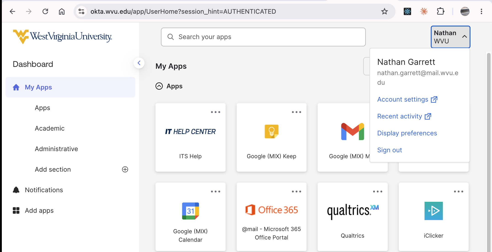
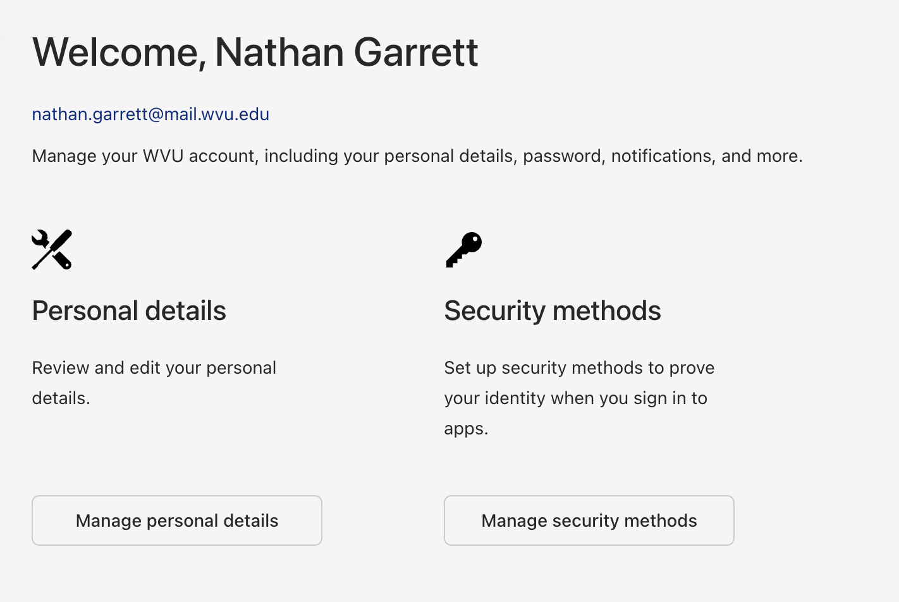
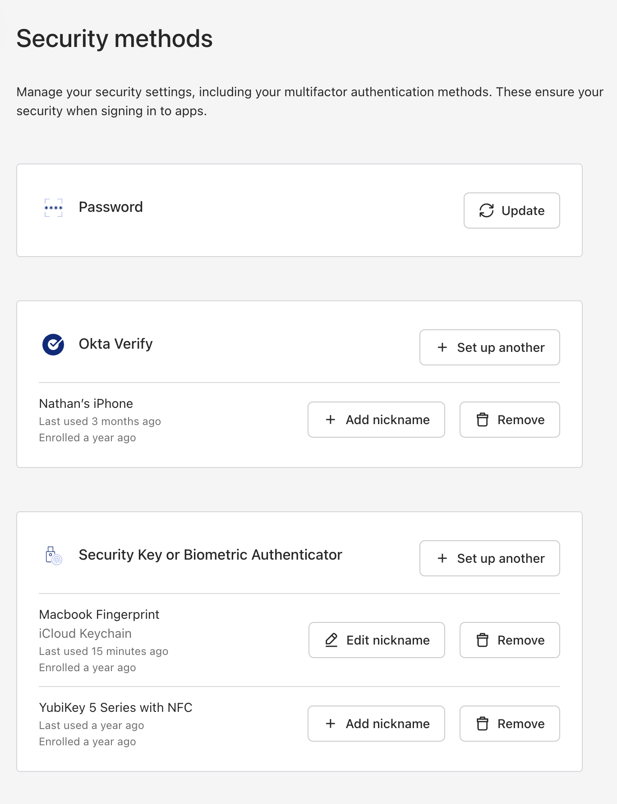

# Setup Okta for Fingerprint Reader

If your computer has a fingerprint reader, you can use it instead of your phone to log into a WVU account.

**Step 1: Log in to Your Okta Account**

Go to the [Okta login page](https://okta.wvu.edu/)

**Step 2: Access Security Settings**

Click on your name in the upper-right corner and select *Account Settings*. 

**Step 3: Click on Security Methods**

Click on *Manage security methods* 

**Step 4: Add Fingerprint**

Under *Security Key or Biometric Authenticator*, click on *set up another* and follow the prompts.

