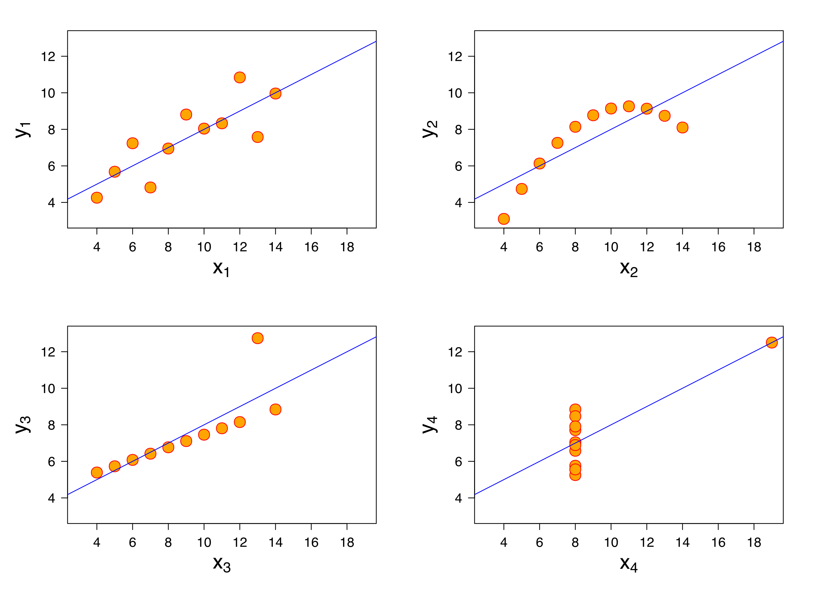

# Introduction to Exploratory Data Analysis (EDA)

EDA is a foundational skill for our course. It is a process for learning about a dataset, generally using visual methods. 

**Outcomes**:

- Distinguish between EDA, CDA, and AI/ML 
- List steps in the EDA process
- Explain why we use a visual approach
- Explain the difference between a chart and a table

## What is EDA?

*Exploratory Data Analysis* will be our primary tool for understanding data. It is an approach that emphasizes visualizing data to identify patterns, spot anomalies, test hypotheses, and check assumptions. EDA is often the first step in analyzing the data from an experiment or an observational study. It was first introduced by John Tukey in the 1970s and has since become a fundamental practice in data analysis.

This is different from *Confirmatory Data Analysis*. You are probably familiar with CDA, which is more commonly used in your statistics classes. CDA is often focused on making inferences about a larger population based on a smaller sample. It uses statistical tests to confirm or reject hypotheses. CDA is more focused on numbers and statistical measures (mean, variance, correlation, etc...) than on visualizations.

This is also different from *Machine Learning* or *Artificial Intelligence*. ML/AI approaches build models to predict future outcomes. They typically work with larger and more complex datasets than traditional statistics. However, even with these advanced techniques, practitioners still begin by using EDA to understand their dataset.

## EDA Process

The EDA process generally follows these steps. A good data analyst will iterate through these steps multiple times.

1. Examine your data
	- Identify where the data came from, and how it was collected (data provenance)
	- Examine Values
		- Look for missing values, outliers, codes, etc...
		- Identify type:
			- String or number (integer v. decimal)
			- Continuous v. discrete
	- Examine Structure
		- Long v. wide data, roll-up, cross-sectional, etc...
	- Clean data
		- Remove duplicates, fix errors, handle missing values, etc...
2. Visualize each variable
	- Use appropriate chart for the data 
		- For categorical data, use bar charts or pie charts
		- For continuous data, use histograms or boxplots
	- Identify data distributions
		- Normal curve, uniform, exponential, bimodal
	- Avoid perceptual problems
3. Look for correlations between variables
	- Identify relationship between variables
4. Tell a story
	- Develop an argument
	- Convert *exploratory* visualizations into *explanatory* visualizations
	- Create a report, presentation, or infographic

## Why a visual approach?

This class focuses on EDA, which primarily uses a visual approach. This is different from the statistical approach used in your statistics classes. The visual approach is often more effective for understanding data, especially when dealing with large datasets or complex relationships.

Follow-up classes, such as Data Modeling in Python (BUDA 451/ACCT 426), use a statistical or machine learning approach. However, these classes build on the foundation of ED- If you don't understand your data, you cannot build good models.

Charts can reveal patterns not seen through normal statistical measures.  One classic validation of this is [Anscombe's Quartet](https://en.wikipedia.org/wiki/Anscombe%27s_quartet). These data points have the same statistical properties (mean, variance, correlation, regression line), but look very different when graphed.

Source: Wikimedia Commons, By Anscombe.svg: Schutz: Avenue - Anscombe.svg, CC BY-SA 3.0, https://commons.wikimedia.org/w/index.php?curid=9838454

My favorite validation is the [Datasaurus Dozen](https://en.wikipedia.org/wiki/Datasaurus_dozen). This also has statistical properties matching to the 2nd decimal place, but look very different when graphed.

Source: Wikimedia Commons, By IngmundForberg - Own work, CC BY-SA 4.0, https://commons.wikimedia.org/w/index.php?curid=138051422

## What is a visualization?

Tables are not charts! A table is a structured arrangement of data in rows and columns. While tables are useful for organizing information, they do not provide the visual cues necessary for quick comprehension and pattern recognition.

Charts, on the other hand, are graphical representations of data that use visual elements like bars, lines, and points to illustrate relationships and trends. Charts leverage our brain's ability to process visual information rapidly, making it easier to identify patterns, outliers, and correlations within the data.

Chart designs must align with people's visual perception systems. Poorly designed charts can mislead viewers. Creating effective charts requires understanding how to map data to visual attributes and how people perceive these visuals.

## Good examples

- 2 minute video on [12,100 years of population change, visualized](https://www.youtube.com/shorts/S4qkMsPTtsE)
- Infographic on [Households with no income](https://www.visualcapitalist.com/mapped-share-of-households-with-no-income-by-u-s-state/)
- Report on [where vacation homes are located in the US?](https://www.construction-physics.com/p/where-are-vacation-homes-located)

## Terms

- **Anscombe's Quartet**: Four small datasets with nearly identical means, variances, correlations, and regression lines that look completely different when graphed.
- **Chart**: A graphic that maps data to visual attributes such as position, length, color, or size. Every chart is a visualization, but not every visualization is a chart.
- **Coded value**: A number or abbreviation that stands in for a category. For example, a `gender` field storing `1` and `2`, or a `state` field storing `WV`. Coded values look like data but need a codebook to interpret.
- **Confirmatory Data Analysis (CDA)**: An approach that starts with a hypothesis and uses statistical tests to support or reject it.
- **Continuous value**: A variable that can take any value within a range, such as revenue or temperature. 
- **Discrete value**: A variable that can only take separate values, usually counts, such as number of invoices.
- **Datasaurus Dozen**: Thirteen datasets with summary statistics identical to two decimal places, one of which forms a dinosaur when plotted 
- **Distribution**: The pattern of how often each value occurs in a variable. Common shapes include normal (bell curve), uniform (flat), exponential (steep decline), and bimodal (two peaks).
- **Exploratory Data Analysis (EDA)**: An approach that examines data to understand its structure, find patterns, and generate questions, primarily through visualization.
- **Machine Learning (ML)**: An approach that builds models to predict outcomes on new data. It prioritizes predictive accuracy over understanding, and handles larger and messier datasets than traditional statistics.
- **Missing value**: A field with no recorded value.
- **Outlier**: A value far from the rest of the data. It may be a data-entry error, a legitimate extreme case, or the most interesting thing in your dataset. Investigate before deleting.
- **Prediction**: Estimating an unknown value for a new observation. It is judged by accuracy on data the model has not seen. It does not require understanding why the model works.
- **Inference**: Drawing conclusions about a population from a sample, including how confident you can be that a pattern is real rather than sampling noise.
- **Table**: A structured arrangement of data in rows and columns. It is precise and good for lookup, but does not let you see patterns at a glance.
- **Visualization**: Any graphic representation of information. This includes charts, but also diagrams, maps, and infographics.

## Practice Questions

1. Who first introduced Exploratory Data Analysis?
   - John Tukey
   - Frank Anscombe
   - Edward Tufte
   - Ronald Fisher

1. What is the primary goal of EDA?
   - To learn about a dataset and generate questions about it
   - To confirm or reject a stated hypothesis
   - To build a model that predicts future outcomes
   - To estimate how confident we can be that a pattern is real

1. Which best describes the difference between EDA and CDA?
   - EDA explores data to find patterns; CDA tests a hypothesis
   - EDA uses larger datasets; CDA uses smaller datasets
   - EDA is used in business; CDA is used in accounting
   - EDA requires software; CDA can be done by hand

1. CDA is often focused on:
   - Making inferences about a population from a sample
   - Cleaning and reshaping messy datasets
   - Producing infographics for a general audience
   - Predicting outcomes for individual customers

1. Which statement about ML/AI is correct?
   - ML/AI practitioners still begin with EDA to understand their data
   - ML/AI has replaced the need for EDA
   - ML/AI works only with small, clean datasets
   - ML/AI is another name for confirmatory data analysis

1. What is the correct order of the EDA process?
   - Examine data, visualize each variable, look for correlations, tell a story
   - Visualize variables, examine data, tell a story, look for correlations
   - Tell a story, examine data, visualize variables, look for correlations
   - Look for correlations, examine data, visualize variables, tell a story

1. Identifying where a dataset came from and how it was collected is called:
   - Data provenance
   - Data cleaning
   - Data structure
   - Data coding

1. How should a good analyst work through the four EDA steps?
   - Iterating through the steps multiple times
   - Once, in order, without revisiting earlier steps
   - Starting with step 4 and working backward
   - Choosing only the steps relevant to the final report

1. Which of the following is a discrete variable?
   - Number of invoices processed
   - Total revenue for the quarter
   - Average shipping time in hours
   - Warehouse temperature

1. Which of the following is a continuous variable?
   - Account balance
   - Customer ID
   - State abbreviation
   - Number of employees

1. A `gender` field in your dataset contains only the values `1` and `2`. This is an example of:
   - A coded value
   - A missing value
   - An outlier
   - A continuous value

1. You find a sales figure that is ten times larger than any other value in the dataset. What should you do first?
   - Investigate why the value is there
   - Delete the row so it does not distort your charts
   - Replace it with the average of the other values
   - Convert the variable to a discrete type

1. "Long v. wide data" and "roll-up" describe a dataset's:
   - Structure
   - Values
   - Provenance
   - Distribution

1. Which task belongs to the cleaning stage of examining your data?
   - Removing duplicate records
   - Choosing a color palette
   - Writing the final report
   - Selecting a chart type

1. You want to visualize the number of customers in each sales region. Which chart is appropriate?
   - Bar chart
   - Histogram
   - Boxplot
   - Scatterplot

1. You want to see how order amounts are spread out across thousands of transactions. Which chart is appropriate?
   - Histogram
   - Pie chart
   - Bar chart of each order
   - Table of all transactions

1. A distribution with two distinct peaks is described as:
   - Bimodal
   - Normal
   - Uniform
   - Exponential

1. A distribution where every value occurs about equally often is described as:
   - Uniform
   - Normal
   - Bimodal
   - Exponential

1. A distribution with many small values and a steep decline toward a few large values is described as:
   - Exponential
   - Normal
   - Uniform
   - Bimodal

1. What does Anscombe's Quartet demonstrate?
   - Datasets with nearly identical summary statistics can look completely different when graphed
   - Four datasets with different statistics can produce identical charts
   - Summary statistics are more reliable than charts
   - Correlation always indicates causation

1. How closely do the summary statistics of the Datasaurus Dozen datasets match?
   - They match to the second decimal place
   - They are only roughly similar
   - They match exactly, with no rounding
   - Only the means match

1. What is the main limitation of a table compared to a chart?
   - Tables do not let you see patterns at a glance
   - Tables cannot hold numeric data
   - Tables are less precise than charts
   - Tables cannot be printed in a report

1. Which statement about charts and visualizations is correct?
   - Every chart is a visualization
   - Every visualization is a chart
   - Charts and visualizations are the same thing
   - Maps and diagrams are charts, but not visualizations

1. A model flags which invoices are likely to be paid late, but no one can explain why it works. This is an example of:
   - Prediction
   - Inference
   - Confirmatory data analysis
   - Data provenance

1. In the final step of the EDA process, you convert exploratory visualizations into:
   - Explanatory visualizations
   - Summary statistics
   - Cross-sectional data
   - Predictive models
