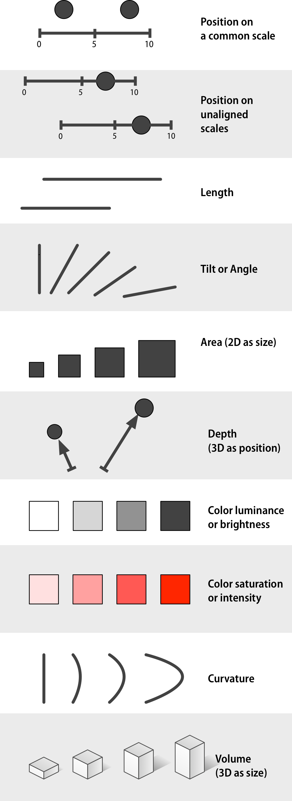
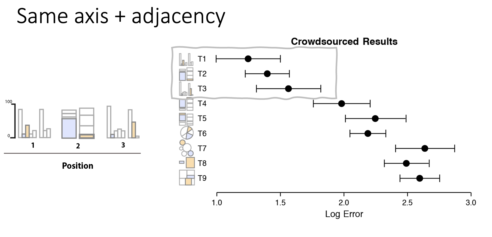
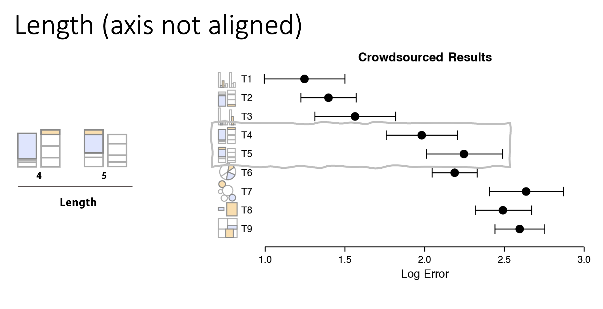
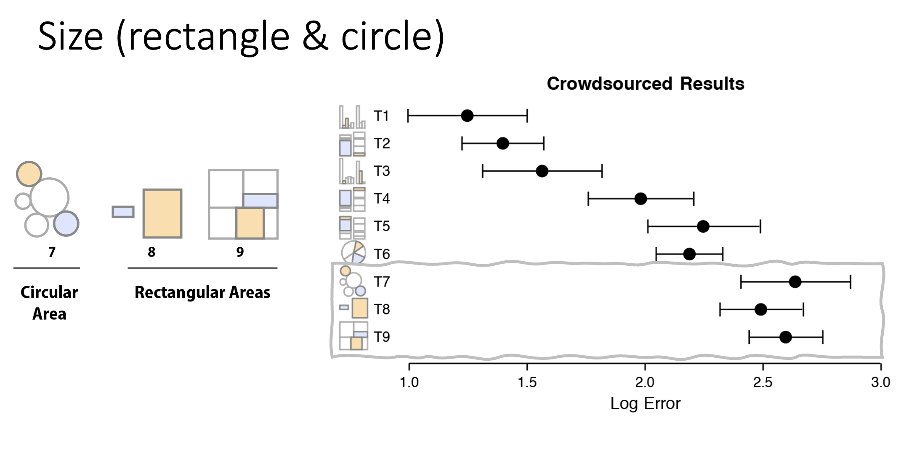

# Pre-attentive attributes

Data visualization is the representation of *numbers* with *visual elements*. There are a variety of ways we can do this, so we call each mapping as a pre-attentive attribute. This module covers what pre-attentive attributes are, and how to use them effectively.

**Outcomes**:
- Understand what a table is versus a graph
- Understand pre-attentive attributes (visual channels)
- Understand accuracy of different pre-attentive attributes
- Map different chart types to pre-attentive attributes

**Links**:
- [Quizlet](https://quizlet.com/1049085197/course_dv02-introduction-to-data-visualization-flash-cards)
- [Socviz website's Look at Data](https://socviz.co/lookatdata.html)

## What is a chart?

There are multiple overlapping terms used to describe charts. A **chart** is a general term for any visual representation of data. This includes bar charts, line charts, pie charts, scatter plots, and more. 

Some visual representations are better called diagrams. These include things like SmartArt, where there are visual elements but they do not represent data values. To be a chart, the visual elements must map to data values through a consistent function.

The diagram below shows some examples of charts versus non-charts.

### What is a table?

**A table is not a chart!** IT has rows and columns with numbers.  Tables can contain charts when use graphical elements to represent data values, such as in a heatmap table (or other conditional formatting option).

Tables have been arond for a very long time. The image below shows an inventory of shepherds and herd from 1300BC. You can see that it has rows and columns, each with a cell recording data. 

Tablet from 13th century BC, showing inventory of shepherds & herds. Linear B, palace of Pylos. Image taken by Nathan Garrett, 2024.

Historical tables:
- [Explanation of Cuneform text](https://www.datafix.com.au/BASHing/2020-08-12.html)
- [Website with tables](https://www.are.na/joshua-kopin/tabular-presentation)

## Graphs use visual channels

A graph uses visual channels (pre-attentive attributes) to represent data. These channels are processed by our brains very quickly, often without conscious effort. This allows us to quickly grasp patterns, trends, and outliers in the data.

However, because these channels are interpreted by a biological visual system, they are limited by our native visual system's capabilities. As a result, some are better than others for accurately conveying information.

Comment channels include:

- Position on a common scale
- Position on unaligned scale
- Length
- Tilt
- Area
- Color luminescence or brightness
- Color saturation or intensity
- Curvature
- Volume
- Depth (3D)

[Image source socviz](https://socviz.co/lookatdata.html)

### Accuracy

How do these compare in accuracy? [Class activity](perceptual-accuracy.html)

Below are some charts showing the results of a crowd-sourced activity measuring accuracy. They are grouped into roughly three levels of accuracy. These images are from Heer and Bostock’s replication of Cleveland and McGill's work \([source](https://socviz.co/lookatdata.html)\).

In order from best to to worst:

1. Position (common scale, then stacked, and unaligned)
1. Length (unstacked, then stacked) and angle (for pie charts)
2. Area (rectangular is slightly better than circular)

**Group 1: Best Accuracy**

The most accurate charts use position on a common scale. Our visual systems are very good at comparing positions, especially when they all start on the same line (or axis). Bar charts are the most common chart type for a reason!

**Group 2: Moderate Accuracy**

The next most accurate charts use position on unaligned scales. This includes tasks that involve comparing values that are not aligned on a common axis, such as non-bottom segments in a stacked bar chart (or bars stacked on top of each other). The means that while bar charts are the best option, tasks requiring comparing stacked bar charts results in less accuracy.

Also in this group are pie charts. These use multiple pre-attentive attributes, including angle and area. While pie charts are very popular, they are not quite as accurate as bar charts.

**Group 3: Low Accuracy**

Finally, size is one of the less accurate pre-attentive attributes. This includes bubble charts, where the size of the circle represents a value. Our visual systems are not as good at accurately judging size differences, especially when comparing areas of circles.

