# Visual Perception

Our eyes take visual input and convert it into meaning. However, they have a lot of quirks that affect how we interpret information in charts.

**Outcomes**:
- Describe the structure of the human visual system
    - Define fovea, saccades, and blind spot
    - Explain how eye movement affects visual perception
    - Explain subitizing, color coding limits, inattentional blindness, and crowding
    - Differentiate between pop-out and slow visual search
- Explain Weber's Law: how people see changes as relative versus absolute
- Explain Stevens' psychophysical power law
- Explain Miller's Law and the modern 4-chunk revision, and apply them to visual designs
- Explain how the gestalt principle of proximity influences visual grouping in charts
- Detect cases of visual clutter and propose strategies to reduce cognitive load
- Explain the Lie Factor and Proportionality Principle

## Physical components of a visual system

Your visual system includes your eyes and your brain. Your eyes take in light and convert it into electrical signals. These signals are then processed by your brain to create a visual representation of the world. However, your visual system has a lot of limitations that we need to understand when creating visualizations.

### Field of view

Human eyes take in a broad visual field, but **only a tiny central region is actually seen with high precision**. This small zone is the **fovea**, a densely packed cluster of cone cells responsible for sharp detail, color accuracy, and fine visual discrimination (like reading or recognizing faces). Everything outside the fovea is processed with **much lower resolution**. Peripheral vision detects motion, contrast, and general shapes but cannot provide fine detail. 

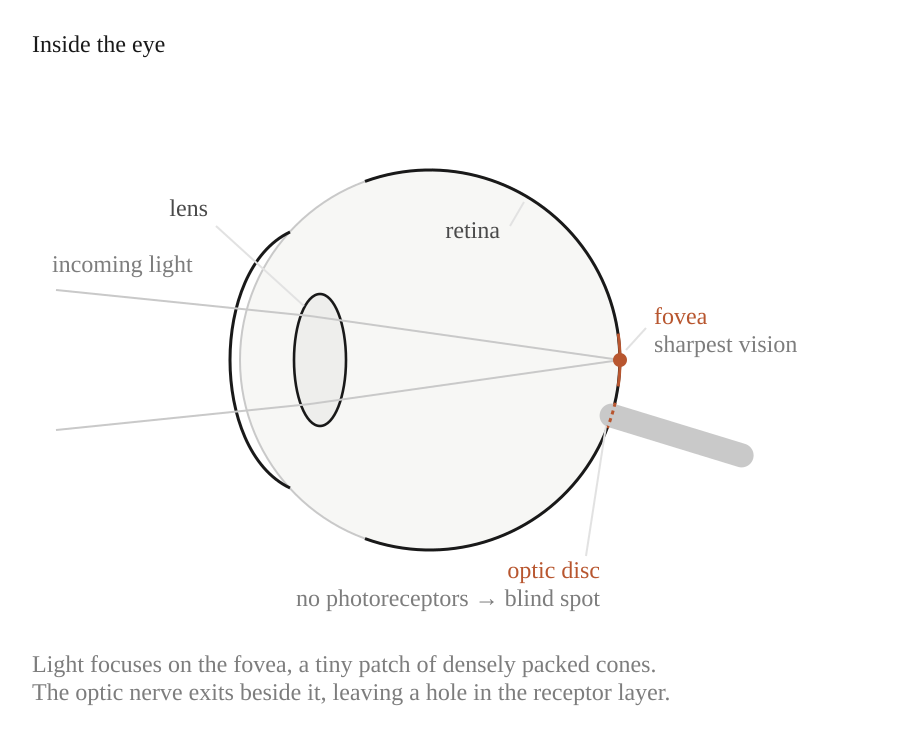

As a result, we constantly move our eyes through rapid **saccades** to bring different parts of a scene into the fovea. The brain creates the impression that you see a steady scene, even though your eyes are constantly moving. It uses the following tricks:

- **Saccadic suppression:** Just before and during a saccade, the brain temporarily reduces visual sensitivity, preventing the smear from reaching awareness.
- **Predictive remapping:** Neurons shift their receptive fields just before the eye moves, preparing for where objects _will_ appear after the jump.
- **Continuity illusion:** After each saccade, the brain stitches the stable snapshots together into a smooth sense of the world.

Each eye has a location on the retina where the optic nerve exits. That region has **no photoreceptors**, meaning it can't detect light at all. This should produce a noticeable hole in your vision, but you never see it because your brain uses neural tricks that create the _illusion_ of continuous, stable vision.

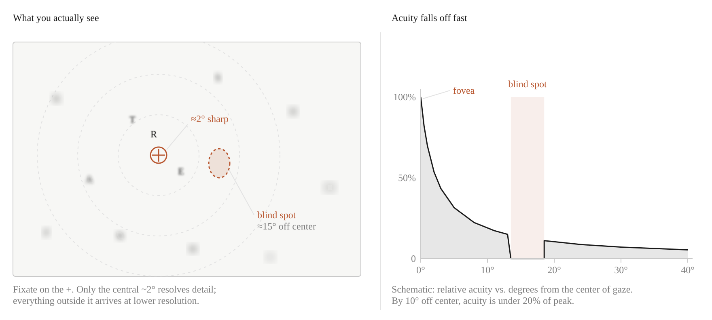

- **Filling-in:** The brain automatically "paints over" the missing area using nearby colors, textures, and patterns.
- **Redundancy from both eyes:** The blind spots of your two eyes are in different locations; one eye covers what the other misses.
- **Assumption of continuity:** The visual system expects smooth, continuous surfaces and fills gaps accordingly.

As a result, you perceive a complete visual field even though a chunk of it contains zero input.

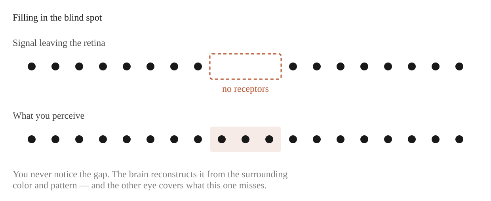

#### Design Implications

How does the phsyical design of the visual system impact data visualization? A few include:

- Only a small portion of a chart can be accurately read at a time. Separating components will reduce accuracy.
- The brain is used to filling in details. We need to work with the physical system's visual tricks, instead of against them.
- You can also improve charts by reducing eye travel. Minimize the distance between data and legends. Or, if you are asking the user to compare multiple data points, move them closely together.

### Processing Limits

We do not actually see all of the information taken in by our eyes.  Overload happens with task demands (being asked to do too much). It is also be limited by the physical limits of our eyes (such as a limited focal view). 

Our visual system silently screens out unneeded information. In the well-known Simons & Chabris (1999) study, viewers asked to count basketball passes in a short video failed to notice a person in a gorilla suit walking through the scene.

#### Subitizing (counting limits)

Humans can instantly and accurately count up to about **4** items. Beyond that, counting becomes slow and deliberate. We remain good at *estimating* larger quantities, but cannot give an exact count at a glance. This is why a chart that requires counting many marks fails, while one that requires comparing lengths succeeds.

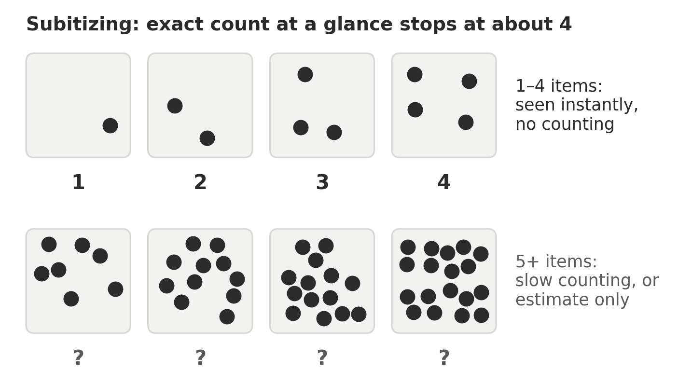

#### Shape coding limits

A related but separate limit applies to how many shapes a chart can use as a category code. Practical guidance is about **5 or 6 distinct shapes** before discrimination breaks down (Ware, *Information Visualization*). More than that, and readers must consult the legend for every mark.

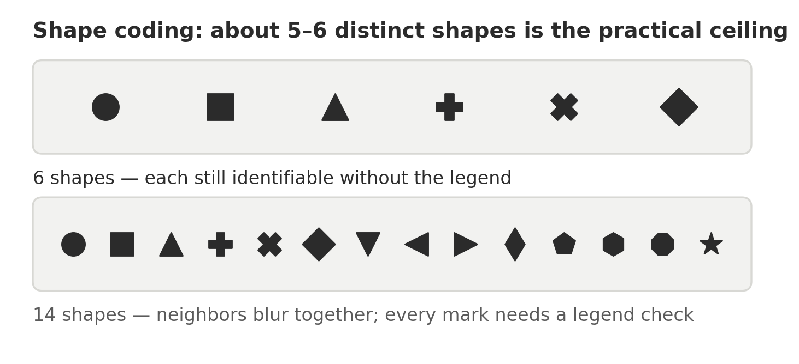

#### Color coding limits

Similarly, categorical color encodings work well up to roughly **6 to 12 colors**, depending on mark size, background, and how separated the colors are (Ware; Brewer). Fewer is almost always better. See [dv36. Colors](/course_dv/dv36-colors/) for details.

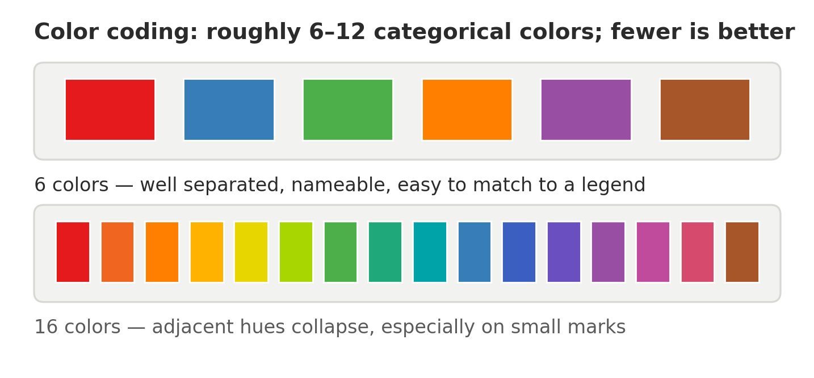

#### Crowding

A character that is easy to identify in isolation becomes hard to identify once similar characters are placed close beside it. This follows from our small focal view: we see a small range of items clearly, but detail "fuzzes out" quickly toward the periphery, and neighboring items interfere with each other.  

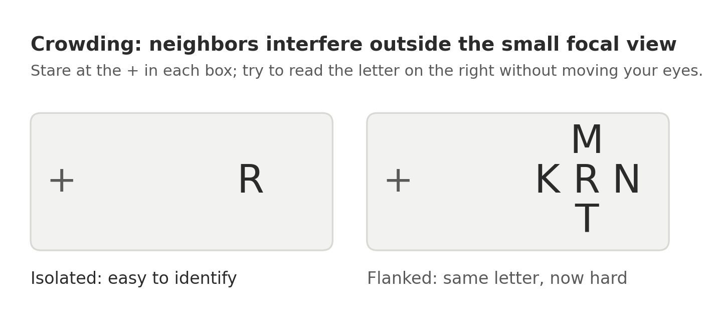

Interestingly, while we struggle to identify *individual* crowded items, we are rather good at *averaging* them. For example, you can judge the general tilt of a field of oriented ellipses even when you cannot identify any single one.

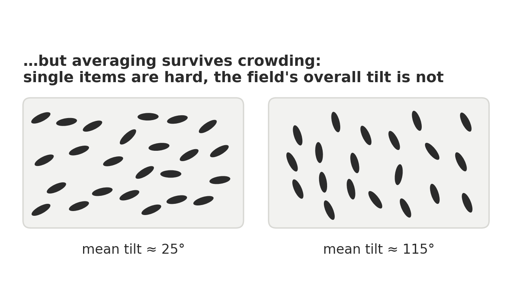

#### Pop-out vs. slow visual search

Some visual patterns are identified almost instantly, while others require slow, deliberate searching. Finding a single bright object in a field of dark items is immediate. Finding a backwards C in a field of Cs is slow, because we must examine each item individually.

- The difference comes from how the visual system is built. Perception starts at a low level—edges, color, orientation—and then feeds higher systems that group those features into objects. Encodings that can be resolved at the low level are processed **pre-attentively** and "pop out."
- Searching on a *combination* of features (a **conjunction search**) is slow. For example, finding a square that is gray on top and black on bottom among squares that are black on top and gray on bottom requires item-by-item inspection, even though both individual colors are pre-attentive.

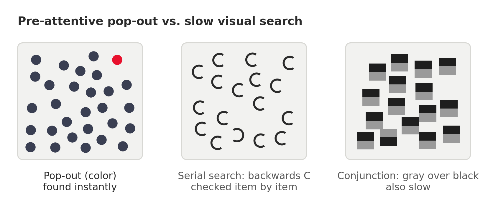

##  Perception Laws

Beyond these general principles of how our visual system works, there are a number of specific laws that describe how we interpret visual information. Understanding these laws can help us design better visualizations.

### Weber's Law: Relative vs. Absolute Changes

Humans tend to interpret data **relatively** (by comparison), not in isolation.

Weber's Law says that the smallest change we can detect depends on how large the starting value is. We can understand this intuitively by imagining our ability to detect a 1 lb change. If we are holding 1 lb, the change is obvious. If we are holding 100 lbs, it is undetectable.

Formally, the **just noticeable difference (JND)** between two stimuli is a constant **proportion** of the original stimulus:

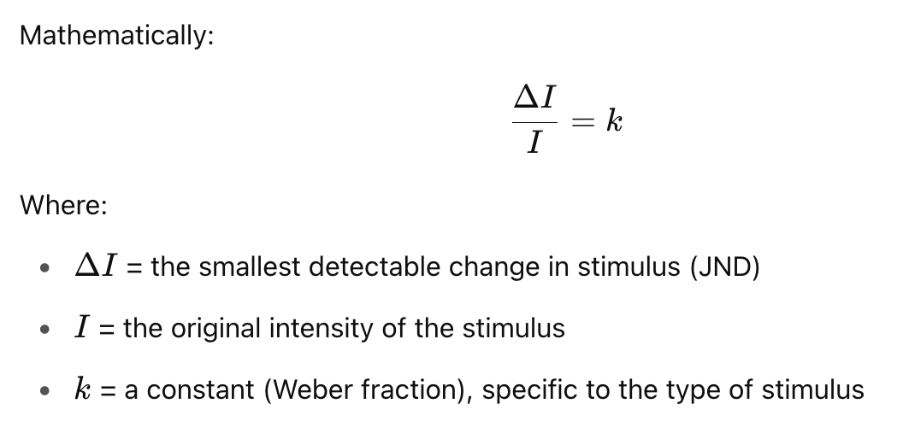

Weber's Law applies to visual perception. In the example below, the change on the left is harder to detect than the same absolute change on the right.

*Caveat*: Weber's Law holds well through the middle of a sensory range, but breaks down at very low and very high intensities.

### Stevens' Psychophysical Power Law

**Stevens' Power Law** describes the relationship between the **actual intensity of a stimulus** and how that intensity is **perceived** by a human observer. It offers an alternative to the earlier **Weber–Fechner Law** and fits a wider range of sensory experiences, though which model is better remains debated.

The graph below shows that perceived intensity changes at a different rate than the underlying physical value. Electric shock is *expansive*: a small increase feels like a large one. Brightness is *compressive*: a large increase feels like a small one. Length is close to one-to-one, which is a major reason bar charts work so well.

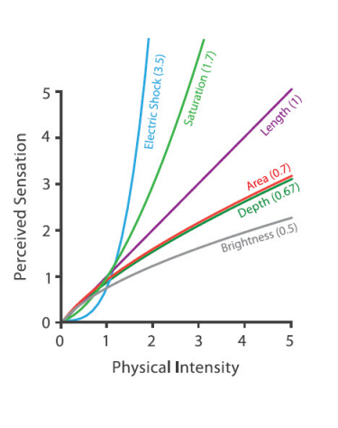

[Source: *Visualization Analysis and Design* by Tamara Munzner](https://www.oreilly.com/library/view/visualization-analysis-and/9781466508910/)

### Miller's Law and Working Memory

**Miller's Law** comes from a 1956 paper by psychologist **George A. Miller** titled *"The Magical Number Seven, Plus or Minus Two."* It holds that the average person can keep about **7 ± 2** discrete items in **working memory** at one time.

Later research revised this downward. Cowan (2001) puts the practical limit closer to **4 chunks** once you remove rehearsal and grouping strategies. **For design purposes, plan for 4.**

Two clarifications matter:

- It applies to **short-term memory**, not long-term learning.
- A **chunk** is a meaningful unit, not necessarily a single item. "1-4-9-2" is four chunks; "1492" may be one. By chunking, we expand what fits in memory.

Practical examples:

* Menu designers group related items (drinks, entrees, etc.)
* Use 3–5 bullet points on a slide
* Visually group survey fields into similar groups using proximity
* Limit navigation menus to 5–7 items at each level

The chart below violates this by requiring readers to hold too many separate categories in mind at once.

How does this change our chart designs?

- Help readers chunk information by using conventions (green = good, red = bad, cause on the x-axis, effect on the y-axis, and so on)
- Break complex charts apart into several simpler charts so readers process a few points at a time

Know the difference between *exploratory* and *confirmatory* visual designs. While exploring a dataset, you'll often overload a chart with information to detect trends. But when it is time to communicate your results, you'll generally need to drastically simplify the chart to make it understandable.

*A note of caution*: Miller's finding is about remembering lists of items, not about looking at a chart. When a chart is on screen, readers do not have to hold its categories in memory. The 4-chunk guideline is a useful design heuristic, but it is an extrapolation from the original research rather than a direct finding of it.

### Gestalt Principle of Proximity

Gestalt principles describe how readers **intuitively group** related items. Several apply to charts—similarity, enclosure, connection, and proximity—but proximity does the most work in dashboard layout: items placed close together are perceived as related.

Improve your dashboards by placing white space between unrelated charts and by placing related charts side by side. The example below illustrates what happens without careful white space.

Improve individual charts by reducing alignment points. Centering items often feels like a good idea, but in practice it adds alignment points for the eye to *catch* on.

### Tufte's Data-ink Ratio 

Tufte's **data-ink ratio** captures the idea: of all the ink on the page, what share encodes actual data? The goal is not minimalism for its own sake, but removing anything that competes with the data for attention.

Every mark on a chart costs the reader attention. **Clutter** is any element that consumes attention without carrying information.

Common sources of clutter, roughly in order of how often they appear in student work:

- Heavy or dark gridlines that compete with the data marks
- Chart borders, plot-area backgrounds, and drop shadows
- Redundant encodings (a legend *and* direct labels *and* a color scale for the same variable)
- Data labels on every point when only a few points matter
- Decorative images, 3D effects, and gradient fills
- Default axis titles that repeat the chart title

Strategies to reduce load:

- **Remove** first. Delete an element and check whether anything was lost.
- **Fade** what you must keep. Push gridlines and axis lines to light gray so they recede.
- **Highlight** the point of the chart. Use one saturated color for the series that matters and gray for context.
- **Label directly** instead of forcing a legend lookup.
- **Sort** categorical axes by value rather than alphabetically, so comparison does not require search.

Avoid visual noise—**every element should serve a purpose**.

## Proportionality & Lie Factor

**Proportionality** refers to the principle that **visual representations in charts should accurately reflect the numerical quantities they represent**. The size, length, area, or angle of a visual element (a bar, circle, or slice) must be **proportional** to the data value it encodes.

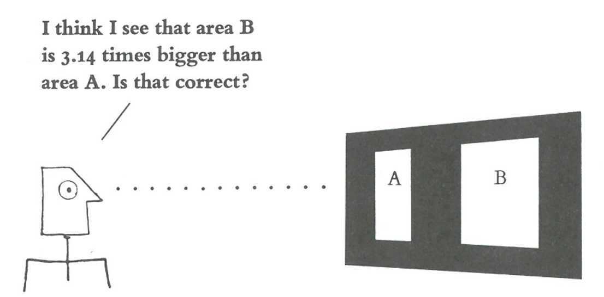

The **Lie Factor** was introduced by Edward Tufte in *The Visual Display of Quantitative Information*. It remains an intuitive way to measure distortion in a chart, though it is a rough instrument: it works cleanly for size distortions and less well for problems like truncated axes or misleading aggregation.

- **Lie Factor ≈ 1** → the graphic is accurate.
- **Lie Factor > 1.05 or < 0.95** → Tufte considered the graphic **misleading**.

Unfortunately, Excel often starts the axis above zero in bar charts. The bar chart on the left greatly overstates the change between years 1 and 3. A corrected version is shown on the right.

When the base number is very large, a better way to show change is a line chart with values stated as percentage differences from a base year. Line charts are more often used to represent ratio values instead of absolute values.

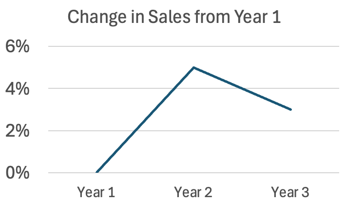

Three of the most common sources of proportionality errors are:

- Using **area** or **volume** instead of **length** to represent a 1D quantity (e.g., circle size)
- 3D effects that **inflate perception**
- Non-zero baselines on bar charts

## Check Your Understanding

1. A dashboard uses 11 colors to distinguish product lines. Name two limits from this page that it violates, and propose a fix.
2. A scatterplot asks readers to find points that are both *large* and *orange*. Why is this slower than finding points that are only orange? Name the effect.
3. A company's stock rose from $400 to $404. Which chart design makes this look dramatic, and which makes it look accurate? Which is the honest choice, and what does your answer depend on?
4. Find a chart in a news article or annual report. Estimate its Lie Factor and identify which of the five proportionality errors above it commits, if any.
5. Your reader missed the annotation you added to the chart's most important point. Using a term from this page, explain why—and name two changes that would fix it.
