# Visual Perception

### dv30 — How Your Eyes and Brain Read a Chart

Nathan Garrett, PhD CPA

*Department of Accounting and Information Systems, WVU*

---

## Why This Module Exists

Your **eyes** and **brain** are very different from a camera. This module takes you through
how they work, and explains how that affects the way you see the world.

**Four Questions To Ask**

1. What can the **eye** physically resolve?
2. What does the **brain** filter out?
3. How is **magnitude** perceived, not measured?
4. Does the picture match the **numbers**?

---

# Part 1

## The Physical Eye

---

## The Fovea

Your visual field is wide. The part seen in **sharp detail** is tiny.

The **fovea** provides detail,
accurate color, and fine discrimination. Everything outside it is low resolution: motion, contrast, and general shape only.

---

## You only perceive a small patch of the world

You never see a whole dashboard. You see a small
patch of it clearly, and have a rough idea of the rest.

---

## Saccades are the eye's jumps

Your eyes jump ~3 times a second (**saccade**). Jumps are hidden by:

- **Saccadic suppression** — sensitivity drops during the jump, hiding the smear
- **Predictive remapping** — neurons shift their receptive fields before the eye moves
- **Continuity illusion** — the brain stitches the stable snapshots together

You can find your blindspot by closing one eye, looking at your finger, and moving it to the left about 15° from center.
---

## The Blind Spot

There are no photoreceptors where the optic nerve exits the retina.
The brain compensates for this by:

- **Filling-in** — the brain paints over the gap with nearby color and texture
- **Redundancy** — the two eyes' blind spots sit in different places
- **Assumption of continuity** — the visual system expects smooth surfaces

---

## Design Implication: Minimize Eye Travel

Don't make users lookup legends. Instead, put labels close to a value.

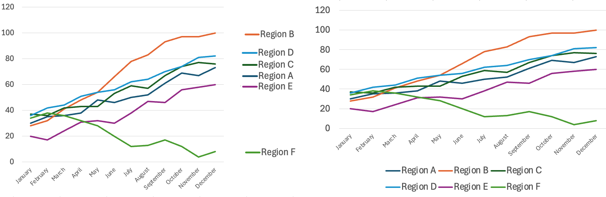

---

## Questions 1-4

*fovea · peripheral vision · saccade · saccadic suppression ·
blind spot · filling-in · eye travel*

**Q1.** A student says she can read her whole 27-inch monitor at once without moving her eyes.

*Fovea: Only a small central region resolves detail. She is moving her eyes constantly and does not notice it. The rest of the screen is low-resolution peripheral vision.*
<!-- .element: class="fragment" -->

**Q2.** A dashboard user reports the numbers "felt right" even though a whole column of the table was blank on screen.

*Filling-in: The visual system reports a complete, continuous scene, papering over what it did not actually receive. *
<!-- .element: class="fragment" -->

**Q3.** A line chart has eight series, and the legend sits in a box below the chart.

*Eye travel: Each series requires a jump down to the legend, a color match, and a jump back. Label the lines at their right ends instead.*
<!-- .element: class="fragment" -->

**Q4.** You do not perceive a blur while your eyes jump from the chart title to the axis.

*Saccadic suppression: The brain lowers visual sensitivity just before and during the jump.*
<!-- .element: class="fragment" -->

---

# Part 2

## Processing Limits

What makes a task challenging for our our visual processing system?
---

## Some differences are easy, some are hard.

We see **pre-attentive** features (color, size, orientation, edges).

But, some tasks require **attention** and item-by-item inspection. We want to avoid those.

---

## Try It

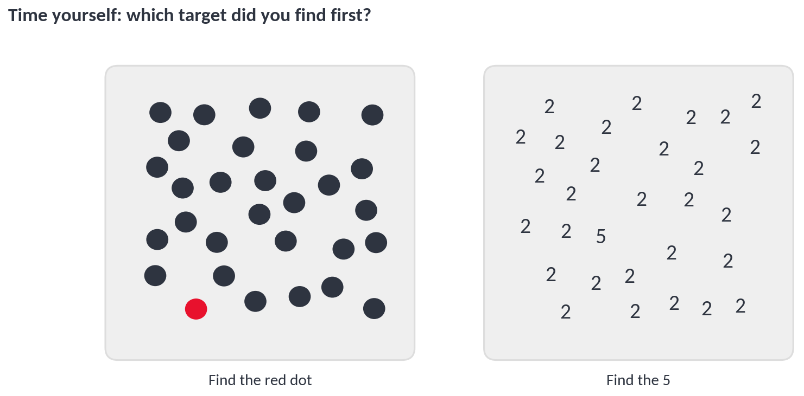

---

## Subitizing

We instantly count **up to about 4** items. Past that,
counting becomes slow and deliberate (though *estimating* still works).

---

## Shape Coding Limits

We see **5 or 6** distinct shapes before discrimination breaks down
(Ware, *Information Visualization*).

---

## Color Coding Limits

Categorical color works up to roughly **6 to 12** colors, depending on
mark size, background, and separation (Ware; Brewer).
Stick to 6 or fewer for general audiences.

---

## Crowding

A character that is easy to read alone becomes hard to read once similar
characters sit close beside it.

---

## Ensemble Averaging

We are bad at identifying crowded items, but surprisingly **good at
averaging them**.

---

## Inattentional Blindness

The visual system silently screens out non-task information.

The classic example is the **gorilla experiment** by **Simons & Chabris (1999)**, where viewers counting basketball passes failed to notice a person in a gorilla suit walk through the scene.

https://www.youtube.com/watch?v=vJG698U2Mvo

---

## Questions 5-6

### inattentional blindness · subitizing · shape limit · color limit ·crowding · ensemble averaging · pop-out · conjunction search

**Q5.** A dashboard encodes 14 product lines with 14 colors. Users keep asking which line is which.

*Color coding limit: Roughly 6-12 is the practical ceiling, and 12 is generous. Group the small lines into "Other," or split into small multiples.*
<!-- .element: class="fragment" -->

**Q6.** An audit exhibit asks the reader to count how many stores exceeded the threshold. There are 17 dots.

*Subitizing: Exact counting collapses past about 4. Print the number, or sort and use length. Do not make the reader count marks.*
<!-- .element: class="fragment" -->

---

## Questions 7-8

### inattentional blindness · subitizing · shape limit · color limit ·crowding · ensemble averaging · pop-out · conjunction search

**Q7.** A scatterplot asks readers to find points that are both **large** and **orange**.

*Conjunction search: Size alone pops out; orange alone pops out; the combination does not. The reader must inspect each point. Encode the condition you care about as one visual feature instead.*
<!-- .element: class="fragment" -->

**Q8.** A CFO reviewing a revenue chart never noticed the "restated" footnote in the corner.

*Inattentional blindness: Attention was on the bars. Anything outside the task is filtered out. Put the caveat in the title or annotate the affected bars directly.*
<!-- .element: class="fragment" -->

---

# Part 3

## Perception Laws

---

## Weber's Law

The smallest change we can detect is a constant **proportion** of the
starting value, not a fixed amount.

Holding 1 lb, a 1 lb change is obvious. Holding 100 lbs, it is
undetectable.

---

## Weber's Law in a Chart

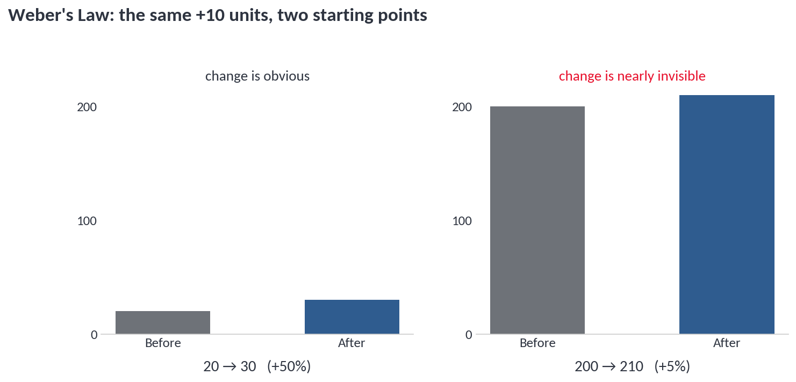

Identical absolute change. Only one of them is visible.

---

## Just Noticeable Difference

The **JND** is the smallest change a person can reliably detect.

*Caveat*: Weber's Law holds through the middle of a sensory range and
breaks down at very low and very high intensities.

---

## Stevens' Power Law

Relates the **physical intensity** of a stimulus to the **perceived**
intensity.

- **Expansive** — electric shock: a small increase feels large
- **Compressive** — brightness, area: a large increase feels small
- **Near one-to-one** — length

---

## Miller's Law

Miller (1956), *"The Magical Number Seven, Plus or Minus Two"* —
working memory holds about **7 ± 2** items.

Cowan (2001) revised this down to roughly **4 chunks** once rehearsal
and grouping are removed.

**For design purposes, plan for 4.**

---

## Chunks

A **chunk** is a meaningful unit, not a single item.

`1-4-9-2` is four chunks.

`1492` may be one.

Chunking is how you expand what fits. Use conventions the reader already
owns: green is good, red is bad, cause on x, effect on y.

But don't use green and red together! 

---

## Overload

---

## Exploratory vs. Confirmatory

**Exploratory** — you are hunting for a pattern. Overload the chart.
Twelve colors is fine. The audience is you.

**Confirmatory** — you found the pattern and are communicating it.
Strip it down to the one comparison that carries the point.

Most student charts are exploratory charts submitted as confirmatory ones.

---

## Questions 9-10

### Weber's Law · just noticeable difference · Stevens' Power Law ·Miller's Law · chunking · exploratory vs. confirmatory

**Q9.** A defect rate improves from 4.0% to 3.6%. On a chart scaled 0–100%, no one can see it.

*Weber's Law / JND: The change is far below the just noticeable difference at that scale. Chart the change itself, or index it to a base period.*
<!-- .element: class="fragment" -->

**Q10.** An analyst encodes revenue as circle area because "it uses less space than bars."

*Stevens' Power Law: Area is compressive — a big increase in area reads as a small increase in value. Length is near one-to-one, which is why bars are the safer encoding.*
<!-- .element: class="fragment" -->

---

## Questions 11-12

### Weber's Law · just noticeable difference · Stevens' Power Law ·Miller's Law · chunking · exploratory vs. confirmatory

**Q11.** A slide lists nine bullet points, each a separate idea.

*Miller's Law: Well past the practical 4-chunk limit. Group them into three themed chunks, or split the slide.*
<!-- .element: class="fragment" -->

**Q12.** A dashboard uses red for "on target" and green for "off target," because those are the corporate brand colors.

*Chunking: The reader arrives with a convention already in memory. Fighting it costs a chunk on every single mark. Plus, violates color-blind accessibility guidelines.*
<!-- .element: class="fragment" -->

---

# Part 4

## Grouping and Clutter

---

## Gestalt: Proximity

Items placed close together are perceived as **related**.  Dashboards use proximity to group related charts.

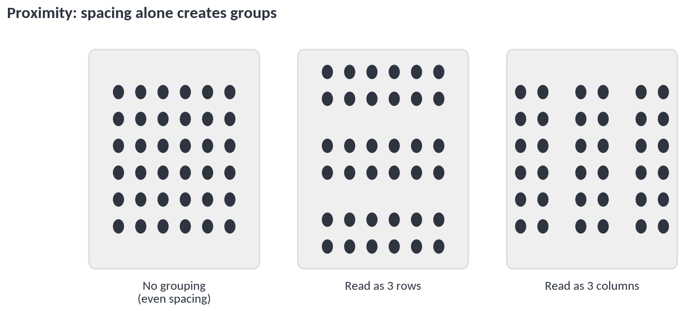

---

## Proximity Gone Wrong

White space is important!

---

## Alignment Points

Every edge the eye must track is an **alignment point**. While centering feels
tidy, left-align gives the eye one edge.

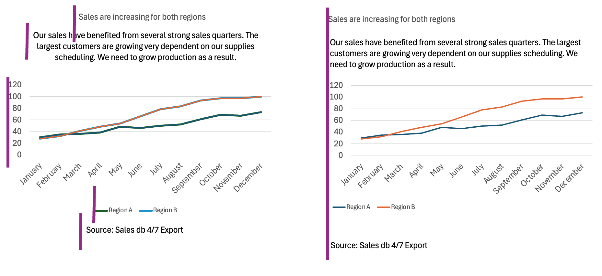

---

## Data-Ink Ratio

Tufte's question: of all the ink on the page, what share encodes actual
**data**?

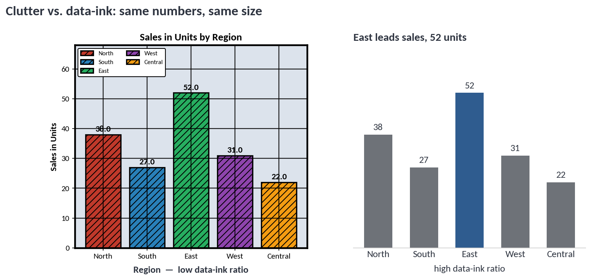

The goal is not minimalism, but removing whatever competes with the data.

---

## Common Clutter

Roughly in order of how often it appears in student work:

- Heavy or dark gridlines competing with the marks
- Chart borders, plot backgrounds, drop shadows
- Redundant encoding — a legend *and* direct labels *and* a color scale
- Data labels on every point when three points matter
- Decorative images, 3D effects, gradient fills
- Axis titles that repeat the chart title

---

## Strategies

Every element should serve a purpose.

- **Remove** first. Delete it and see whether anything was lost.
- **Fade** what must stay. Gridlines to light gray.
- **Highlight** the point. One saturated color, everything else gray.
- **Label directly** instead of forcing a legend lookup.
- **Sort** by value, not alphabetically, so comparison does not require search.

---

## Questions 13-14

### proximity · white space · alignment point · data-ink ratio ·clutter · redundant encoding · direct labeling

**Q13.** A dashboard has six charts evenly spaced in a 3×2 grid. Readers keep assuming the two revenue charts and the headcount chart are one analysis.

*Proximity / white space: Even spacing gives no grouping signal, so the reader invents one. Tighten the space inside a group and widen it between groups.*
<!-- .element: class="fragment" -->

**Q14.** A bar chart shows category names in a legend, colored bars, and a value label on every bar.

*Redundant encoding: The category is stated three times. Keep the axis labels and the values, drop the legend and the color coding.*
<!-- .element: class="fragment" -->

---

## Questions 15-16

### proximity · white space · alignment point · data-ink ratio ·clutter · redundant encoding · direct labeling

**Q15.** A quarterly report chart has a black border, a gray plot background, dark gridlines, and a drop shadow on each bar.

*Clutter / data-ink ratio: None of that ink encodes data. Removing all four costs makes the bars easier to compare.*
<!-- .element: class="fragment" -->

**Q16.** Every text block on a slide is centered, and the reader says it feels "hard to scan."

*Alignment points: Centering creates a new ragged edge for every block. Left-aligning gives the eye a single vertical line to follow.*
<!-- .element: class="fragment" -->

---

# Part 5

## Proportionality and the Lie Factor

---

## Proportionality

The size, length, area, or angle of a mark must be **proportional** to
the value it encodes.

*Source: Tufte, The Visual Display of Quantitative Information*

---

## The Lie Factor

- **≈ 1** — the graphic is accurate
- **> 1.05 or < 0.95** — Tufte considered it misleading

---

## Truncated Axis

Excel defaults will start a bar axis above zero. Bars encode value by **length from zero**. 

---

## The Fix

When the base is large and the change is small, show the **change**.

Line charts do not carry the zero-baseline requirement, because they
encode position and slope rather than length.

---

## Area Instead of Length

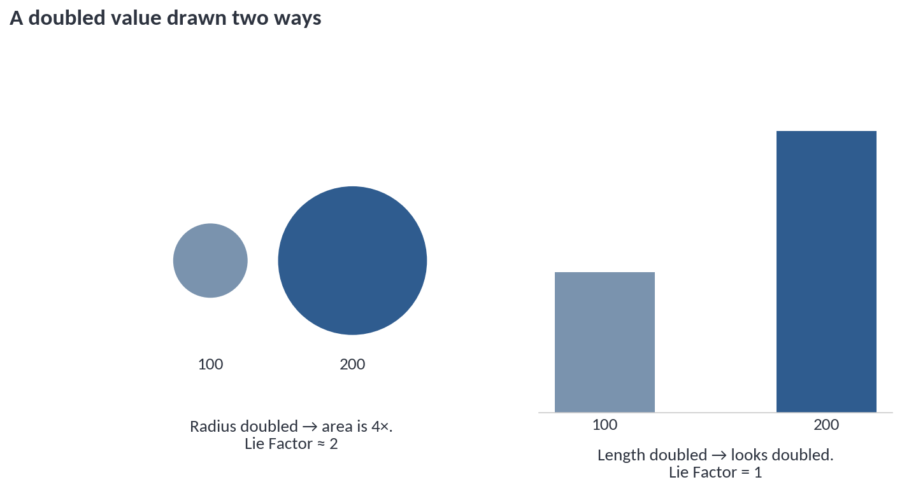

Double the radius and the area quadruples. The reader sees "four times,"
the data says "two times."

---

## Three-D Effects

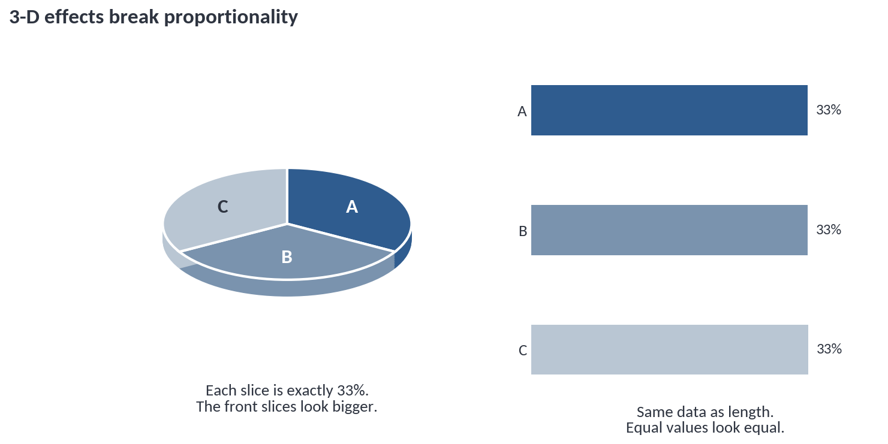

Each slice is exactly 33%. Perspective adds area to the front and takes
it from the back. There is no honest 3-D pie.

---

## Questions 17-18

### truncated axis · area for a 1-D quantity · 3-D inflation · proportional and fine

**Q17.** A bar chart of revenue starts its axis at $9.8M. The bars run $9.9M, $10.0M, $10.2M, and the last bar looks four times the first.

*Truncated axis: The visible lengths are 0.1, 0.2, and 0.4 — a 300% change shown for a 3% change in the data, a Lie Factor near 100. Start bars at zero, or switch to a line chart of percentage change.*
<!-- .element: class="fragment" -->

**Q18.** An infographic sizes state icons by population using icon **height**, so a state with 4× the population gets an icon 4× as tall — and 16× the area.

*Area for a 1-D quantity: Scaling height also scales width, so area grows as the square. Scale by area, or use a bar chart.*
<!-- .element: class="fragment" -->

---

## Questions 19-20

### truncated axis · area for a 1-D quantity · 3-D inflation · proportional and fine

**Q19.** A line chart of stock price starts its y-axis at $395 rather than $0.

*Proportional and fine: Line charts encode position and slope, not length from a baseline. A non-zero axis is acceptable — and often necessary — as long as the axis is labeled.*
<!-- .element: class="fragment" -->

**Q20.** A revenue chart uses 3-D columns with a receding floor. The tallest column is in front.

*3-D inflation: Depth adds ink that encodes nothing and the perspective favors the front. Remove the 3-D.*
<!-- .element: class="fragment" -->

---

## Overall Review

--
## Problem 1

What concept(s) does this chart design violate? How would you fix it?

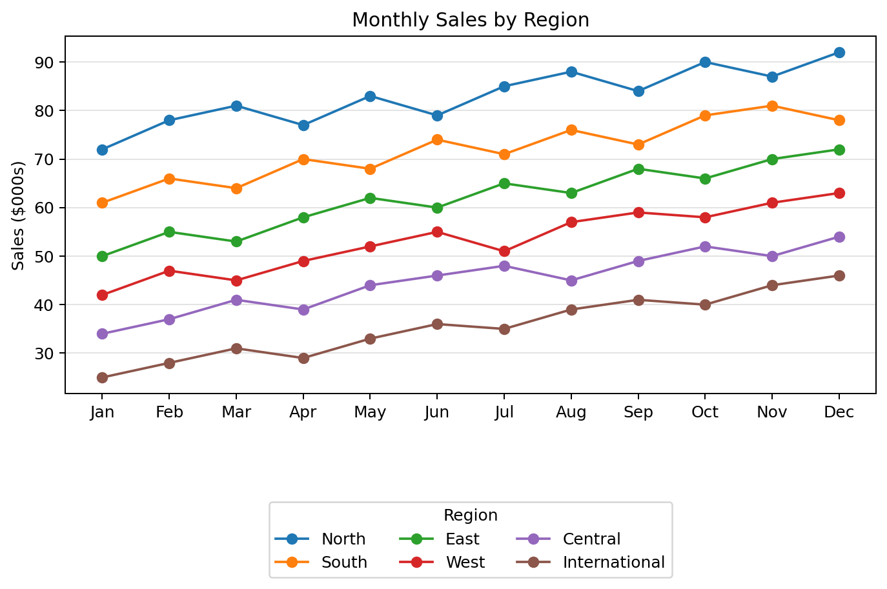

Excessive eye travel
<!-- .element: class="fragment" -->

--
## Problem 2

What concept(s) does this chart design violate? How would you fix it?

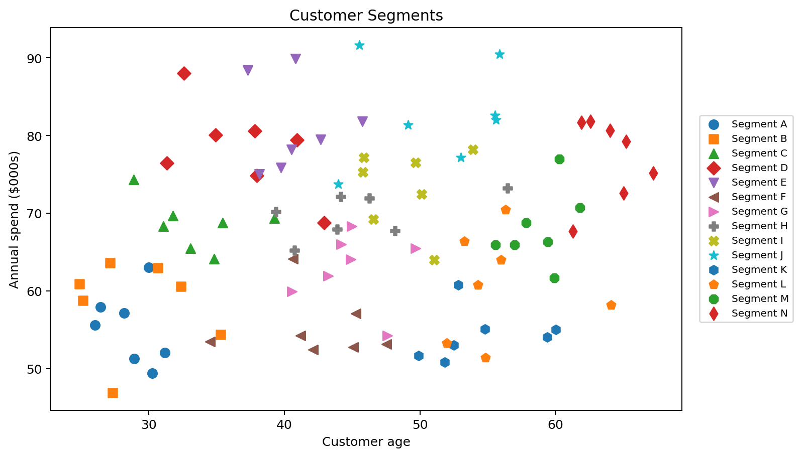

Too many colors and shapes
<!-- .element: class="fragment" -->

--
## Problem 3

What concept(s) does this chart design violate? How would you fix it?

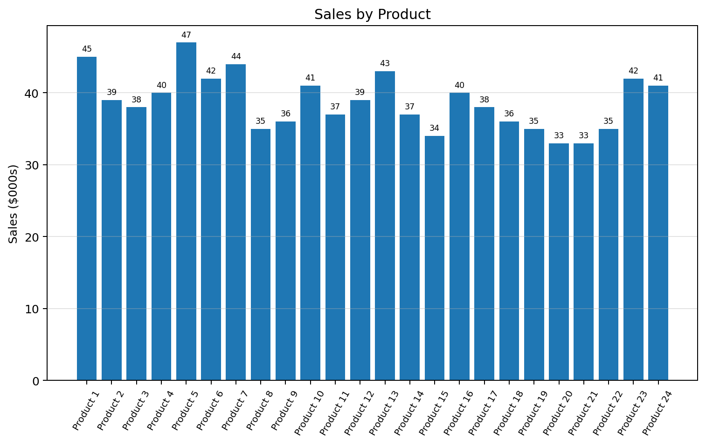

Crowding and count overload
<!-- .element: class="fragment" -->

--
## Problem 4

What concept(s) does this chart design violate? How would you fix it?

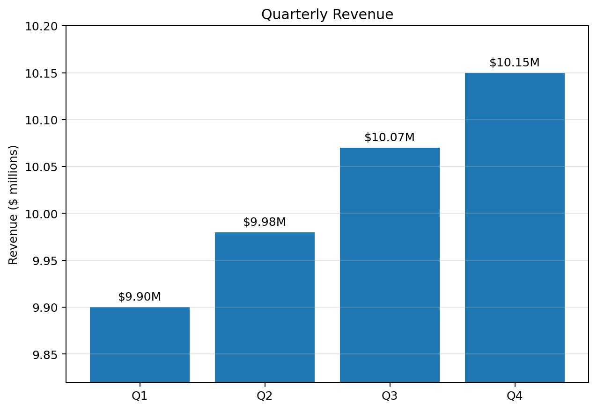

Truncated axis
<!-- .element: class="fragment" -->

--
## Problem 5

What concept(s) does this chart design violate? How would you fix it?

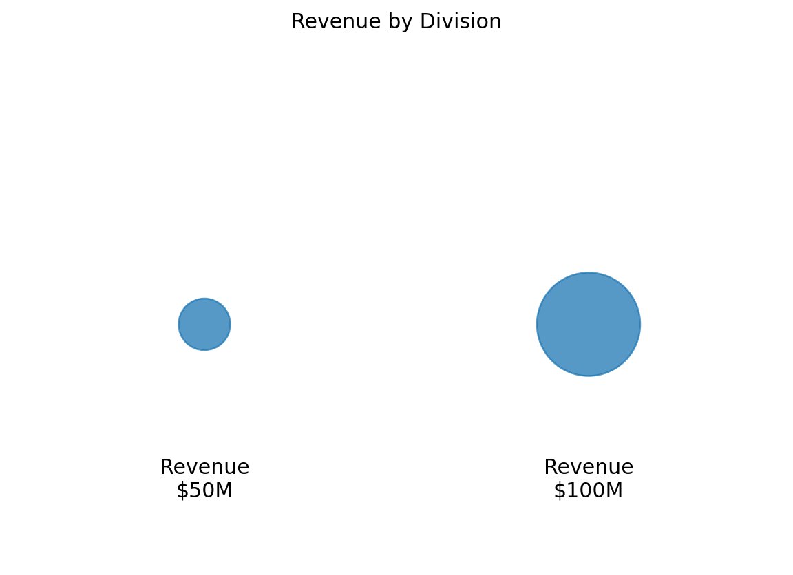

Area distortion
<!-- .element: class="fragment" -->

---

## Review 1 — The Eye

**R1.** A colleague argues that a busy dashboard is fine because "the whole thing is on one screen, so users can see it all at once." What is wrong with that claim?

*Only the foveal patch is high-resolution. Users see one small region clearly at a time and move through the rest with saccades. Being on one screen does not make it simultaneously readable.*
<!-- .element: class="fragment" -->

**R2.** You add a red annotation to the least important corner of a chart and readers miss it. Name two effects at work and one fix.

*Inattentional blindness (attention is on the task, not the corner) and eye travel (the annotation is far from the mark it describes). Fix: move the annotation next to the data point, or put the finding in the title.*
<!-- .element: class="fragment" -->

**R3.** Why does replacing a legend with direct labels usually improve accuracy, not just aesthetics?

*It removes a saccade, a color match, and a working-memory hold for every series. The reader stops paying a lookup cost on each mark.*
<!-- .element: class="fragment" -->

**R4.** A map shows 40 city dots and asks the reader how many are above target. Which limit does this violate, and what would you do instead?

*Subitizing — exact counting collapses past about 4. Print the count, or use a sorted bar chart so the answer is read rather than tallied.*
<!-- .element: class="fragment" -->

---

## Review 2 — Encoding and Attention

**R5.** A dashboard uses 11 colors for product lines and asks readers to find lines that are both declining and low-margin. Name two limits it violates and propose a fix.

*Color coding limit (11 is at or past the practical ceiling) and conjunction search (two features combined must be inspected item by item). Fix: reduce to 5-6 lines plus "Other," and encode the declining-and-low-margin condition as a single highlight color.*
<!-- .element: class="fragment" -->

**R6.** A scatterplot has 3,000 overlapping points. A reader can describe the overall trend but cannot identify any single point. Is the chart broken?

*No — that is ensemble averaging working as intended. Crowding blocks individual identification, but the average property reads fine. Only a problem if the task requires reading individual points.*
<!-- .element: class="fragment" -->

**R7.** An analyst uses nine marker shapes to distinguish nine departments. What happens, and why?

*Past the roughly 5-6 shape coding limit, discrimination fails and every mark becomes a legend lookup. Use small multiples, or highlight only the department in question.*
<!-- .element: class="fragment" -->

**R8.** Why does a single red bar among gray bars work so well?

*Color is a pre-attentive feature, so the red bar pops out with no search. It also raises the data-ink ratio by letting you delete the legend and the other colors.*
<!-- .element: class="fragment" -->

---

## Review 3 — Magnitude

**R9.** A company's stock rose from $400 to $404. Which chart design makes this look dramatic, which makes it look accurate?

*Truncating the axis to $399-$405 makes 1% look enormous; a bar chart from zero makes it invisible. The honest choice depends on the question: if 1% matters to the reader, chart percentage change on a labeled line chart rather than distorting a bar.*
<!-- .element: class="fragment" -->

**R10.** Why does Stevens' Power Law argue against bubble charts and in favor of bar charts?

*Perceived length is close to one-to-one with actual length; perceived area is compressive, so area differences are systematically underestimated. Bars therefore transmit magnitude with less distortion.*
<!-- .element: class="fragment" -->

**R11.** A donor report shows gifts of $50,000 and $52,000 as two circles. A reader says they look identical. Which law explains this, and is the chart lying?

*Weber's Law — a 4% difference is below the just noticeable difference at that size. The chart is not distorting the data (Lie Factor near 1), but it fails to communicate. Accuracy and readability are separate problems.*
<!-- .element: class="fragment" -->

**R12.** Estimate the Lie Factor: a chart shows a 5% increase in enrollment using two figures where the second is drawn twice as tall and twice as wide.

*Area grew 4× (300% increase) to show a 5% increase, so the Lie Factor is roughly 300/5 = 60. Far past Tufte's 1.05 threshold.*
<!-- .element: class="fragment" -->

---

## Review 4 — Putting a Chart Together

**R13.** You are redesigning a cluttered quarterly chart for a board meeting. Name the first three things you remove and why.

*Gridlines or fade them, the plot border and background, and the legend (replaced with direct labels). None of that ink encodes data, and the legend costs a saccade per series.*
<!-- .element: class="fragment" -->

**R14.** During analysis you built a 14-series chart that helped you find the pattern. Your director asks for it in the board deck. What do you do?

*That is an exploratory chart. Rebuild it as a confirmatory one: one or two series that carry the finding, the rest gray for context, the conclusion stated in the title. Keep the original in the appendix.*
<!-- .element: class="fragment" -->

**R15.** A dashboard's four charts are evenly spaced, centered, and each has its own legend. Name three separate problems.

*Proximity — even spacing gives no grouping, so unrelated charts read as one analysis. Alignment points — centering adds an edge per element. Eye travel and redundant encoding — four legends that direct labels would eliminate.*
<!-- .element: class="fragment" -->

**R16.** In one sentence each, state the design rule that follows from the fovea, from subitizing, and from Weber's Law.

*Fovea: put things that must be compared close together. Subitizing: never ask the reader to count more than about four marks. Weber's Law: a small change on a large base needs its own chart of the change, not a bigger axis.*
<!-- .element: class="fragment" -->

---

## Summary

Before any chart:

- **Eye** → can it be resolved without hunting? how far must the eye travel?
- **Attention** → how many colors, shapes, marks to count?
- **Magnitude** → is the encoding near one-to-one, or compressive?
- **Memory** → about four chunks; exploratory or confirmatory?
- **Truth** → does the picture change by as much as the data?

Questions?
