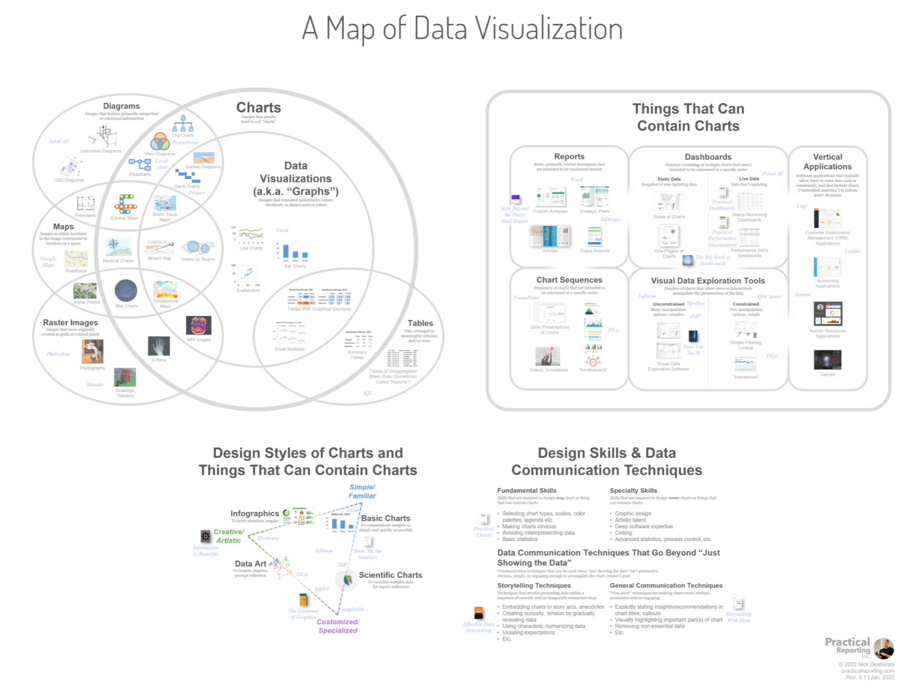
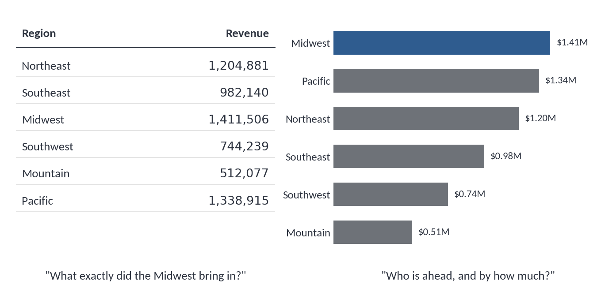
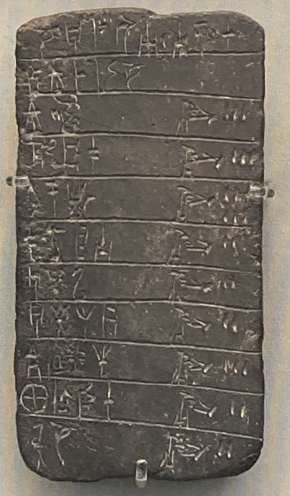
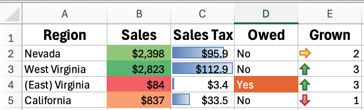
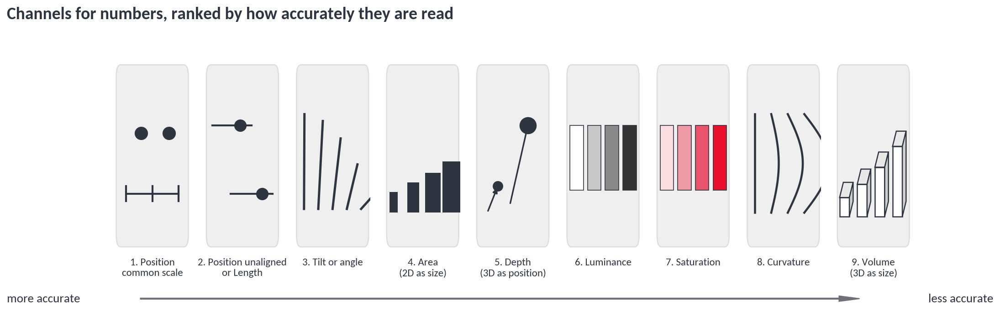
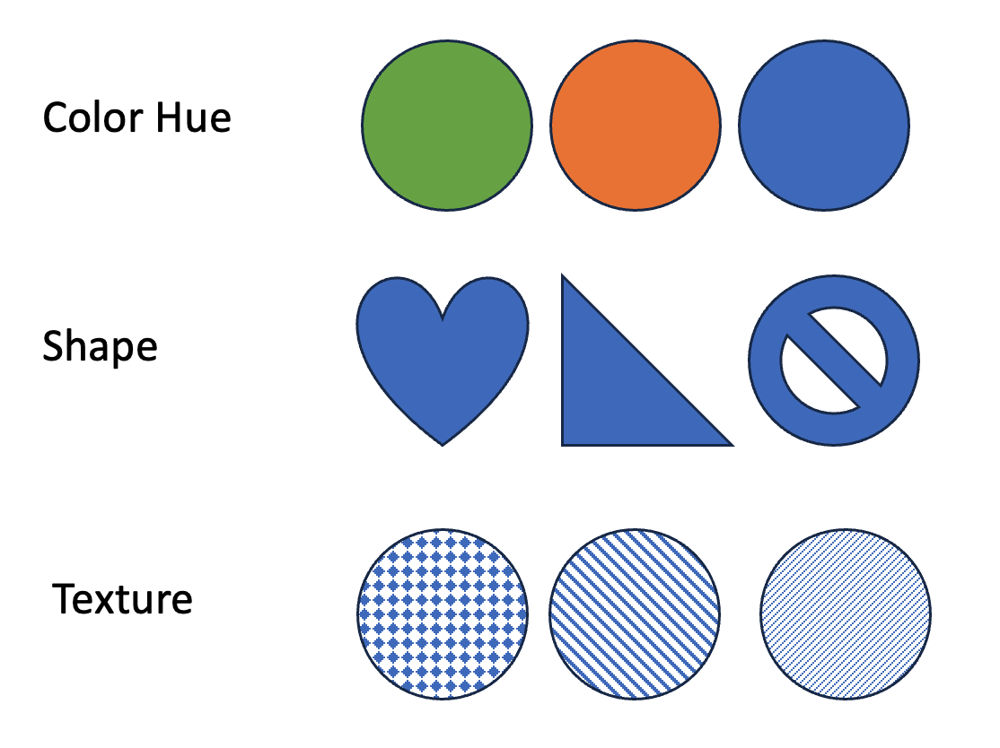
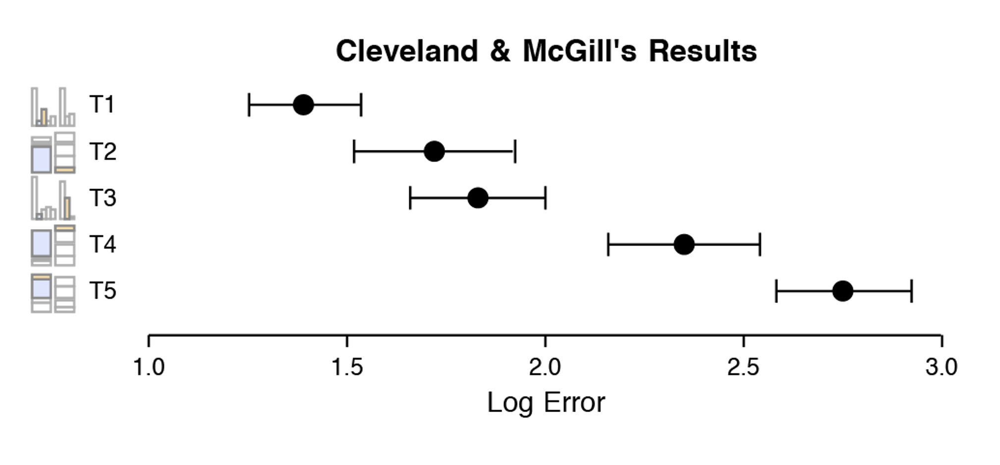
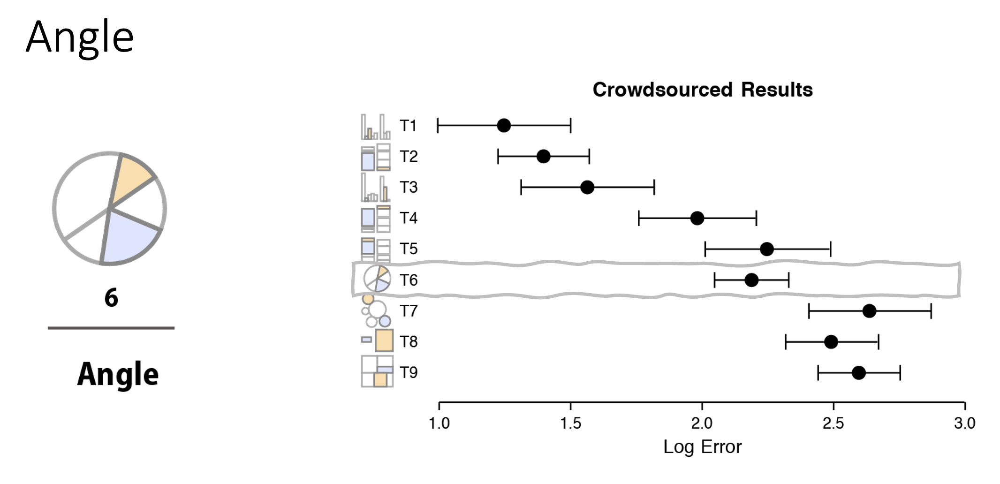

# Visual channels

Data visualization represents *numbers* with *visual elements*.  This module covers how our visual system interprets different mapping approaches. We call these **visual channel**. This module covers channel definitions, accuracy, and usage.

**Outcomes**:
- Decide when to use a table versus a chart
- Understand visual channels 
- Rank the accuracy of different visual channels 
- Map visual channels to different chart types 

**Links**:
- [Socviz website's Look at Data](https://socviz.co/lookatdata.html)
- [Slides](/static/pages/slides.html?course=course_dv&module=dv31-visualchannels)

## What is a chart?

There are multiple overlapping terms used to describe charts. A **chart** is a general term for any visual representation of data. This includes bar charts, line charts, pie charts, scatter plots, and more. I use *chart* and *graph* interchangeably in our class.

Some visual representations are better called diagrams. These include things like SmartArt, which has visual elements but does not map elements to numbers. We focus on the visual elements that map visuals to to data through a consistent function.

The diagram below shows some examples of charts versus non-charts.

### What is a table?

**A table is not a chart!** It has rows and columns of numbers.  Tables and charts answer different questions, so neither is "better":

When should you use a table, and when should you use a chart?

| Use a table when | Use a chart when |
| --- | --- |
| Readers need exact values | Readers need a pattern, trend, or comparison |
| There are only a handful of numbers | There are many values |
| Values are looked up individually | Values are read together |

Tables have been around for a very long time. The image below shows an inventory of shepherds and herds from around 1300 BC. You can see that it has rows and columns, each with a cell recording data.

Historical tables:
- [Explanation of Cuneiform text](https://www.datafix.com.au/BASHing/2020-08-12.html)
- [Website with tables](https://www.are.na/joshua-kopin/tabular-presentation)

A table can *contain* charts when it uses graphical elements to represent data values, such as a heatmap table or other conditional formatting.

## Graphs use visual channels

A graph uses **visual channels** to represent data. Your visual system processes many of these channels very quickly and without conscious effort. Charts work better when we interpret values intuitively. We want to avoid forcing the user to conciously count or manipulate data.

Because these channels are interpreted by a biological visual system, they are limited by that system's capabilities. Some channels are far better than others for conveying information accurately.

### Per-attentive versus accuracy

Two related ideas get mixed up constantly, so keep them separate:

- **Pre-attentive** describes what your eye detects in under a quarter of a second, without searching. A single red dot in a field of gray dots "pops out." This is about *noticing*.
- **Accuracy** describes how well you can judge *how much* a visual element represents. Reading that one bar is 1.4 times another is a slow, deliberate task.

A channel can be great at one and poor at the other. Color hue pops out instantly but is terrible for judging magnitude. The rest of this module is about accuracy. 

### Channels for quantities versus categories

Choose the channel to match the data type:

- **Number data** (sales, hours, temperature) needs a channel with an ordered magnitude: position, length, angle, area, luminance.
- **Categorical data** (region, product line, department) needs a channel that separates without implying order: hue, shape, texture.

Encoding categories with a magnitude channel implies a ranking that does not exist. Encoding quantities with hue throws away most of your precision. The accuracy ranking below applies only to number channels.

### Channels 

*Channels for numbers*, listed roughly from most to least accurate:

- Position on a common scale
- Position on unaligned scales or Length
- Tilt or angle
- Area (2D as size)
- Depth (3D as position)
- Color luminance or brightness
- Color saturation or intensity
- Curvature
- Volume (3D as size)

*Channels for categories*. Note that only a handful of levels are usable at once — see [dv36. Colors](../dv36-colors/index).

- Hue
- Shape
- Texture

### Accuracy

Cleveland and McGill (1984) tested how accurately people judge magnitudes from different chart designs. Heer and Bostock (2010) replicated the study using crowdsourced workers on Mechanical Turk. The charts below come from that work, by way of [socviz](https://socviz.co/lookatdata.html).

**How to read these charts.** The dot is average error and the bars are the confidence interval. The x-axis is *log error*, so **shorter is better** and a difference of 1.0 is large. Each label (T1, T2, and so on) is a different chart design that the study participants were asked to read.

#### Position and length: what T1 through T5 mean

This first chart compares five bar-chart designs, not five different channels.

- **T1–T3** are **position on a common scale**: the two bars being compared both sit on the same baseline. Accuracy drops slightly as the bars get farther apart.
- **T4–T5** are **length**: the segments being compared float inside a stacked bar and do not share a baseline, so the reader must judge length instead of position.

The takeaway: **position on a common scale beats length**, and this is why an ordinary bar chart outperforms a stacked bar chart for comparing values.

**Group 1: Best accuracy**

The most accurate charts use position on a common scale. Our visual systems are very good at comparing positions, especially when everything starts on the same axis. Bar charts are the most common chart type for a reason.

**Group 2: Moderate accuracy**

Next come judgments on unaligned scales and length judgments. This includes comparing values that do not share an axis, such as the upper segments of a stacked bar chart or bars in separate small-multiple panels. So bar charts are still the best option, but *stacking* them costs you accuracy.

Pie charts also land here. They combine angle, arc length, and area. Pie charts are popular, but they are measurably less accurate than bar charts.

**Group 3: Low accuracy**

Area is one of the least accurate channels. This includes bubble charts, where the size of a circle represents a value. People systematically underestimate large areas, and circles are read less accurately than rectangles.

## Mapping chart types to channels

| Chart type | Main channel | Accuracy |
| --- | --- | --- |
| Bar chart (unstacked, shared axis) | Position on a common scale | High |
| Dot plot | Position on a common scale | High |
| Line chart | Position on a common scale, plus slope | High |
| Scatterplot | Position on two common scales | High |
| Stacked bar, bottom segment | Position on a common scale | High |
| Stacked bar, upper segments | Length | Moderate |
| Small multiples / separate panels | Length | Moderate |
| Pie or donut chart | Angle, arc length, and area | Moderate |
| Bubble chart | Area | Low |
| Treemap | Area | Low |
| Heatmap | Color luminance or saturation | Low |
| Any 3D chart | Volume or depth | Lowest |

The practical rule: **if the reader needs to compare values, use position on a common scale.** Reach for area or color only when you are showing rough magnitude or adding a secondary variable to a chart that already uses position.

Accuracy is not the only thing that matters. A treemap handles hundreds of categories that would not fit in a bar chart, and a heatmap shows a whole matrix at once. Just be aware of what precision you are trading away.

## Check your understanding

1. Your manager wants to know the exact revenue for each of six regions to paste into a memo. Table or chart? Why?
2. You have a stacked bar chart of revenue by region and product line. Which comparisons are easy, and which are hard?
3. Why does a bubble chart understate large values?
4. A dashboard encodes "department" using a blue-to-red gradient. What is wrong with that choice?

## Key terms

- **Chart**: A visual representation of data that maps numbers to visual elements through a consistent function. Used interchangeably with *graph*.
- **Diagram**: A visual that has graphical elements but does not map those elements to numbers, such as SmartArt. A diagram is not a chart.
- **Table**: A grid of rows and columns holding individual data values, used for looking up exact numbers rather than seeing patterns.
- **Visual channel**: A visual property, such as position, length, or hue, used to represent a data value.
- **Number data**: Quantitative values such as sales, hours, or temperature, which need a channel with an ordered magnitude.
- **Categorical data**: Values such as region, product line, or department, which need a channel that separates groups without implying order.
- **Position on a common scale**: Encoding values as locations along a shared baseline or axis. The most accurate channel.
- **Position on unaligned scales or Length**: Encoding values as positions that do not share a baseline, such as bars in separate small-multiple panels, or segments in a stacked bar.
- **Tilt or angle**: Encoding a value as the rotation or opening between lines, as in a pie slice.
- **Area**: Encoding a value as two-dimensional size, as in a bubble chart or treemap. A low-accuracy channel.
- **Depth**: Encoding a value as apparent 3D position, which is read less accurately than 2D position.
- **Color luminance**: Encoding a value as brightness or lightness, as in a heatmap.
- **Color saturation**: Encoding a value as color intensity or vividness.
- **Curvature**: Encoding a value as the amount of bend in a line.
- **Volume**: Encoding a value as three-dimensional size. The least accurate channel.
- **Hue**: The color name, such as red or blue. A categorical channel with no inherent order.
- **Shape**: The form of a marker, such as circle or triangle. A categorical channel.
- **Texture**: A fill pattern such as hatching or dots. A categorical channel.
- **Pre-attentive** describes what your eye detects in under a quarter of a second, without searching. A single red dot in a field of gray dots "pops out." This is about *noticing*.
- **Accuracy** describes how well you can judge *how much* a visual element represents.

## Practice questions

1. What makes something a chart rather than a diagram?
   - It maps numbers to visual elements through a consistent function
   - It uses more than one color
   - It was created in charting software rather than drawing software
   - It contains a title and axis labels

1. Which statement about tables is correct?
   - A table is not a chart, but it can contain charts through conditional formatting
   - A table is a type of chart because it displays data
   - A table can never include any graphical elements
   - A table is always better than a chart for showing patterns

1. When should you use a table instead of a chart?
   - When readers need to look up exact individual values
   - When you have hundreds of data points
   - When readers need to see a trend over time
   - When you want to compare two groups quickly

1. When should you use a chart instead of a table?
   - When readers need a pattern, trend, or comparison across many values
   - When readers need to cite exact figures in a memo
   - When there are only three numbers to show
   - When each value will be looked up individually

1. What does "pre-attentive" describe?
   - What your eye detects in under a quarter of a second without searching
   - How precisely you can estimate a magnitude
   - How quickly software renders a chart
   - How much training a reader needs to interpret a chart

1. What does "accuracy" describe in the context of visual channels?
   - How well a reader can judge how much a visual element represents
   - How fast a reader notices an element
   - Whether the underlying data is correct
   - Whether the chart has the right number of gridlines

1. Which channel pops out instantly but is poor for judging magnitude?
   - Color hue
   - Position on a common scale
   - Length
   - Position on unaligned scales

1. Which set of channels is appropriate for number data?
   - Position, length, angle, area, luminance
   - Hue, shape, texture
   - Shape, hue, curvature only
   - Texture, hue, and outline style

1. Which set of channels is appropriate for categorical data?
   - Hue, shape, texture
   - Position, length, area
   - Luminance, saturation, volume
   - Angle, depth, curvature

1. What is wrong with encoding a categorical variable using a magnitude channel?
   - It implies a ranking that does not exist in the data
   - It uses too much ink on the page
   - It makes the chart render more slowly
   - It prevents you from adding a legend

1. What is the cost of encoding a quantity using hue?
   - You throw away most of your reading precision
   - You lose the ability to add a title
   - The values become impossible to sort
   - Readers cannot tell the categories apart

1. Which channel is the most accurate for reading quantities?
   - Position on a common scale
   - Length
   - Area
   - Color luminance

1. Which channel is the least accurate for reading quantities?
   - Volume
   - Curvature
   - Area
   - Tilt or angle

1. Why does an ordinary bar chart outperform a stacked bar chart for comparing values?
   - Position on a common scale beats length
   - Stacked bars use too many colors
   - Stacked bars cannot be sorted
   - Ordinary bars can hold more categories

1. In a stacked bar chart, which segment is read most accurately?
   - The bottom segment, because it sits on a common baseline
   - The top segment, because it is closest to the label
   - The middle segment, because it is surrounded by references
   - All segments are read equally well

1. Which channels does a pie chart combine?
   - Angle, arc length, and area
   - Position and length
   - Luminance and saturation
   - Depth and volume

1. How accurate are pie charts compared to bar charts?
   - Measurably less accurate, landing in the moderate group
   - More accurate, because circles are read easily
   - Equally accurate, since both encode the same values
   - Less accurate only when there are exactly two slices

1. Why does a bubble chart understate large values?
   - People systematically underestimate large areas
   - The circles overlap and hide each other
   - Bubble charts always use a log scale
   - Larger circles are drawn with lighter fills

1. Which shape is read more accurately when comparing areas?
   - Rectangles
   - Circles
   - Triangles
   - Hexagons

1. When is it still reasonable to choose a low-accuracy channel such as area or color?
   - When you need rough magnitude, many categories, or a secondary variable
   - Never, because accuracy is the only thing that matters
   - Only when the audience is not technical
   - Only when the data has fewer than five values

## References

- Cleveland, W. S., & McGill, R. (1984). Graphical perception: Theory, experimentation, and application to the development of graphical methods. *Journal of the American Statistical Association*, 79(387), 531–554.
- Heer, J., & Bostock, M. (2010). Crowdsourcing graphical perception: Using Mechanical Turk to assess visualization design. *CHI '10*, 203–212.
- Healy, K. *Data Visualization: A Practical Introduction*, ch. 1, [Look at Data](https://socviz.co/lookatdata.html).
