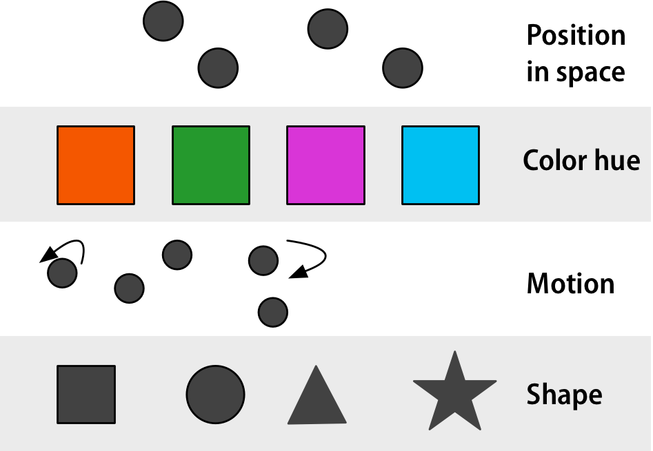
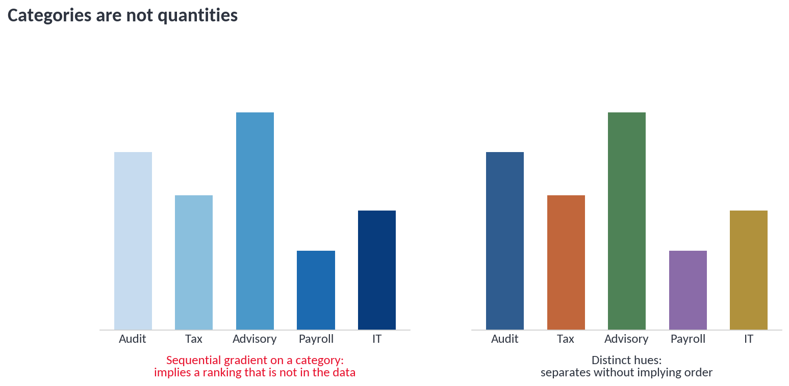
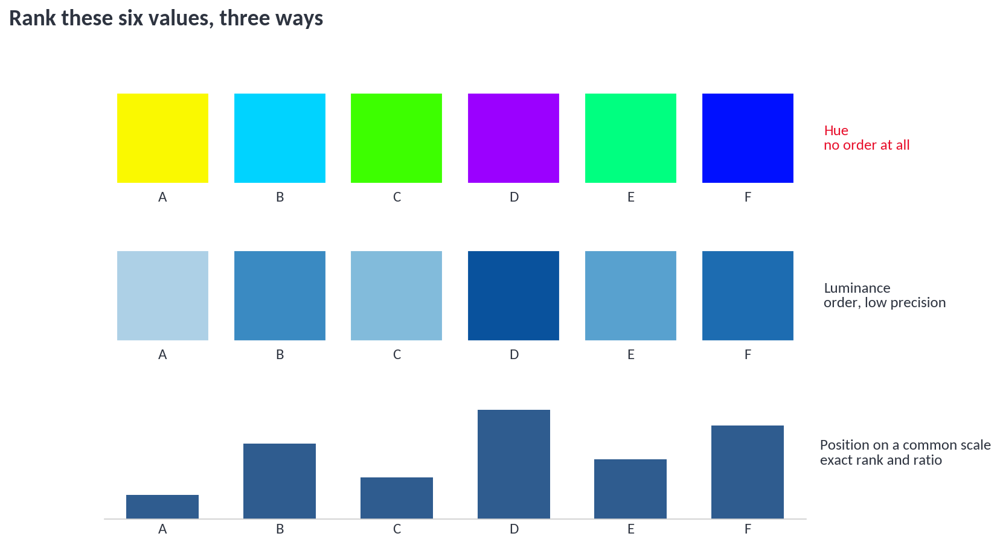
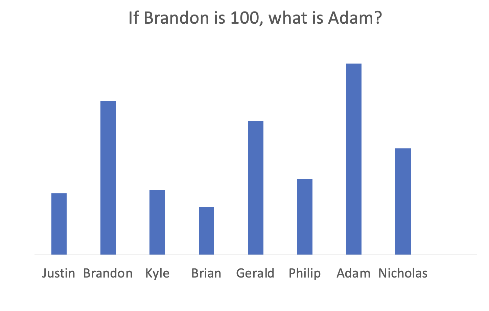
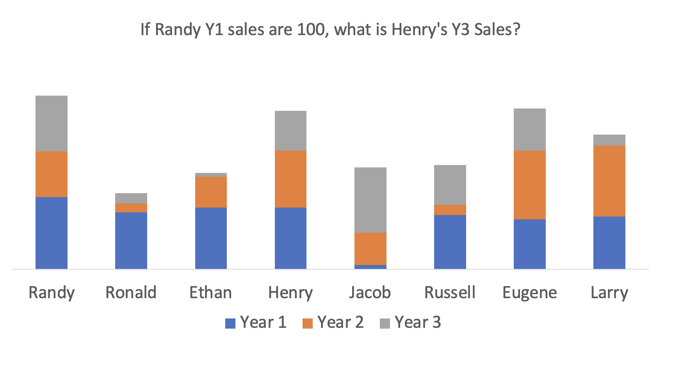
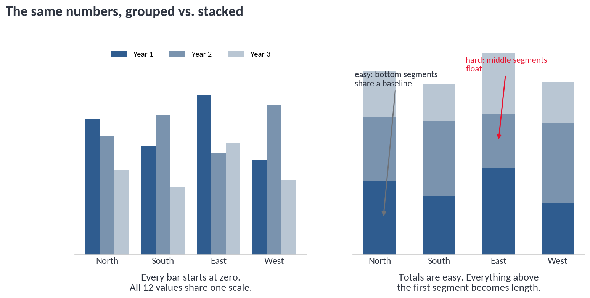
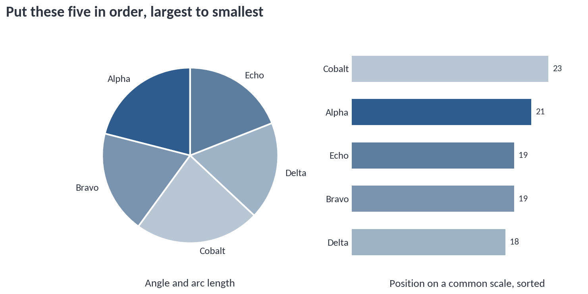

# Visual Channels

### dv31 — Mapping data to visual elements

Nathan Garrett, PhD CPA

*Department of Accounting and Information Systems, WVU*

---

## Overview

Charts turn **numbers** into
**visual properties** (a length, an angle, a shade) and hands it to a
biological visual system to decode.

Some channels are more accurate than others.

---

## Four Questions To Ask

1. Does this need a **chart** at all?
2. Which **channel** is carrying the number?
3. How **accurately** is that channel read?
4. Does the channel match the **data type**?

---

# Part 1

## Charts, Diagrams, and Tables

---

## What Is a Chart?

A **chart** maps numbers to visual elements through a consistent
function. *Chart* and *graph* mean the same thing in this course.

A **diagram** — SmartArt, an org chart, a process flow — has visual
elements but no consistent mapping from number to size. It is not a chart.

---

## A Table Is Not a Chart

A table contains rows and columns of values. It's not a chart because there is no visual encoding of the numbers.

Tables are older than charts by roughly three thousand years. 

---

## A Table Can Contain Charts

Conditional formatting with icons, data bars or fill colors turns a table into a chart.

It provides exact values, plus a visual channel that shows the pattern.

---

## Table or Chart?

When should you use a table, and when should you use a chart?

| Use a table when | Use a chart when |
| --- | --- |
| Readers need exact values | Readers need a pattern or comparison |
| There are only a handful of numbers | There are many values |
| Values are looked up individually | Values are read together |

---

## Questions 1-4

### chart · diagram · table · table containing a chart

**Q1.** A slide shows five boxes connected by arrows, labeled with the stages of the audit process. The boxes are all the same size.

*Diagram: There is no mapping from number to visual property. Nothing about the box size means anything. Useful, but not a chart.*
<!-- .element: class="fragment" -->

**Q2.** A controller needs the exact accrual balance for each of eight accounts to paste into a footnote.

*Table: Eight values, looked up individually, needed to the dollar. A chart would force her to read values off an axis and then go find the real numbers anyway.*
<!-- .element: class="fragment" -->

**Q3.** A monthly variance report lists 12 departments with a red-to-white-to-green fill behind each variance number.

*Table containing a chart: The numbers are still exact and readable, and the fill adds a color channel that shows the pattern at a glance. A good hybrid.*
<!-- .element: class="fragment" -->

**Q4.** A report shows 400 store locations plotted by square footage and annual sales.

*Chart: Far too many values to read individually, and the question is about the relationship, not any single store. Position on two common scales.*
<!-- .element: class="fragment" -->

---

# Part 2

## Visual Channels

---

## What Is a Channel?

A **visual channel** is the property doing the encoding: position,
length, angle, area, brightness, hue, shape, texture.

Your visual system processes many of these without conscious effort.

---

## Pre-Attentive Is Not Accuracy

Two ideas that get mixed up constantly:

- **Pre-attentive** — what the eye detects in under a quarter second, without searching. This is about **noticing**.
- **Accuracy** — how well you can judge *how much* a mark represents. This is a slow, deliberate task.

Color hue pops out instantly and is terrible for judging magnitude. A
channel can be excellent at one and useless at the other.

The rest of this module is about **accuracy**.

---

## Channels for Numbers

Roughly most to least accurate:

position on a common scale · position on unaligned scales or length ·
tilt or angle · area · depth · luminance · saturation · curvature · volume

---

## Channels for Categories

**Hue · shape · texture.** These separate groups without implying an order.

Only a handful of levels are usable at once — see
[dv36. Colors](../dv36-colors/index).

---

## Match the Channel to the Data Type

You should not encode a **category** with a channel emphasizing magnitude. This suggests a ranking to the reader that is not in the data. 

---

## The Other Direction

Encoding a **quantity** with hue throws away nearly all your precision.
Luminance keeps the order but not the amount.

---

## Questions 5-8

### pre-attentive but inaccurate · magnitude channel on a category · hue for a quantity · appropriate match

**Q5.** A dashboard colors each of six product lines with a distinct hue and labels the values on the bars.

*Appropriate match: Product line is categorical, and hue separates without implying order. The magnitude is carried by bar length, where it belongs.*
<!-- .element: class="fragment" -->

**Q6.** A map shades each state on a blue-to-red gradient to show which the preferred truck (Ford, Chevrolet, or Toyota).

*Magnitude channel on a category: A gradient implies "more" and "less." Company is nominal. Use distinct hues, not a ramp between them.*
<!-- .element: class="fragment" -->

**Q7.** A heatmap encodes monthly revenue as color hue. A manager asked if March beat April.

*Color is not a great channel for fine-grained comparisons. It is fine for showing overall  shape, but closely-related values can be difficult to distinguish. Use luminance or bar length instead.*
<!-- .element: class="fragment" -->

**Q8.** An analyst defends a rainbow color scale by pointing out that readers spot the red cells instantly.

*Pre-attentive but inaccurate: True and irrelevant. Popping out is about noticing, not about judging how much. Rainbow scales also reorder magnitude arbitrarily — yellow is not "between" green and red to the eye.*
<!-- .element: class="fragment" -->

---

# Part 3

## How Accurate Is Each Channel?

---

## The Evidence

**Cleveland and McGill (1984)** tested how accurately people judge
magnitudes from different chart designs.

**Heer and Bostock (2010)** replicated the study with crowdsourced
workers on Mechanical Turk.

The charts that follow come from that work, by way of
[socviz](https://socviz.co/lookatdata.html).

---

## T1 Through T5

The **dot** is average error; the **bars** are the confidence interval. The x-axis is **log error**, so **shorter is better**. A difference of 1.0 is large. **T1, T2, …** are different chart *designs* the participants were asked to read

- **T1–T3** — position on a common scale; both bars share a baseline. Error rises slightly as the bars get farther apart.
- **T4–T5** — length; the segments float inside a stacked bar with no shared baseline.

**Position on a common scale beats length.** This is why a plain bar
chart outperforms a stacked one.

---

## Group 1 — Best

Position on a common scale. Bar charts, dot plots, line charts,
scatterplots. These are the most accurate charts.

---

## Group 2 — Moderate

Unaligned scales and length: upper segments of a stacked bar, or bars in
separate small-multiple panels.

Bars are still good, but **stacking** can reduce accuracy.

---

## Group 2 — Pie Charts

A pie combines angle, arc length, and area. Popular, but less
accurate than a bar chart.

---

## Group 3 — Worst

Area. Bubble charts and treemaps. People systematically **underestimate**
large areas, and circles are read less accurately than rectangles.

---

## Questions 9-12

### *position on a common scale · length · angle · area · luminance*

**Q9.** A reader compares the height of the third segment in one stacked bar to the third segment in another.

*Length: Neither segment sits on a baseline, and the two do not share a starting point. This is the T4/T5 case — the worst-performing bar design in the study.*
<!-- .element: class="fragment" -->

**Q10.** A dot plot shows 20 counties on a single horizontal axis.

*Position on a common scale: Every dot is measured from the same origin. Highest accuracy available, and it handles more categories than a bar chart without clutter.*
<!-- .element: class="fragment" -->

**Q11.** A treemap shows 60 SKUs sized by revenue.

*Area: Low accuracy, but a defensible trade — 60 categories will not fit in a readable bar chart. Just do not ask the reader for a ratio.*
<!-- .element: class="fragment" -->

**Q12.** A dashboard shows revenue by state as a choropleth map shaded light to dark.

*Luminance: Ordered but imprecise, and the reader also has to fight the fact that big empty states get more ink than small dense ones. Good for geography, poor for magnitude.*
<!-- .element: class="fragment" -->

---

# Part 4

## Test Yourself

---

## How This Works

Each of the next six slides shows one chart and one question.

One value is set to **100**. Estimate the other.

Write your answer down *before* the reveal. The point is not the number
— it is how far off you were, and on which chart type.

---

## Estimate 1

**If Nathan is 100, what is Michael?**

*40. Two bars, same baseline, adjacent — position on a common scale. Most people land within a few points.*
<!-- .element: class="fragment" -->

---

## Estimate 2

**If Brandon is 100, what is Adam?**

*124. Same channel, but the bars are farther apart. Still accurate — error rises only slightly with distance.*
<!-- .element: class="fragment" -->

---

## Estimate 3

**If Randy's Y1 sales are 100, what are Henry's Y3 sales?**

*55. Now you are comparing a floating segment to a grounded one. This is a length judgment, and error climbs.*
<!-- .element: class="fragment" -->

---

## Estimate 4

**If Russell's Y1 sales are 100, what are his Y2 sales?**

*63. Same bar, adjacent segments — easier than Estimate 3, and still harder than a plain bar chart.*
<!-- .element: class="fragment" -->

---

## Estimate 5

**If Raymond's sales are 100, what are Billy's?**

*54. Angle plus arc length plus area, and the two slices are not adjacent. Errors here are noticeably larger than on any bar design.*
<!-- .element: class="fragment" -->

---

## Estimate 6

**If Samuel's sales are 100, what are Donald's?**

*28. Pure area, and the two rectangles have very different shapes. Area carries the largest errors of any common chart design, and comparing a tall full-height column to a small block makes it harder still.*
<!-- .element: class="fragment" -->

---

## Debrief

Which estimates were you confident about, and which were guesses?

---

## Questions 13-16

**Q13.** Why did the bar chart stay accurate even though the bars were far apart?

*Both bars still share a common baseline. Distance costs a little accuracy — the T1 to T3 gap in the study — but far less than losing the shared baseline entirely.*
<!-- .element: class="fragment" -->

**Q15.** A manager insists the pie chart "worked fine" because everyone identified the largest slice.

*Identifying the largest slice is a rank judgment on one extreme value — the easiest thing a pie does. It says nothing about whether readers can tell 23% from 19%, which is what the chart is usually asked for.*
<!-- .element: class="fragment" -->

**Q16.** Which single change would have improved five of those six charts?

*Replace the encoding with position on a common scale — a sorted bar chart or dot plot. Estimates 1 and 2 already used it, which is why they were the easy ones.*
<!-- .element: class="fragment" -->

---

# Part 5

## Mapping Chart Types to Channels

---

## The Mapping

| Chart type | Main channel | Accuracy |
| --- | --- | --- |
| Bar chart (unstacked, shared axis) | Position on a common scale | High |
| Dot plot | Position on a common scale | High |
| Line chart | Position on a common scale, plus slope | High |
| Scatterplot | Position on two common scales | High |
| Stacked bar, bottom segment | Position on a common scale | High |
| Stacked bar, upper segments | Length | Moderate |
| Small multiples / separate panels | Length | Moderate |
| Pie or donut | Angle, arc length, and area | Moderate |
| Bubble chart | Area | Low |
| Treemap | Area | Low |
| Heatmap | Luminance or saturation | Low |
| Any 3D chart | Volume or depth | Lowest |

---

## One Chart, Two Channels

A stacked bar is not one channel. The bottom segment is position on a
common scale. Everything above it is length. The total is easy. The parts are not.

---

## Sorting Is Free Accuracy

Instead of using alphabetical order, sort by the value. 

---

## The Practical Rule

Reach for area or color when you are showing rough magnitude, handling
too many categories for bars, or adding a secondary variable to a chart
that already uses position.

> If the reader needs to **compare values**, use position on a common
> scale.

But, accuracy is not everything

- A treemap handles 200 categories that would never fit in a bar chart.
- A heatmap shows a whole matrix at once.
- A map shows *where*, which no bar chart can.

---

## Questions 17-20

### bar or dot plot · line chart · stacked bar · treemap or heatmap · table

**Q17.** A board wants to know how total revenue splits across four segments, and whether each segment grew.

*Two questions, two charts. A stacked bar answers the total and the split; it will not answer "did segment three grow" reliably. Add a small-multiple line or bar chart per segment.*
<!-- .element: class="fragment" -->

**Q18.** An analyst must show 150 vendors by spend so leadership can see the concentration at the top.

*Treemap, or a bar chart of the top 20 with the rest grouped as "Other." A 150-bar chart is unreadable; the treemap trades ratio accuracy for the shape of the distribution.*
<!-- .element: class="fragment" -->

**Q19.** A dashboard tracks one KPI monthly for three years.

*Line chart: Position on a common scale plus slope, and slope is what a trend question is actually asking about. A 36-bar chart would work but reads worse.*
<!-- .element: class="fragment" -->

**Q20.** A CFO needs to cite exact headcount for each of six divisions in a footnote.

*Table: Six values, needed exactly, read one at a time. Add conditional formatting if you also want the pattern.*
<!-- .element: class="fragment" -->

---

# Putting It Together

## Overall Review

---

## Review 1 — Chart or Not

**R1.** Your manager wants exact revenue for each of six regions to paste into a memo. Table or chart, and why?

*Table. Six values, needed to the dollar, looked up individually. A chart would force a second lookup to get the real numbers. Consider data bars in the table if he also wants the pattern.*
<!-- .element: class="fragment" -->

**R2.** Is an org chart a chart? Is a Gantt chart?

*An org chart is a diagram — box size encodes nothing. A Gantt chart is a chart: bar position and length map to start date and duration through a consistent function.*
<!-- .element: class="fragment" -->

**R3.** A colleague says tables are old-fashioned. What is the actual dividing line?

*Not age — the question being asked. Tables serve individual lookups of exact values; charts serve patterns read across many values. The Linear B tablet is 3,200 years old and still the right tool for an inventory.*
<!-- .element: class="fragment" -->

**R4.** When does a table become the more *honest* choice?

*When there are few enough values that a chart adds no pattern, or when precision matters more than shape. A bar chart of three numbers is decoration.*
<!-- .element: class="fragment" -->

---

## Review 2 — Channels

**R5.** A dashboard encodes "department" using a blue-to-red gradient. What is wrong with that choice?

*Department is categorical; a sequential gradient is a magnitude channel. It implies a ranking that does not exist and invites readers to interpret dark as "more." Use distinct hues.*
<!-- .element: class="fragment" -->

**R6.** Name a channel that is excellent pre-attentively and poor for accuracy, and explain the distinction.

*Hue. A red mark among gray marks is found in under a quarter second — that is noticing. Asking how much bigger the red value is requires magnitude judgment, and hue carries almost none.*
<!-- .element: class="fragment" -->

**R7.** You need to add a third variable to a scatterplot that already uses both position axes. What are your options and what do they cost?

*Size (area), hue, or shape. Area for a quantity, hue or shape for a category — and all three are low-accuracy channels, so use them for the variable the reader needs least precisely.*
<!-- .element: class="fragment" -->

**R8.** Why is luminance a better choice than hue for a quantity, and still a poor one?

*Luminance has a natural order — darker reads as more — so the ranking survives. Precision does not. Readers can tell "high" from "low" but not 38 from 44.*
<!-- .element: class="fragment" -->

---

## Review 3 — Accuracy

**R9.** You have a stacked bar chart of revenue by region and product line. Which comparisons are easy and which are hard?

*Easy: total per region (the full bar height, on a common scale) and the bottom segment across regions. Hard: any upper segment across regions, because those float and become length judgments.*
<!-- .element: class="fragment" -->

**R10.** Why does a bubble chart understate large values?

*Area is a compressive channel — people systematically underestimate large areas. If the software also scales by radius rather than area, the chart overstates instead. Both are failures of the same channel.*
<!-- .element: class="fragment" -->

**R11.** The x-axis on the Cleveland and McGill charts is log error and the bars are confidence intervals. What does a *short* bar far to the left mean?

*Low average error and high agreement among readers — the design is both accurate and reliable. Long bars mean readers disagreed, which is its own warning.*
<!-- .element: class="fragment" -->

**R12.** Two designs differ by 1.0 on the log error scale. Is that a lot?

*Yes. On a log error scale, 1.0 is a large gap — the difference between a design readers get about right and one they routinely misread. It is not a rounding difference between chart types.*
<!-- .element: class="fragment" -->

---

## Review 4 — Choosing

**R13.** A client asks for a 3-D pie chart of the revenue split. Give the two-sentence answer.

*A pie already asks readers to judge angle and area, the moderate group; 3-D adds volume and perspective, the worst channels on the list. A sorted bar chart or a plain pie with labeled percentages shows the same split without spending accuracy on decoration.*
<!-- .element: class="fragment" -->

**R14.** You must show 80 branches by profitability, and leadership cares about the bottom ten.

*Sort and show the bottom ten as a bar chart, with the rest summarized or in an appendix table. The question is about ten values, not eighty — do not use a treemap to answer a question about a few specific branches.*
<!-- .element: class="fragment" -->

**R15.** Name three chart choices where trading accuracy away is defensible, and what you get in return.

*Treemap — hundreds of categories in one view. Heatmap — a whole matrix at once. Map — geography, which no bar chart can show. Each trades ratio precision for something a high-accuracy channel cannot provide.*
<!-- .element: class="fragment" -->

**R16.** In one sentence each, state the rule that follows from the channel ranking, from the data-type match, and from the table-versus-chart distinction.

*Ranking: if values must be compared, use position on a common scale. Data type: magnitude channels for numbers, hue and shape and texture for categories. Table vs. chart: exact individual lookups get a table, patterns across many values get a chart.*
<!-- .element: class="fragment" -->

---

## Summary

Before choosing a chart type:

- **Chart at all?** → exact lookups belong in a table
- **Which channel?** → name the property carrying the number
- **How accurate?** → position beats length beats angle beats area
- **Which data type?** → magnitude channels for numbers, hue and shape for categories
- **What did you trade?** → and did you get something worth it

Questions?
