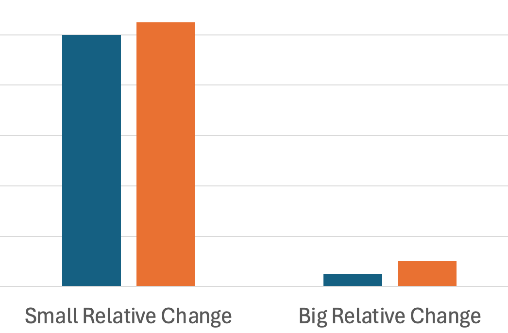
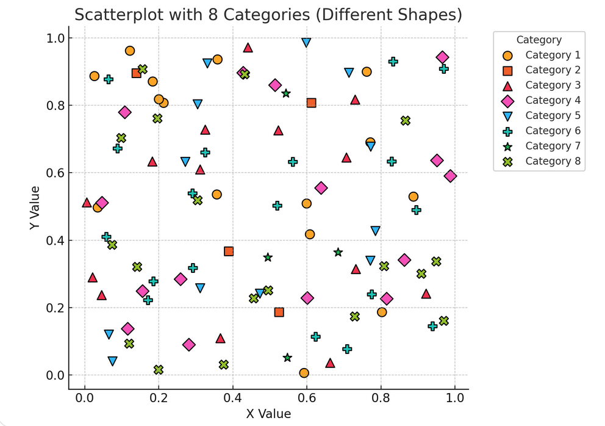
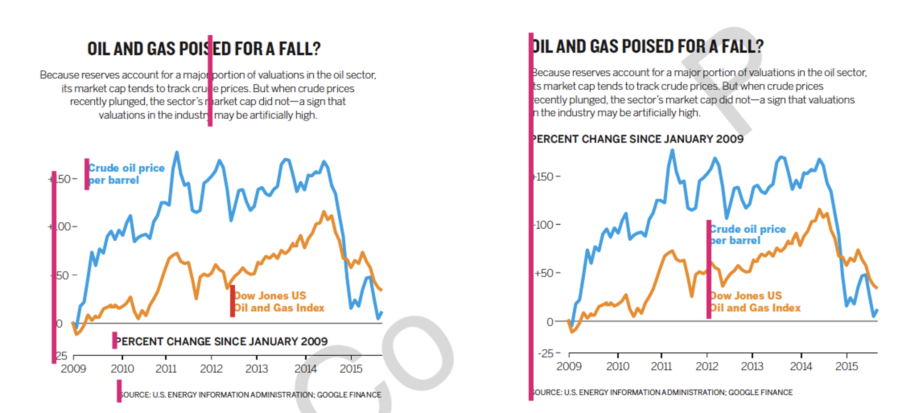
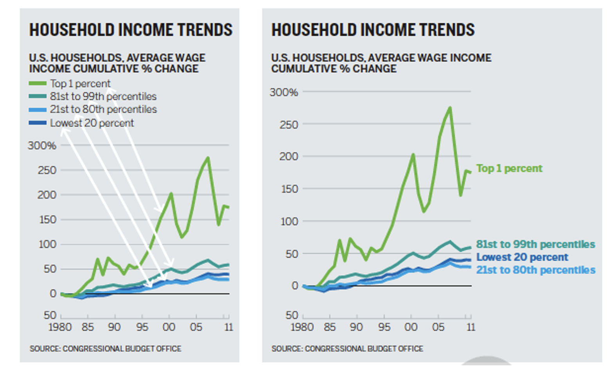
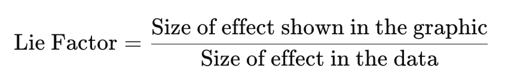
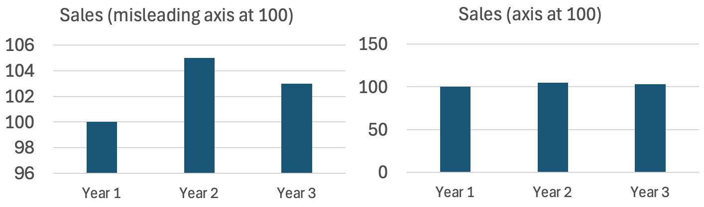

# Visual Perception

Our eyes take visual input and convert it into meaning. However, they have a lot of quirks that affect how we interpret information in charts.

**Outcomes**:
- Describe the structure of the human visual system
    - Define fovea, saccades, and blind spot
    - Explain how eye movement affects visual perception
    - Explain shape memory, color memory, selectivity blindness, and flanker blindness
    - Differentiate between pop-out and slow visual search
- Explain Weber's Law: how people see changes as relative versus absolute 
- Explain Steven's psychophysical power law
- Explain Miller's Law: how the 5 +/-2 rule applies to visual designs
- Explain how the gestalt principle of proximity influences visual grouping in charts.
- Detect cases of visual clutter and propose strategies to reduce cognitive load.
- Explain the Lie Factor and Proportionality Principle

**Links**:
- [Quizlet](https://quizlet.com/1148660564/dv35-visual-perception-flash-cards/?new)

## What is your visual system?

Your visual system includes your eyes and your brain. Your eyes take in light, and convert it into electrical signals. These signals are then processed by your brain to create a visual representation of the world. However, your visual system has a lot of limitations that we need to understand when creating visualizations.

### Field of view

Human eyes take in a broad visual field, but **only a tiny central region is actually seen with high precision**. This small zone is the **fovea**, a densely packed cluster of cone cells responsible for sharp detail, color accuracy, and fine visual discrimination (like reading or recognizing faces).

Everything outside the fovea is processed with **much lower resolution**. Peripheral vision detects motion, contrast, and general shapes but cannot provide fine detail. As a result, we constantly move our eyes—through rapid **saccades**—to bring different parts of a scene into the fovea. This creates the _illusion_ of seeing everything sharply at once, even though at any instant only a tiny point is in true focus.

Each eye has a location on the retina where the optic nerve exits.  That region has **no photoreceptors**, meaning it can’t detect light at all.  This should produce a noticeable hole in your vision, but you never see it because your brain uses clever neural tricks that create the _illusion_ of continuous, stable vision.

- **Filling-in:** The brain automatically “paints over” the missing area using nearby colors, textures, and patterns.
- **Redundancy from both eyes:** The blind spots of your two eyes are in different locations; one eye covers what the other misses.
- **Assumption of continuity:** The visual system expects smooth, continuous surfaces and fills gaps accordingly.

As a result result you perceive a complete visual field even though a chunk of it contains zero input.

### Eye Movement

Your eyes make rapid jumps called **saccades**—hundreds of them every minute.  During each jump, the image sweeping across the retina should look like a blur.  It doesn’t, because the visual system **suppresses** that input. 

The brain creates the impression that you see a steady scene, even though your eyes are jumping 3–4 times per second. It uses the following tricks:

- **Saccadic suppression:** Just before and during a saccade, the brain temporarily reduces visual sensitivity, preventing the smear from reaching awareness.
- **Predictive remapping:** Neurons shift their receptive fields just before the eye moves, preparing for where objects _will_ appear after the jump.
- **Continuity illusion:** After each saccade, the brain stitches together the stable snapshots into a smooth sense of the world.

### Overload
We do not actually see all of the information taken in by our eyes. Instead, our visual processing systems must decide how to interpret information. Our brain has multiple processing systems that work together to help us see the world.

As a result, this visual system can be overloaded. Overload happens with task (being asked to do too much). It can also be limited by physical limits of our eyes (such as limited focal view). As your brain deals with overload, it selectively focuses on certain things, screening out stimulus that is not needed.

- **Shape Memory**: Humans can only distinguish up to 4 shapes at one time. This rule also applies to the number of shapes that can be distinguished. Typically, humans can quickly count up to 4 items. But, more than that requires significantly more effort. Humans are good at estimating, but can not provide an exact count.
- **Color Memory**: Humans can only distinguish up to 7 colors at one time. Similar to shape memory, humans can only remember a limited number of colors at one time.
- **Selectivity Blindness**: When overloaded, the visual system will screen out information that is not needed. This can lead to missing important information. For example, people watching a basketball game, and asked to count the number of times a ball is passed, will miss a person in a gorilla suit walking across the court.
- **Flanker Blindness**: While people may be able to easily interpret a single character, adding similar characters closely by it will decrease their performance.  This blindness can be partially explained by our small focal view. We see a small range of items very clearly, but quickly this 'fuzzes out' as we move into a larger visual view. Moving things into the focal window increases interference. The crowding effect makes it hard to identify items that are close together.
    - Interestingly, while we struggle to identify individual items, we are rather good at averaging information. For example, you can identify the general tilt of a series of circles in orbit around a target.
- **Pop-out v. slow visual search**: Some visual patterns are easy to identify quickly, while others require slow, deliberate searching. This is because our visual system is optimized to detect certain types of differences rapidly.
    - Finding a single bright object in a field of dark items is easy. In contrast, finding a backwards C in a field of Cs is slow. In the first case, our visual perception system easily identifies a difference. But, in the second, we must individually examine each point to identify the backwards C.
    - Part of the reason for this difference is the design of the visual system. Perception starts at a low level, such as recognizing edges or colors. It then goes into higher systems that groups these individual perceptions together into items. Graphics that let processing happen that the lower level are then easier to process. Similarly, spatial relationship perception is also very slow. For example, trying to find a gray/black square with the gray on top, and black on bottom, among a field of similar reversed objects, is very slow.

## Common Visual Perception Laws

Beyond these general principles of how our visual system works, there are a number of specific laws that describe how we interpret visual information. Understanding these laws can help us design better visualizations.

### Weber's Law: _Relative_ vs. _Absolute_ Changes

Humans tend to interpret data **relatively** (by comparison), not in isolation.

Weber’s Law says that our ability to interpret a percentage change is relative to the absolute value. We can intuitively understand this by imaging our ability to detect a 1lb change. If we are holding 1lb, then it is easy to detect the change, but if we holding 100lbs, then it is very difficult.

Formally, the **just noticeable difference (JND)** between two stimuli is a constant **proportion** of the original stimulus.

If you’re holding a weight of 100g, and the JND is 2g, then for a 200g weight, the JND would be 4g. The ratio remains constant:

Weber's Law applies to visual perception. Look at the example below. The the change on the left is less significant than the change on the right.

Be sure of what you're trying to communicate. Are you trying to communicate an absolute number, or the change?

## Steven's Psychophysical Power Law

**Stevens’ Power Law** describes the relationship between the **actual intensity of a stimulus** and how that intensity is **perceived** by a human observer. It refines and replaces earlier models like **Weber–Fechner Law**, especially for a wider variety of sensory experiences. 

The graph below shows that we perceive actual changes in stimulus at a different rate than the underlying value actually changes. For example, we perceive a small change in electrical shocks as a big change. We have the opposite direction for brightness, perceiving large changes as small changes.

[source: Visualization Analysis and Design by Tamarna Munzner](https://www.oreilly.com/library/view/visualization-analysis-and/9781466508910/)

## Miller's Law: Working Memory (5 ± 2) Rule

The **“5 ± 2” rule**, also known as **Miller’s Law**, originates from a 1956 paper by psychologist **George A. Miller** titled _"The Magical Number Seven, Plus or Minus Two"_. It refers to the idea that the **average person can hold about 7 (plus or minus 2)** discrete items in **working memory** at one time—so roughly **between 5 and 9** items. Modern research sometimes suggests the working memory capacity is closer to **4 chunks**, depending on the complexity of the information (Cowan, 2001).

It applies specifically to **short-term memory**, not long-term learning. The term **chunk** refers to a meaningful unit, not necessarily a single item. By "chunking," we can expand what’s stored in memory.

As pratical examples:
* Menu designers group related items (drinks, entrees, etc...)
* Use 3-5 bullet points on a slide 
* Visually group survey fields into similar groups using proximity
* Limit navigation menus to 5-7 items at each level

Miller's Law means that people can only remember **4 chunks** of information without external aids. The below chart violates this by requiring that people recall too many different categories.

How does this change our chart designs?
- Help users chunk information by using conventions (green = good, red = bad, cause on the x axis, effect on the y-axis, etc..)
- Break complex charts apart into separate to help users process individual points

Know the difference between *exploratory* and *confirmatory* visual designs. While exploring a dataset, you'll often overload information to detect trends. But, when it is time to communicate your results, you'll generally need to drastically simplify the charts to make the understandable.

## Gestalt Principle of Proximity 

Gestalt principles help users **intuitively group** related items. The most important one for graphics proximity. This is the idea that items close together are perceived as related.    

Improve your dashboards by placing white space between charts, and placing related charts side-by-side. The below illustrates the need for careful white space

Improve individual charts by reducing alignment points. While center items often feels like a good idea, in practice it can greatly add to the number of alignment points for the eye to *catch* on.

You can also improve charts by reducing eye travel. Try to minimize distance between legends and data points, as well as comparisons between different parts of the chart.

Avoid visual noise—**every element should serve a purpose**.

## Proportionality & Lie Factor

**Proportionality** refers to the principle that **visual representations in charts should accurately reflect the numerical quantities they represent**. This means the size, length, area, or angle of a visual element (like a bar, circle, or slice) must be **proportional** to the data value it encodes.

*Source: Tufte's The Visual Display of Quantitative Information*

The Lie Factor was introduced by Edward Tufte in _The Visual Display of Quantitative Information_. While it has been replaced with better measures, the **Lie Factor** is still an intuitive way to measure distortion in a chart.

- If **Lie Factor ≈ 1** → the graphic is accurate.
- **Lie Factor > 1.05 or < 0.95**, Tufte considered it **misleading**.
   
Unfortunately, Excel often starts the axis at 100 in bar charts. The bar chart on the left greatly overstates the change between years 1-3. A corrected version is shown on the right.

A better way to show change with the base number is very large is to use a line chart, and state your values at % differences from the base year. Line charts are more often used to represent ratio values (instead of absolute values).

Common sources of proportionality errors are:

- Using **area** or **volume** instead of **length** to represent 1D quantities (e.g., circle size).    
- 3D effects that **inflate perception**.    
- Non-zero baselines on bar charts.    
- Inconsistent axis scaling.    
- Icon repetition (e.g., duplicating icons for count) without accounting for perceptual grouping. 

