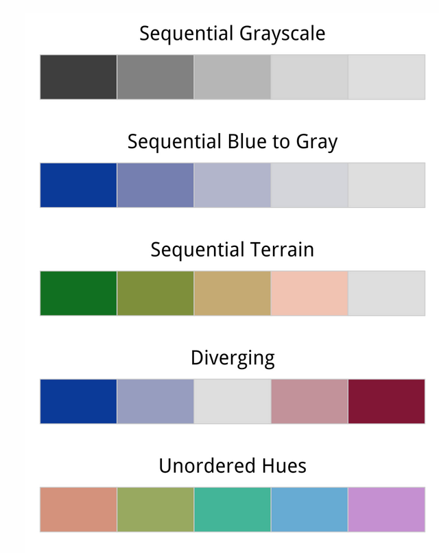
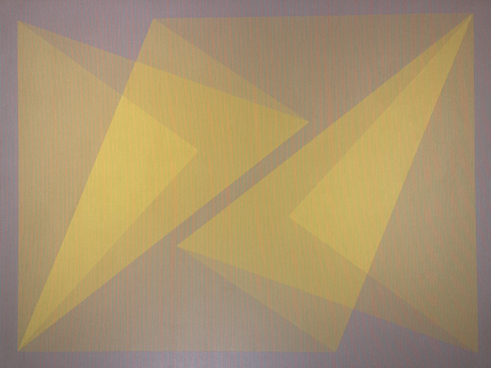

# Using Colors

**Outcomes**:
- Describe how many people are color blind
- Describe the most common form of color-blindness
- Differentiate between diverging, categorical, and sequential color scales
- Describe the emotional impact of different colors and how to use this in your visualizations
- Describe major color scales and the major reason to use each one

**Links**

- [Color Blindness](https://www.theverge.com/23650428/colorblindness-design-ui-accessibility-wordle)
- [Color: From Hexcodes to Eyeballs](https://jamie-wong.com/post/color/)
- [Saccades and other weird things your eyes do](https://imgur.com/gallery/XNlmPi8)
- [Accessible data visualizations](https://ucdavisdatalab.github.io/workshop_data_viz_principles/accessible-data-visualizations.html) 
- [Activity: What is your color JND?](https://www.keithcirkel.co.uk/too-much-color/)
- [Activity: Is my blue your blue?](https://ismy.blue/)
- [Color scales](https://socviz.co/lookatdata.html#color)

**Common exam mistakes**:
- Avoid red/green colors scales
- Match the emotional meaning of color to the data (for example, using red for negative values and blue for positive values)
- Use the appropriate color scale for the type of data you are showing (for example, using a diverging color scale for data that has a meaningful midpoint, such as profit vs loss, and using a sequential color scale for data that has a natural order, such as population or sales)

## Color Blindness

Around 1% of women and 8% of men are color blind. The most common form of color-blindness is red-green color blindness, which makes it difficult to distinguish between red and green colors. This can be a problem for data visualizations that rely on these colors to convey information. To make your visualizations more accessible, you can use color palettes that are designed to be color-blind friendly. 

In general, avoid green/red color combinations, and instead use blue/orange or purple/yellow combinations. You can use green/red if that information is redundant with another visual property (for example, if you are using both color and shape to differentiate between categories, then you can use green/red for the color since the shape will provide an additional cue for those who are color-blind).

## Color Scales

Understand the three different types of color scales and when to use each one:

- Diverging: when we are showing good, bad, and neutral values (for example, profit vs loss)
- Categorical: when we are showing different categories that do not have a natural order (for example, different regions or product categories)
- Sequential: when we are showing a range of values that have a natural order (for example, population or sales)

Source: [Socviz.co](https://socviz.co/lookatdata.html)

## Color Emotion

Colors also have emotional associations that can impact how people interpret your visualizations. For example, red is often associated with danger or urgency, while blue is associated with calmness and trust. When choosing colors for your visualizations, consider the emotional impact of the colors you are using and how they might influence the interpretation of your data. For example, if you are showing a decrease in sales, using red might reinforce the negative connotation, while using blue might make it feel less urgent.

## Just for fun

We do not all interpret color the same. The link below compares your perception of blue versus green.
[Is my blue your blue?](https://ismy.blue/)

Our eye links movement. Even though the pixels do not move very far, we interpret the overall pattern as them falling down the page.

[Dot illusions](colors-illusion-dots.mp4)

Crowding together lines of text makes it less readable. Your also is able to *fill in* details for fuzzy elements when we are far away from the image.

[Space between lines / letters](https://www.youtube.com/watch?si=faN_Tz3MJ9m6I3Em&v=JTKwpqE9fsc)

The picture below looks yellow, but looking more closely at it reveals that it has alternating green and red lines. Your eye combines the two colors into yellow.

