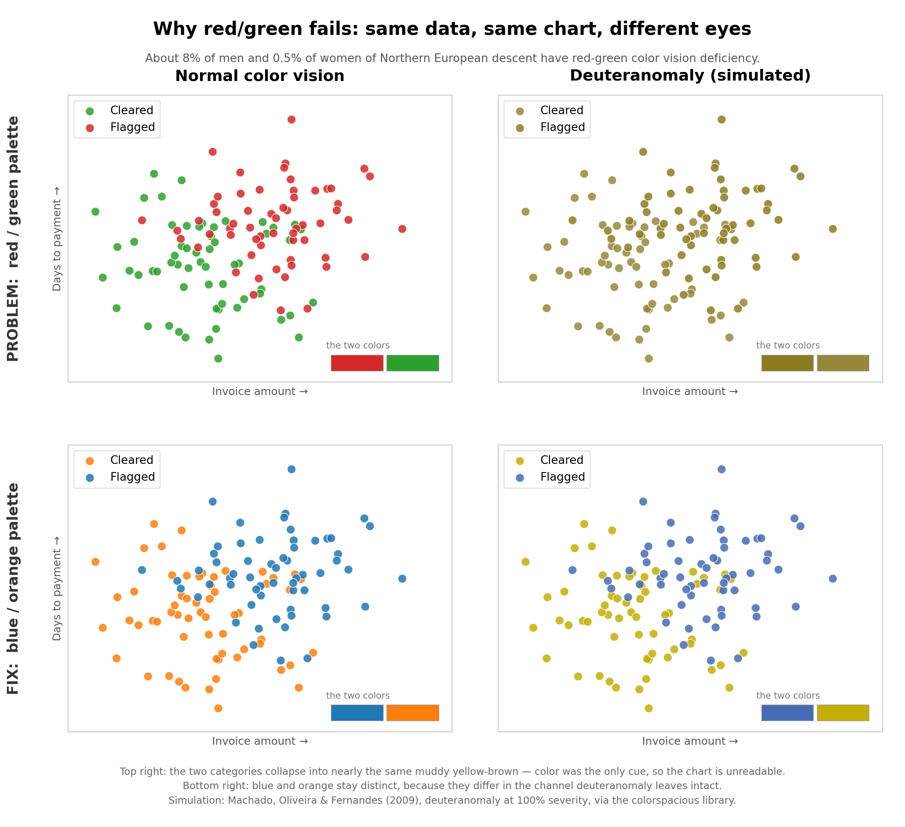
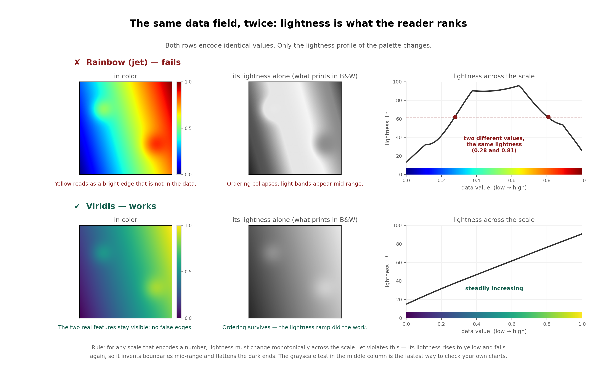
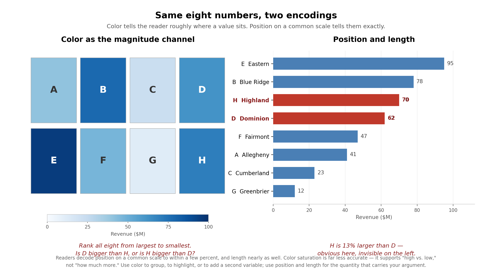
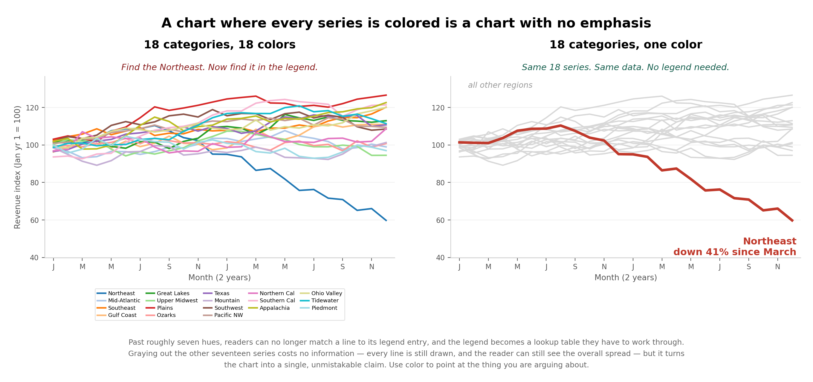
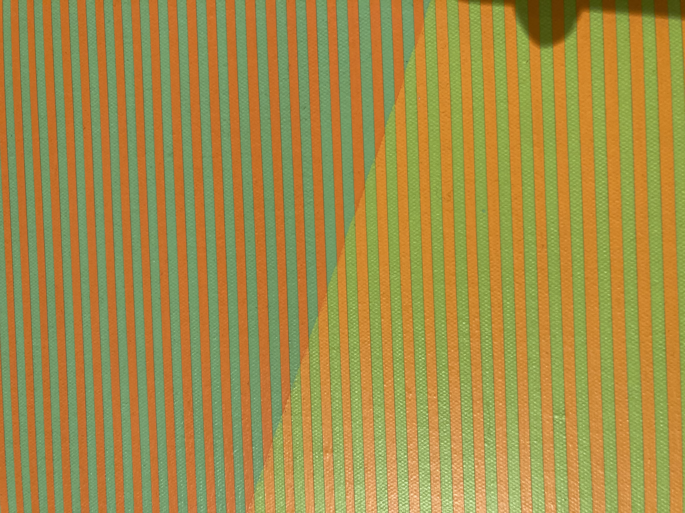
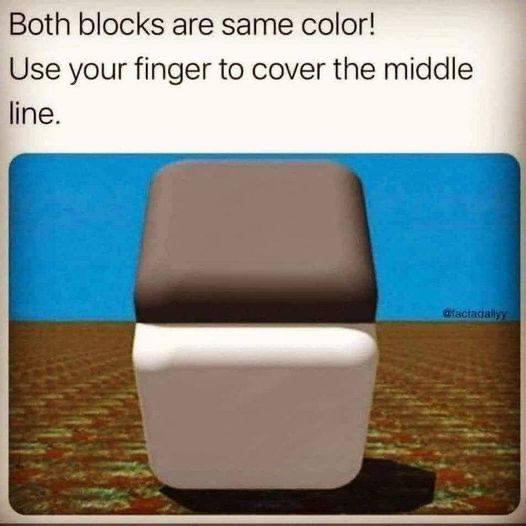
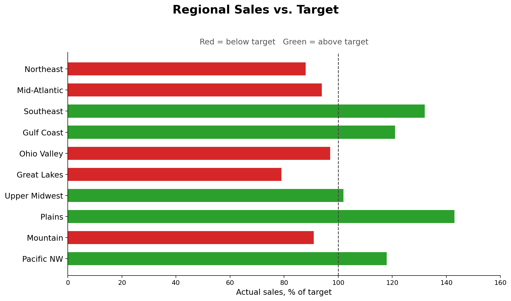
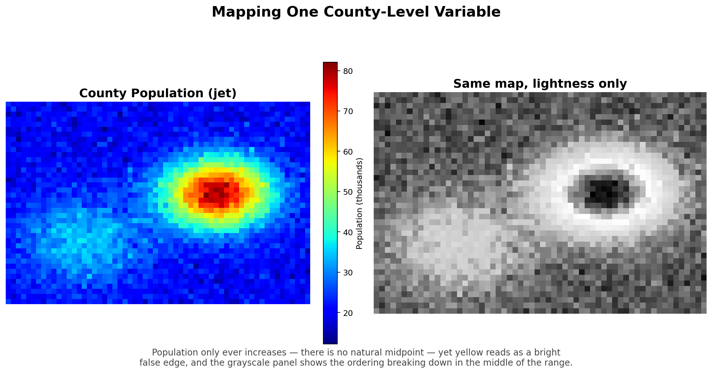
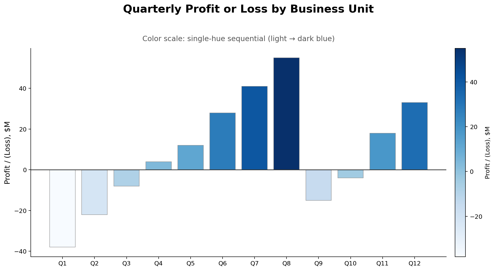
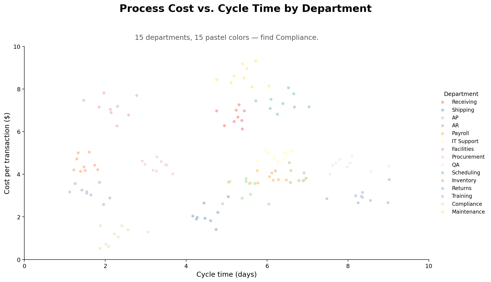

# Using Colors

### dv40 — Choosing and Testing Color in Visualizations

Nathan Garrett, PhD CPA

*Department of Accounting and Information Systems, WVU*

Note: Arrow keys or space to advance. Down arrow reveals answers on question slides.

---

## Why This Module Exists

Color **is not decoration**, but an **encoding** like position or length.

Major challenges:

1. Can **every reader**, including one with color vision deficiency,
   still get the message?
2. Does the data have a **sequential**, **diverging**, or **categorical**
   structure?
3. Is color carrying a **precise magnitude**, or grouping and emphasis?
4. Does the palette still work in **gray**, in **print**, and at the
   **size** it will actually be shown?

---

# Part 1

## Seeing Color

---

## Color Vision Deficiency

About **8% of men** and **0.5% of women** of Northern European descent
have red-green color vision deficiency.

The most common specific form is **deuteranomaly** — a green cone whose
sensitivity has shifted toward red, not a missing cone. The result is
**compressed discrimination**, not blindness: someone with deuteranomaly
still sees red and green, but cannot reliably tell them apart. 

---

## Color Vision Deficiency, Illustrated

---

## Redundant Encoding

**Never let color be the only carrier of meaning** (WCAG 1.4.1).

- Prefer *blue/orange* or *purple/yellow* over *red/green*
- Use *red/green* only when also 
  carried another way (i.e., shape or position)
- Default to redundant encoding for colors

---

## Questions 1-3

*color vision deficiency · deuteranomaly · redundant encoding ·
direct labeling*

**Q1.** A fraud-analytics dashboard flags suspicious transactions as red
dots scattered among green "cleared" dots, with nothing else to tell
them apart.

*Color Vision Deficiency / Redundant Encoding: Roughly 8% of men (about 1 in 12) cannot reliably separate red from green, especially for small scattered marks. Because red is the only carrier of "flagged," those reviewers cannot use the chart. Add a shape, border, or direct label as a second channel.*
<!-- .element: class="fragment" -->

**Q2.** A student says a colleague with deuteranomaly "just can't see
red or green."

*Deuteranomaly: This is a common misconception. Deuteranomaly is a shifted green cone sensitivity, not a missing one — the person sees both colors but has compressed discrimination between them. Complete inability to see a hue (dichromacy) is rarer and different.*
<!-- .element: class="fragment" -->

**Q3.** Two dashboards use only two colors, no labels, no shapes:
Dashboard A is red/green, Dashboard B is blue/orange. Which is safer
for readers with red-green color vision deficiency, and why?

*Redundant Encoding: Dashboard B. Deuteranomaly compresses discrimination specifically along the red-green axis; blue and orange differ on a channel that shift leaves intact. Best practice is still to add a redundant cue to either dashboard — but forced to pick colors alone, blue/orange survives where red/green does not.*
<!-- .element: class="fragment" -->

---

# Part 2

## Choosing a Color Scale

---

## Three Types of Color Scales

- **Sequential** — data with a natural low-to-high order and **no
  meaningful middle** *(population, sales, transaction counts)*
- **Diverging** — data with a **meaningful midpoint** *(zero, an average, a budget target, a break-even point)*
- **Categorical** — unordered groups *(region, product line, department)*

---

## The Most Common Mismatch

A **sequential** scale applied to profit and loss hides the
break-even point.

A **diverging** scale applied to population **invents** a midpoint that
does not exist.

---

## Lightness Does the Work

When color encodes a *number*, readers get almost all their information
from **lightness**, not hue.

> For any scale that encodes a number, lightness must be perceived as a common change aacross the scale.

The rainbow ("jet") scale fails at this goal. Its lightness rises and
falls, so yellow reads as a bright false boundary.

---

## The Grayscale Test

A quick check that needs no special software:

**Convert the chart to grayscale.** If the ordering still reads
correctly, the palette's lightness is ok and the scale works.
If everything collapses into similar grays, you were relying on hue
alone.

Palettes such as **viridis** and **cividis** are built to pass this
test by design.

---

## Questions 4-6

*sequential scale · diverging scale · categorical scale · lightness · rainbow (jet) scale · grayscale test*

**Q4.** A university dashboard shades each state by change in
enrollment versus last year (ranging from -12% to +9%) using a
single-hue scale that runs light-to-dark based on the raw percentage.

*Wrong Scale (needs Diverging): Enrollment change has a meaningful midpoint — zero, no change — so it needs a diverging scale. A sequential ramp hides exactly where growth turns into decline, and a small decline can look like a small increase.*
<!-- .element: class="fragment" -->

**Q5.** A retail dashboard colors each store's revenue using a rainbow
palette running blue (lowest) through green and yellow to red
(highest).

*Rainbow (Jet) Scale: Revenue is sequential with no natural midpoint, and jet's lightness rises and falls rather than moving in one direction. This invents a bright false boundary at the yellow stores and hides real differences at the dark blue and dark red ends. Replace with a sequential scale.*
<!-- .element: class="fragment" -->

**Q6.** An analyst wants to check whether a new sequential palette will
read correctly, without running any special software.

*Grayscale Test: Convert the chart to grayscale, or print it in black and white. If the data's order still reads from light to dark, the lightness ramp is ok and the scale will work.*
<!-- .element: class="fragment" -->

---

# Part 3

## Magnitude, Volume, and Emphasis

---

## Color Is a Weak Channel for Magnitude

Position on a common scale is read most accurately; length is next;
area, angle, and color trail well behind. Readers can compare two bar
**lengths** to within a few percent. They cannot tell you that one
shade of blue is 1.4 times another.

If the reader must **compare quantities**, use position or length.
Reserve color for grouping, highlighting, and rough magnitude.

---

## How Many Colors, and Where to Point Them

Categorical palettes stop working past about **seven** hues — beyond
that, readers cannot match a chart color to its legend entry.

The single most useful technique: **gray out everything, then color
the one thing you are talking about.** A chart where every series is
colored is a chart with no emphasis at all.

---

## Small Marks Need Stronger Colors

The same fill color reads differently depending on how much of it there
is.

- **Large areas** (bars, map regions, backgrounds) can use muted,
  desaturated colors without disappearing
- **Small marks** (scatter points, thin lines) need more saturated,
  higher-contrast colors, because the eye has less area to judge from

A palette tuned for a bar chart can look washed out on a scatterplot.

---

## Questions 7-9

*weak channel for magnitude · position/length · categorical hue limit
(~7) · highlight technique · saturation for small marks*

**Q7.** A board deck shows nine regional revenue figures as a strip of
colored squares (a "heat strip") and asks the board which two regions
are within 2% of each other.

*Weak Channel for Magnitude: Readers can judge bar length or position within a few percent, but cannot reliably judge that one color shade is close to another. Redraw as a sorted bar or dot chart so the comparison uses position or length.*
<!-- .element: class="fragment" -->

**Q8.** A dashboard uses 14 distinct hues for 14 cost centers with a
side legend, and users keep asking "which color is Facilities again?"

*Categorical Hue Limit: Readers can reliably match color to a legend for roughly seven categories; past that the legend becomes a lookup puzzle. Group the smallest cost centers into "Other," split into small multiples, or gray out all but the one or two under discussion.*
<!-- .element: class="fragment" -->

**Q9.** A scatterplot with hundreds of small, thin points uses the same
medium-saturation palette that looks fine on the department's large
filled bar charts.

*Saturation for Small Marks: The eye has less area to judge color from a thin point than from a large fill, so a saturation level that reads fine on a bar chart looks washed out as scattered points. Increase saturation and contrast for small marks.*
<!-- .element: class="fragment" -->

---

# Part 4

## Culture, Testing, and Interpretation

---

## Color Emotion and Culture

Colors carry associations that shape interpretation before a reader
sees a single number — and these associations are **learned, not
universal**.

- In the US and Europe, red means loss in financial reporting. In
  China, Japan, Korea, and Taiwan, red conventionally means **gains**
  and green means losses — the opposite convention.
- In the US, red and blue are bound to political parties; a red-blue
  scale on a US map reads as partisan no matter what it measures.
- Hold color meaning **constant** across every chart in a set.

---

## Test Your Palette

Do not stop at "I avoided red and green."

1. **Simulate** color vision deficiency (Color Oracle, Viz Palette)
2. **Convert to grayscale** and confirm ordered scales still read as
   ordered
3. View the chart at the **size** it will actually be shown — a
   projector crushes contrast
4. **Print** it in black and white; someone will

---

## Interpretation Demonstrations

The eye combines small adjacent colors into one perceived color
(**optical mixing**). A fill color also looks different depending on
what surrounds it (**simultaneous contrast**) — this is why colored
regions that are not adjacent cannot be reliably compared.

---

## Optical Mixing, Closer Look

Up close, the red and green lines are obvious. From a normal viewing
distance, they blend into yellow. Your eye does the mixing — the paint
never changes.

---

## Simultaneous Contrast

Readers cannot reliably compare two colored regions unless they sit
**adjacent** to each other, or share a common reference point.

---

## The Eye Invents Movement

The pixels barely move, yet the pattern reads as falling down the page.
Perception adds motion that is not in the data — a reminder that what
you *see* in a chart is not a direct readout of what is *there*.

---

## Identify the Concept

Name which concept applies:

*color culture/convention · consistency · CVD simulation · grayscale
test · optical mixing · simultaneous contrast*

---

## Questions 10-12

**Q10.** A US-based analyst sends a report to a supplier in Seoul using
red bars for revenue gains and green bars for revenue declines,
matching the firm's usual internal color scheme.

*Color Culture/Convention: In South Korea, as in China, Japan, and Taiwan, red conventionally signals gains and green signals losses — the reverse of the US financial-reporting convention. The chart will likely be misread even though it is technically correct.*
<!-- .element: class="fragment" -->

**Q11.** A presenter says they "avoided red and green entirely" in a
chart and considers the accessibility work done.

*Testing the Palette: Avoiding one color pair is one check, not the whole test. The presenter should also simulate CVD with dedicated software, confirm the chart survives a grayscale conversion, and view it at the size and medium it will actually be shown.*
<!-- .element: class="fragment" -->

**Q12.** Two shapes in a painting are literally the same gray, but a
reviewer insists one looks darker because of the colors around it.

*Simultaneous Contrast: The same fill color appears different depending on its surroundings. This is why two colored regions that are not physically adjacent — such as counties on opposite ends of a map — cannot be reliably compared by eye alone.*
<!-- .element: class="fragment" -->

---

## Overall Review

--

## Problem 1

What is wrong with this chart's use of color? How would you fix it?

No redundant encoding — red vs. green is the only cue for above/below target. Add direct data labels or a pattern so the message survives for readers with color vision deficiency.
<!-- .element: class="fragment" -->

--

## Problem 2

What is wrong with this chart's use of color? How would you fix it?

Rainbow (jet) scale on sequential data — population only increases, but jet's lightness rises and falls, inventing a false bright boundary and hiding the true high-population area. Use a sequential scale such as viridis.
<!-- .element: class="fragment" -->

--

## Problem 3

What is wrong with this chart's use of color? How would you fix it?

Sequential scale on diverging data — profit/loss has a meaningful midpoint at zero, but a single-hue ramp makes small losses and small gains look almost the same pale shade. Switch to a diverging scale centered on zero.
<!-- .element: class="fragment" -->

--

## Problem 4

What is wrong with this chart's use of color? How would you fix it?

Too many categorical hues at low saturation — 15 pastel colors are well past the ~7-hue limit, and several (IT Support and Maintenance, for instance) are nearly indistinguishable. Group into fewer categories, or label the departments directly.
<!-- .element: class="fragment" -->

---

## Review 1 — Seeing and Encoding Color

**R1.** An audit tool marks "control failure" rows in red font on a
spreadsheet, with no other cue, among hundreds of black "pass" rows.
What is wrong, and what is a fix that costs nothing extra to build?

*No redundant encoding. A reader with color vision deficiency, or a black-and-white printout, loses the signal entirely. Bold the text, add a "FAIL" flag column, or sort failures to the top — all free.*
<!-- .element: class="fragment" -->

**R2.** A colleague says "our dashboard only uses six colors, so we're
fine for colorblind users." Is six colors enough to guarantee
accessibility?

*No. Hue count and CVD-safety are separate questions. Six well-chosen hues at similar lightness can still include a red/green pair that collapses for a deuteranomalous reader. Check the specific hues — simulate them, or use a colorblind-safe set — not just the count.*
<!-- .element: class="fragment" -->

**R3.** Which needs a stronger color to stay legible: a legend with
five large filled map regions, or a legend with five thin trend lines
using the same five hex codes?

*The thin trend lines. Small marks read as less saturated than large fills of the identical color, so a palette that is legible on a choropleth may need boosted saturation to stay legible as thin lines.*
<!-- .element: class="fragment" -->

**R4.** A vendor's default chart theme assigns colors to categories in
spreadsheet order, so "Northeast" gets a different color in every chart
of the same report.

*Consistency. Hold color meaning constant across every chart in a set — a reader who learns "Northeast is orange" in chart one should not have to relearn "Northeast is blue" in chart four.*
<!-- .element: class="fragment" -->

---

## Review 2 — Choosing the Right Scale

**R5.** A nonprofit maps counties by dollars raised this year ($0 to
$4M) using a diverging red-white-blue scale centered on the state
median.

*Probably the wrong scale. Dollars raised is a sequential quantity — more is more, with no natural crossing point in the data itself. A diverging scale invents a midpoint and makes counties near the median look like a "flat" no-data zone. Use sequential unless the question is specifically "above vs. below the median."*
<!-- .element: class="fragment" -->

**R6.** A weather app shows daily temperature anomaly (actual minus the
30-year average) from deep blue (cold) through white (normal) to deep
red (hot).

*Correct diverging scale. Temperature anomaly has a genuine, meaningful midpoint at zero, so a diverging scale that highlights the crossing point is the right structural choice — even though neither color is "good" or "bad."*
<!-- .element: class="fragment" -->

**R7.** Someone argues: "diverging scales are for good/bad data,
sequential scales are for neutral data." Correct this statement.

*The deciding factor is whether there is a meaningful midpoint, not whether the data has a moral valence. Election margin, z-scores, and temperature anomaly are diverging without being "good vs. bad"; population and transaction counts are sequential even though more transactions might be viewed positively.*
<!-- .element: class="fragment" -->

**R8.** A designer builds five categories using hues that are visually
distinct but sit at very different lightness levels — one nearly black,
one nearly white.

*Categorical scale error. Categorical hues should sit at similar lightness so no category visually "outweighs" another. A very dark or very light entry looks more or less important than the data warrants, even though the categories have no order.*
<!-- .element: class="fragment" -->

---

## Review 3 — Magnitude, Volume, and Emphasis

**R9.** A CFO's slide shows nine product lines as differently colored
pie wedges and asks the audience to identify the two closest in size.

*Wrong tool, twice over. Color/area encodes magnitude poorly, and nine wedges exceed the roughly seven-hue categorical limit. Redraw as a sorted bar chart so length carries the comparison and no legend lookup is required.*
<!-- .element: class="fragment" -->

**R10.** An analyst wants to draw attention to one underperforming
branch among twenty, without deleting the other nineteen.

*Highlight technique. Gray out all twenty branches, then color only the one under discussion in a single saturated hue. This keeps the context — all twenty are still visible — while making the one point unmistakable.*
<!-- .element: class="fragment" -->

**R11.** A dashboard uses the same medium blue at 40% opacity for both
a large area chart's fill and a companion scatterplot's small points,
and the points are hard to see.

*Small marks need stronger colors. The identical color reads differently depending on how much area it covers; boost saturation or opacity specifically for the small points rather than reusing the large-fill setting.*
<!-- .element: class="fragment" -->

**R12.** A report's "before" and "after" bar charts use seven very
similar shades of blue for seven cost categories, and readers cannot
tell which bar is which without checking the legend constantly.

*Even within the ~7-hue guideline, hues must be perceptually distinct, not just numerically different. Near-identical shades still force a color-matching lookup — increase hue separation, or switch to direct labels.*
<!-- .element: class="fragment" -->

---

## Review 4 — Culture, Testing, and Putting It Together

**R13.** A US accounting firm's global template always uses red for
negative variances and green for positive ones, applied without
exception to every regional office's reports.

*Real risk in Chinese, Japanese, Korean, and Taiwanese markets, where the convention is reversed. Regionalize the color choice, or add a redundant encoding — a "+"/"−" label or an arrow — so the number itself, not just the color, carries the meaning everywhere.*
<!-- .element: class="fragment" -->

**R14.** Before shipping a new sequential palette for a public
dashboard, name the four checks from this module you would run, in
order.

*(1) Identify whether the data is sequential, diverging, or categorical. (2) Choose a scale that matches, with properly scaling lightness for anything encoding a number. (3) Simulate color vision deficiency and check the grayscale conversion. (4) View or print it at the actual display size — projectors and printers crush contrast.*
<!-- .element: class="fragment" -->

**R15.** A student argues a chart "can't be improved" because it
already avoids red/green and uses a colorblind-safe ColorBrewer
palette.

*Colorblind-safe is necessary, not sufficient. It says nothing about whether the scale type matches the data's structure, whether color is being asked to carry a precise magnitude it cannot deliver, whether there are too many hues, or whether cultural associations will mislead a specific audience.*
<!-- .element: class="fragment" -->

**R16.** In one sentence each, state the design rule that follows from
color vision deficiency, from the ~7-hue categorical limit, and from
color being a weak magnitude channel.

*CVD: never let color alone carry meaning — add a redundant cue. Hue limit: past about seven categories, group, facet, or label directly instead of adding more hues. Weak magnitude channel: when the reader must compare quantities precisely, put them on position or length, and reserve color for grouping or emphasis.*
<!-- .element: class="fragment" -->

---

## Summary

Before you color any chart:

- **See** → will color vision deficiency, grayscale printing, or a
  projector break this palette?
- **Structure** → sequential, diverging, or categorical — and does
  lightness increase in a perceptually consistent fashion?
- **Magnitude** → is color carrying a quantity the reader must compare
  precisely, or grouping and emphasis?
- **Context** → does this audience read these colors the way you
  intend, and is meaning consistent across every chart?

Questions?
