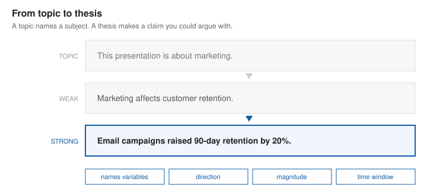
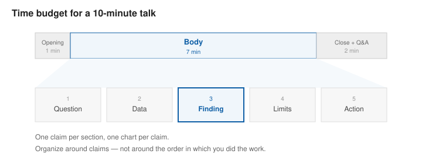
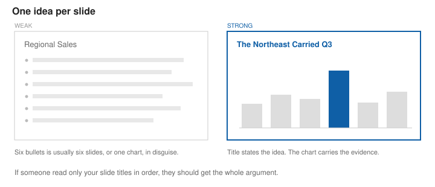
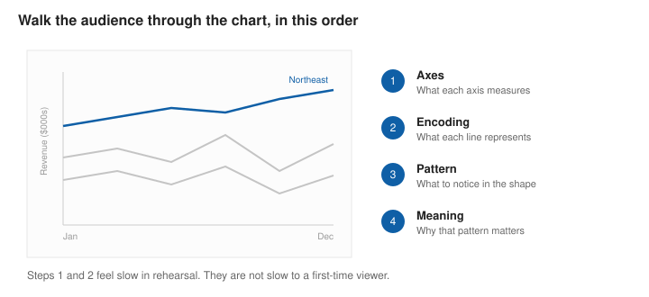
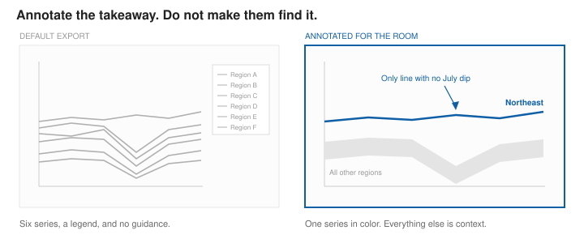
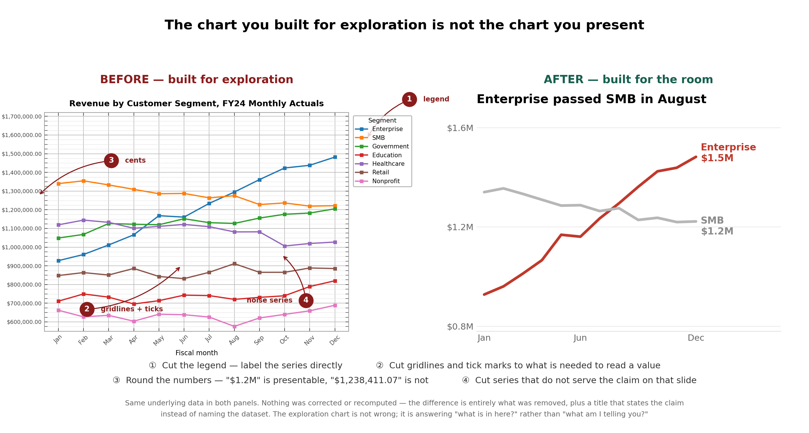
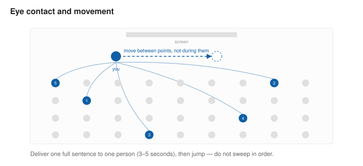
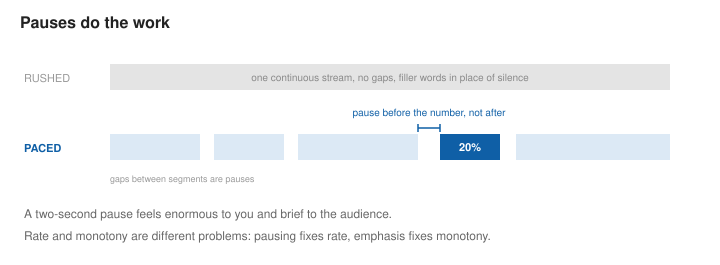
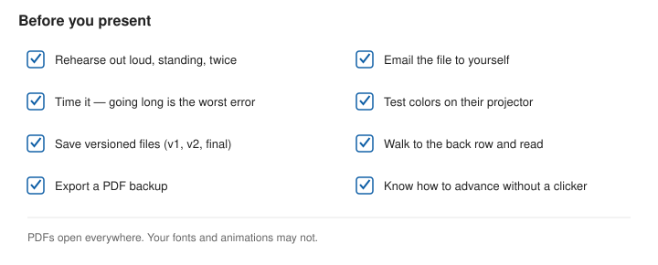

# Presenting Your Analysis

This chapter covers how to build a presentation around a single message, how to walk an audience through a chart, and how to deliver it without undoing your own work.

The major problem with most presentations is that they lack a central point. Do not just describe data! You need to cut to make a single clear thesis.

**Outcomes**:

- Write a thesis that makes a specific, arguable claim
- Structure a short analytical presentation around claims rather than workflow
- Design slides that stay legible on a projector
- Walk an audience through a chart in a deliberate order
- Deliver with controlled posture, eye contact, rate, and pauses
- Handle questions without losing credibility

## Start With the Message

Every presentation needs a core **thesis**. This is a single  sentence you want the audience to remember. Poor presentations only have topics, a general subject area. 

Most projects start with *exploration*, where you are looking around and creating lots of highly detailed charts. However, you should eventually move into *explanation*, where you cut 80% of the charts, simplify the remaining ones, and turn them into a presentation.

A good thesis is:

- **A dis-provable claim** It can be argued with.
- **Specific** It names the effect, and where possible, the size of the effect.
- **Short enough to remember.** If you cannot say it without reading, the audience cannot repeat it.

*Example*

| | |
|---|---|
| **Topic (not a thesis)** | "Financial Results for 2026-2027." |
| **Weak thesis** | "Profit has gone up." |
| **Strong thesis** | "Profit is up 20% due to a 35% drop in COGS." |

The strong version names the variables, the direction, the magnitude, and the window. It also tells you what the presentation needs to prove — which means it tells you which charts to build.

## Structure

A short analytical presentation has three parts. For a ten-minute talk, budget roughly one minute for the opening, seven for the body, and two for the close and questions. The body carries most of the time and divides into five claims. Each claim gets one chart

### Opening

Your opening slides needs your name, the date, and the course or client. Slides are often shared, so it needs author and version information.

Your first job is to give the audience a reason to listen. Do not open with the agenda; open with the problem or the finding. Three openings that work:

- **The surprising number.** "Forty percent of our support tickets come from three percent of customers."
- **The stakes.** "We are about to renew a $200,000 contract, and the data says we should not."
- **The question.** "Why do our best months always follow our worst?"

Your **title slide** should carry the thesis, not just the subject. "Q3 Sales Analysis" tells the audience nothing; "Email Drove Q3 Retention; Paid Social Did Not" tells them everything. 

### Body

Organize the body around **claims, not around your workflow**. Nobody needs to hear about your data cleaning in chronological order. Each section of the body should be one claim, supported by one chart.

A reliable pattern for a data presentation:

1. **Here is the question** and why it matters
2. **Here is the data** — source, time period, size, and any exclusion that could change the answer
3. **Here is what I found** — the main chart, with the takeaway stated out loud
4. **Here is what could be wrong** — Being honest increases your credibility
5. **Here is what to do about it** — the recommendation

### Close

End on the thesis and the action. Say the thesis a second time, in the same words you used at the start. Repetition makes a claim  memorable.

If there is a decision to be made, name it: who should do what, by when.

## Designing Slides

### One idea per slide

The governing rule is **one idea per slide**, and the slide title should state that idea as a sentence. "Regional Sales" is a label. "The Northeast Carried Q3" is an idea. If someone read only your slide titles in order, they should get your whole argument.

*Figure 3. The weak slide names a category and lists six things. The strong slide makes a claim and shows the evidence for it.*

You will see the **6×6 rule** (at most six bullets, at most six words each) recommended elsewhere. Bullets are a fallback; a chart or an image is almost always better in this course.

### Legibility

Your slides will be viewed on a projector in a lit room by someone in the back row. Design for that person, not for your laptop:

- **Body text at 24pt minimum**, 30pt or larger preferred. If you are shrinking text to fit, cut text instead.
- **High contrast.** Dark text on light backgrounds survives bad projectors better than the reverse. Aim for a contrast ratio of at least 4.5:1 for normal text and 3:1 for large text — the WCAG standard, and a good proxy for "readable from the back."
- **Test it.** Display the slide, walk to the back of the room, and look. This takes two minutes and catches most problems.

This is the same perceptual argument from [pre-attentive attributes](https://profgarrett.github.io/course_dv/dv30-preattentive/) and [colors](https://profgarrett.github.io/course_dv/dv36-colors/), applied under worse conditions. Projectors crush dark tones, wash out light ones, and shift hues. A color scale that is distinguishable on your monitor may be a single mud-colored band on the wall.

### Images

- **Use openly licensed images** and cite them. Unsplash, Pexels, and Wikimedia Commons are reliable sources; check the specific license, since it varies by image even within a site.
- **Generative AI images** are acceptable in this course when they illustrate a concept, but disclose the tool in your references. Never use a generated image to depict data, a real person, or a real event.
- **Typography can encode meaning**.  Use size for importance, weight for emphasis, color for grouping. Do not overdo it - decorative text effects reduce legibility and signal that the content could not carry itself.

## Presenting a Chart

When a new chart appears, the audience stops listening to you and starts reading it. Give them a moment, then orient them explicitly, in this order:

1. **Axes.** "Time runs left to right, from January through December. The vertical axis is revenue in thousands."
2. **Encoding.** "Each line is a region. The blue one is the Northeast."
3. **The pattern.** "Notice that every line dips in July except the blue one."
4. **The meaning.** "The Northeast is not seasonal, and that is what carried the quarter."

Steps 1 and 2 feel tediously slow when you rehearse them. They are not slow to someone seeing the chart for the first time. Skipping them is the single most common failure in student presentations.

### Annotate the takeaway on the chart

Do not make the audience find the point. Put it on the chart:

- Add a text label directly on the line or bar you are discussing
- Gray out the series you are not talking about
- Draw an arrow or a shaded band around the region that matters
- Use color for one series only, and leave the rest neutral

### Build complex charts progressively

If a chart needs more than about fifteen seconds to explain, split it across slides. Show the axes and one series, make your point, then add the second series on the next slide. 

### Simplify for the room

The chart you built for exploration is not the chart you present. Before it goes on a slide:

- **Cut the legend** if you can label series directly on the chart
- **Cut gridlines and tick marks** to what is needed to read a value
- **Round the numbers.** "$1.2M" is presentable; "$1,238,411.07" is not
- **Cut series** that do not serve the claim on that slide

## Delivery: Body

### Posture

- Stand tall, shoulders back, facing the audience rather than the screen
- Weight evenly on both feet — rocking and swaying read as nervousness
- Keep hands visible and above the waist; gesture to illustrate size, direction, and contrast
- Avoid the common anchors: hands in pockets, arms crossed, gripping the podium, fidgeting with a clicker or pen

A hand moving up as you say "retention rose" genuinely helps the audience encode the claim.

### Eye contact

Deliver roughly one full sentence to one person, then move to another — giving a full sentence to each. Move around the room rather than sweeping in order, and include the back and the sides, not just the front row.

### Notes

Do not read or memorize your presentation.  Let the slide be your prompt: if you need a reminder of what comes next, the slide title should provide it. If you find yourself needing full sentences on a card, your structure is not clear enough yet.

### Movement

Move deliberately, between points rather than during them. Walking as you deliver a key sentence competes with the sentence. Plant yourself, make the point, then move as you transition.

Do not turn your back to read your own slides. If you need to reference something on screen, gesture toward it while continuing to face the room.

## Delivery: Voice

### Rate

Nervousness speeds people up, and you will be faster on the day than in rehearsal. Deliberately start slower than feels natural.

Note that **rate and monotony are separate problems**. Speaking slowly is not the same as speaking in a monotone — you can be fast and flat, or slow and expressive. Monotony is a lack of variation in pitch, volume, and pace. The fix for speaking too fast is pausing; the fix for monotony is varying emphasis.

### Pauses

A pause of two seconds feels enormous to you and brief to the audience. Use pauses to:

- Slow yourself down when you notice you are racing
- Set up an important number — pause before it, not after
- Give the audience time to read a new chart
- Replace filler words. Silence is better than "um," and the audience does not experience it as a mistake.

### Breathing

Nervousness produces shallow chest breathing, which makes your voice thin and your sentences short. Before you go up:

- Inhale slowly through your nose, letting your belly expand rather than your shoulders rising
- Hold briefly, then exhale slowly and completely — a longer exhale than inhale
- Repeat three or four times

(The diaphragm is the muscle that pulls air in; it does not fill. "Breathe into your belly" is the practical cue.)

Do the same during a pause mid-presentation if you notice yourself racing.

## Handling Questions

Questions are where credibility is won or lost, and most of it is handled before anyone asks.

- **Anticipate three questions** and prepare backup slides for them. "I have a slide on that" is a strong answer.
- **Repeat or rephrase the question** before answering. It buys thinking time and ensures the room heard it.
- **Answer the question asked**, briefly, then stop. Rambling past your answer signals uncertainty.
- **"I don't know" is a complete answer**, ideally followed by "I can find out and follow up." Inventing a number is far worse than not having one.
- **Distinguish what your data shows from what you believe.** If someone asks about a cause your analysis did not test, say so.

If a question challenges your analysis and the challenge is right, concede it. Defending a flawed point costs you the rest of your credibility.

## Before You Present

*Figure 8. The last eight things to do, in the order they are easiest to forget.*

- Rehearse **out loud**, standing, at least twice. Reading through silently does not surface the sentences you cannot say.
- **Time it.** Going long is the most common and least forgivable presentation error.
- **Save versioned files** as `talk_v1.pptx`, `talk_v2.pptx`, `talk_final.pptx` — so a bad edit is recoverable.
- **Bring a backup.** Export a PDF, put it on a flash drive, and email it to yourself. PDFs open everywhere; your fonts and animations may not survive another machine.
- **Test the room** if you can: your file on their projector, your color scheme on their screen.
- Have your **clicker or a plan for advancing slides**, and know which key advances if the clicker fails.

## References

Images generated through Claude.