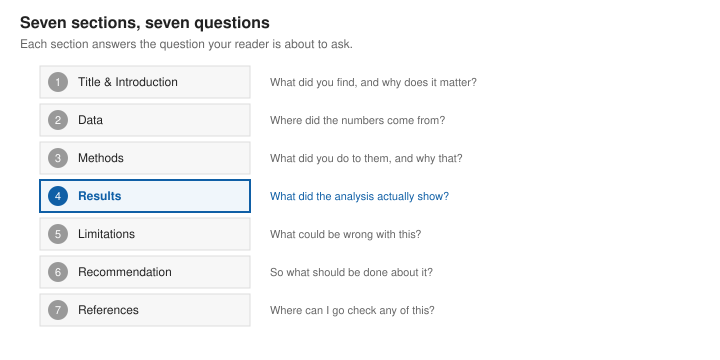
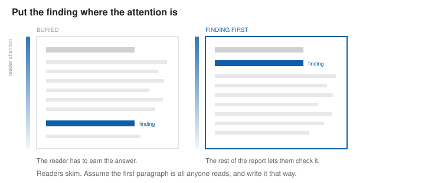
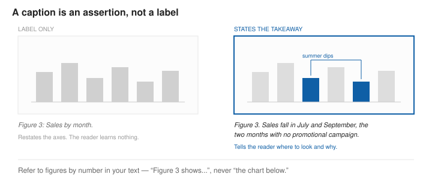
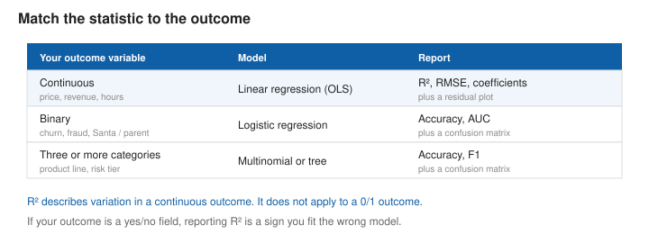

# How to Write a Good Report

A report is not a record of what you did. It is an argument that a specific conclusion follows from specific evidence. Your reader wants the conclusion first and the supporting detail second, which is close to the reverse of the order in which you did the work.

**Outcomes**:

- Organize a report into seven standard sections
- State a finding with the numbers that support it
- Match your reported statistics to the type of outcome you modeled
- Distinguish statistical significance from practical significance
- Write figure captions that state a takeaway
- Disclose data sources, tools, and AI assistance

## Format and Submission

Unless the assignment says otherwise:

- **Length**: 3 to 5 pages, including figures. The appendix does not count.
- **File format**: Word Document *(NOT A PDF)*
- **Figures**: at least two, numbered, each referred to by number in the text.
- **Code**: in an appendix or a linked repository, never inline in the body.
- **AI assistance**: permitted, and must be disclosed in your References section — the tool, the version, the date, and what it did. Undisclosed use is an academic integrity violation. Disclosed use is not.

You are responsible for everything in the report, including the parts a model wrote. "The AI produced that number" is not a defense.

## Lead With the Finding

The single most common failure in student reports is burying the answer. Writers who worked hard on the analysis want to walk the reader through it chronologically, arriving at the finding as a reveal on the last page. Readers do not read that way. They read the first paragraph, decide whether to keep going, and skim the rest.

Attention is highest at the top of the page. Put your main finding in the first paragraph, with its numbers attached. Everything after that exists to let a skeptical reader check you.

## Figures and Tables

Because this is a data visualization course, your figures are held to a higher standard than the prose around them.

- **Number every figure** and refer to it by number: "Figure 3 shows..." Never write "the chart below." Figures move during layout; numbers do not.
- **Write captions that state the takeaway**, not the contents. "Figure 3. Sales by month" tells the reader nothing they cannot see. "Figure 3. Sales fell every July except in the Northeast" tells them what to look for.
- **Label axes, with units.** "Revenue" is not a label. "Revenue ($000s)" is.
- **Annotate the point.** Gray out the series you are not discussing; color and label the one you are. See [pre-attentive attributes](https://profgarrett.github.io/course_dv/dv30-preattentive/) and [colors](https://profgarrett.github.io/course_dv/dv36-colors/).
- **Place each figure in the section that discusses it.** A figure the reader has to scroll back for is a figure they will skip.
- **Use a table when the reader needs exact values** they might look up. Use a chart when they need to see a pattern. Do not use a chart to present six numbers.

## 1. Title and Introduction

Open with a title that states your finding, then one paragraph covering the purpose of the analysis, the data, your main question, and your major finding. Include the numbers. A finding without a number is an opinion.

Be precise about the word *significant*. Reserve it for statistical significance, and say "large" or "substantial" when you mean size. With a large enough sample, trivial effects become statistically significant — so report the effect size alongside the p-value and tell the reader whether it matters.

>  **Section 1. Santa's Gifts Cost the Same as Ours**
>
> *Nathan Garrett. Updated August 1, 2026.*
> 
> This analysis uses 3.0 million holiday toy orders from Amazon and Target to test whether gifts labeled as coming from Santa differ in price from gifts labeled as coming from parents. If Santa were subsidizing Christmas, gifts attributed to him should be priced differently from the ones parents claim for themselves. They are not. Controlling for item type and how close to December 25 the order was placed, the Santa label predicts a $0.42 higher price (95% CI: $0.40 to $0.44). Across 2.6 million orders that difference is statistically significant, but at 1.2% of the $34.18 average gift price it is far too small to matter. Santa's gifts are priced exactly like the ones parents buy, which is what we would expect if parents were buying them. I call this the **Grinch hypothesis**.
> 

## 2. Data

Describe your data in a short paragraph: source, time period, number of observations, and how it was collected. State every exclusion and the reason for it, with counts. Then list your key variables as bullets, marking which one is the outcome and giving the type and units of each.

A reader should be able to tell from this section alone whether your analysis set is the one your question requires.

> **Section 2. Data**
> 
> Amazon and Target provided 3,048,112 order records from the 2020–2021 holiday season, covering November 1 through December 24. Orders were included only if the gift-message field identified a giver: 412,006 orders with blank gift messages were dropped, and a further 30,114 orders with Hanukkah-related messages were excluded as outside the scope of the question. The analysis set contains 2,605,992 orders.
>
> Key variables:
>
> - **Sale price** — decimal, USD. *Outcome variable.* Range $0.99 to $499.00, mean $34.18, SD $14.90.
> - **Giver label** — text, parsed from the gift message into Santa or parent. 38% of orders were labeled Santa.
> - **Item type** — categorical: game, toy, or doll.
> - **Order date** — datetime, converted to `days_until_christmas` (integer, 0 to 53).

## 3. Methods

State what you estimated and why that method fits your question. The most common error in this course is reporting a statistic that does not apply to your outcome. Before you write this section, check that your outcome type, your model, and your reported statistics agree.

*Figure 4. Match the statistic to the outcome. R² describes variation in a continuous outcome and does not apply to a 0/1 outcome.*

Also describe any transformation you applied, and say whether your conclusions survive a reasonable alternative specification. If they do not, that belongs in Limitations.

> **Section 3. Methods**
>
> I estimated an ordinary least squares regression predicting sale price in dollars. The outcome is continuous, so OLS and R² are appropriate here. Had I instead modeled the Santa label itself — a 0/1 field — this would have called for logistic regression and a confusion matrix rather than R².
> 
> Independent variables were the giver label (Santa = 1, parent = 0), item type (dummy coded, with game as the reference category), and `days_until_christmas`.
> 
> Residuals were right-skewed, as retail prices usually are. Re-estimating on log price left the sign and the practical size of the Santa coefficient unchanged; that specification appears in the appendix.

## 4. Results

This is the section your reader came for. Report what the model found, in plain language, with the statistic that matches your outcome type. Then interpret it: not just whether an effect exists, but whether it is large enough to act on.

Include at least one figure showing your main result, and one showing your errors or residuals. State the takeaway in the caption.

Report the result you got, including the boring one. A null result honestly reported is a finding. A null result dressed up as a positive one is a fabrication.

> **Section 4. Results**
>
> The model explains 56% of the variation in gift price (R² = 0.56, RMSE = $9.20, n = 2,605,992). Almost all of that comes from item type: dolls average $12.10 more than games, and toys $4.30 more, both with narrow confidence intervals. Orders placed closer to Christmas are slightly more expensive, at $0.09 per day.
> 
> The variable of interest does almost nothing. The Santa coefficient is $0.42 (SE $0.011, p < 0.001). With 2.6 million observations, an effect this small still clears any conventional significance threshold — which is precisely why the p-value is the wrong thing to look at here. The estimate is 1.2% of the mean gift price and smaller than the price difference between two sizes of the same board game.
>  
> *Include the regression output table.*
>
>  *Include a coefficient plot with confidence intervals, and a residual-versus-fitted plot.*

## 5. Limitations

Name what could be wrong with your analysis before your reader does. Conceding a real weakness makes your remaining claims more credible, not less. Vague hedging does the opposite — "further research is needed" tells the reader nothing.

Be specific about three things: what your data cannot observe, who or what is missing from your sample, and what your design does not let you claim.

> **Section 5. Limitations**
>
> The gift-message field records who a gift *claims* to be from, not who paid for it. This is the central limitation: the analysis compares labels, not givers, and no retail dataset can observe the latter.
>
> The 412,006 orders with blank gift messages were dropped, and they may differ systematically from the rest — a household that skips gift messages may also shop differently. This is a selection problem, and it is unaddressed.
>
> The data covers two large general retailers. Specialty toy stores, where average prices are higher, are absent.
>
> Finally, this is observational data. The analysis identifies an association between a text label and a price; it establishes nothing about what caused either.

## 6. Recommendation

Say what should be done, by whom. If your finding does not support an action, say that instead — "these data do not support segmenting on giver label" is a legitimate recommendation and a useful one.

Tie the recommendation to a number from your Results section. A recommendation that could have been written before the analysis is not a recommendation.

> **Section 6. Recommendation**
> 
> Retailers should not use the giver label as a segmentation variable for holiday inventory or pricing. It predicts a $0.42 difference in order value, which is not enough to justify the cost of parsing gift messages at scale. Item type and order timing together account for nearly all of the explained variation and are already captured in existing systems.
>
> If the question of interest is household spending rather than per-order price, this dataset cannot answer it, and a panel with household identifiers would be required.

## 7. References

List your data sources, your tools with versions, and every use of AI assistance. Link to anything a reader could check. If a source is not public, say so rather than inventing a link.

> **Section 7. References**
>
> - Amazon.com and Target holiday order extract, 2020–2021 season. Provided under data access request #4471; not publicly available.
> - R 4.4.1. Models estimated with `lm()` from the **stats** package; figures produced in Tableau 2024.2.
> - ChatGPT (GPT-4o, accessed 15 July 2026) was used to debug a date-parsing error in the `days_until_christmas` conversion and to draft an initial version of the Figure 2 caption. All output was checked against the source data.

## Good Examples

These are longer and less structured than the report you are being asked to write. Read them for one specific thing each, noted below — not as templates.

- [Most Deadly Animals](https://www.gatesnotes.com/Most-Deadly-Animal-Mosquito-Week-2016) — the finding is in the first sentence and the headline chart carries the entire argument.
- [The limits of personal experience](https://ourworldindata.org/limits-personal-experience) — every chart is annotated, and every caption makes a claim.
- [Is 200k a year good?](https://ofdollarsanddata.com/is-200k-a-year-good/) — watch how the author states what the data cannot answer before answering what it can.
- [Generational Wealth](https://ofdollarsanddata.com/generational-wealth/) — a clean example of separating a statistically detectable effect from a practically meaningful one.

## References

Images generated through Claude.