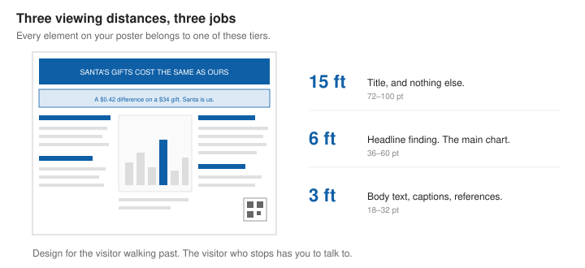
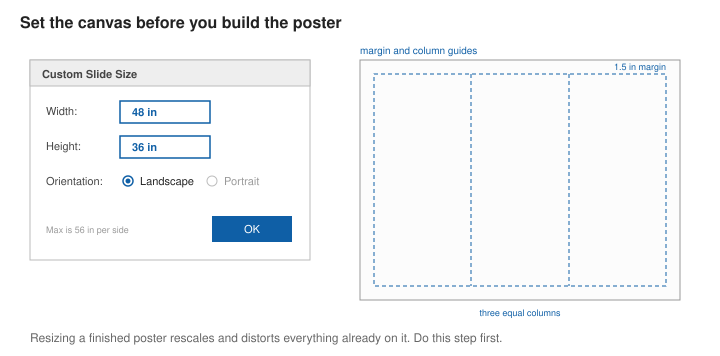
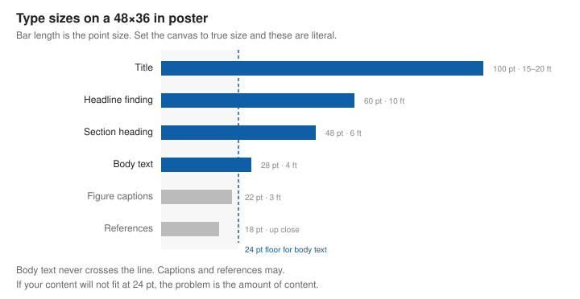
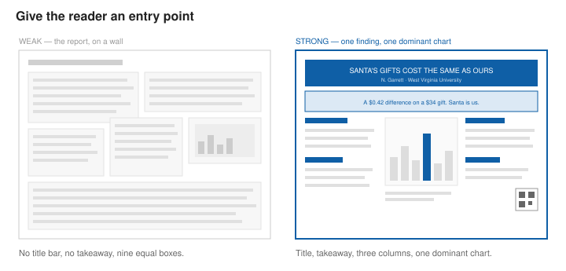

# Designing a Poster

A poster is conversation starter and memory aid.

Most people walking a poster session give any single poster about thirty seconds — enough to read the title, look at one chart, and decide whether to stop. If they stop, they are going to talk to you, and the poster becomes the visual aid for that conversation.

That gives you two audiences with opposite needs. **Skimmers** need the title and one finding, large enough to read while walking. **Stoppers** need you, plus a chart you can point at.

**Outcomes**:

- Set up a 48×36 inch poster file in PowerPoint
- Lay out a poster in columns with a clear reading order
- Choose type sizes that are legible at poster viewing distance
- Prepare charts that survive printing at large scale
- Adapt a written report into roughly 400 words of poster text
- Recognize where class posters and academic research posters differ

**Links**:

- [Garrett 2026 AAA presentation](GarrettAAA2026.pptx)
- [Sample Template](example-poster-48x36.pptx)

## Setting Up the File in PowerPoint

PowerPoint is a perfectly good poster tool. The setup takes two minutes.

1. **Design → Slide Size → Custom Slide Size**
2. Set **Width: 48 in**, **Height: 36 in**, orientation **Landscape**
3. Choose **Ensure Fit** if prompted
4. Delete every slide but one.

Do this **before** you add any content. Resizing a finished poster rescales and distorts everything you already placed.

**If your poster needs to be larger than 56 inches on a side**, PowerPoint will not let you — 56 in × 56 in is a hard limit. Design at half scale instead (a 72×36 poster becomes a 36×18 slide) and tell the print shop to print at 200%. If you do this, halve every type size in this chapter too, and check a printed sample before committing.

A few more settings worth changing now:

- **View → Guides** and **View → Gridlines**, so your columns actually line up. Nothing signals "made the night before" like three columns of slightly different widths.
- **Set a margin.** Nothing within 1.5 inches of any edge. Printers trim unevenly, and boards have clips.
- **Embed your fonts**: File → Options → Save → *Embed fonts in the file*. Otherwise the print shop substitutes something and your layout shifts.
- **Export to PDF for printing**, not PPTX. Always open the PDF and look at it before sending.

## Type Sizes

| Element | Size | Must be readable from |
|---|---|---|
| Title | 72–100 pt | 15–20 feet |
| Headline finding | 48–60 pt | 10 feet |
| Section headings | 36–48 pt | 6 feet |
| Body text | 24–32 pt | 4 feet |
| Figure captions | 20–24 pt | 3 feet |
| References | 16–18 pt | up close, and that is fine |

**Never go below 24 pt for body text.** If your content does not fit at 24 pt, you have too much content. That is the actual problem, and shrinking the type only hides it.

## Word Count

**Target 300 to 500 words for the entire poster.** Your five-page report has perhaps 1,500 words in it. Roughly two-thirds of them do not go on the poster.

Bullets beat paragraphs on a poster. A paragraph longer than four lines will not be read standing up.

## Layout

At 48 inches wide, use **three or four columns**. Readers scan a poster the way they read a newspaper: down the first column, then down the next. Do not fight this with clever diagonal arrangements or arrows connecting boxes across the poster.

A layout that works:

- **Title bar** across the full width at the top: title, your name, email, your affiliation. Roughly 5 inches tall.
- **A takeaway box** — one sentence, boxed or shaded, at the top of the first column or spanning under the title. This is the thing you most want read. Give it the second-largest type on the poster.
- **Column 1**: question and background, then data and methods.
- **Columns 2 and 3**: results. Charts live here, and this is the largest area on the poster.
- **Column 4 (or bottom of column 3)**: limitations, conclusion, references, QR code.

**Charts and images should occupy 40 to 60 percent of the poster area.** 

Leave real whitespace — 30 to 40 percent of the poster. Cramped posters read as anxious, and visitors skip them.

## Charts on a Poster

**Rebuild the chart at poster scale.** A chart exported from Tableau at default settings carries 8–10 pt axis labels. Blown up to poster size those become blurry and, worse, they were designed for a screen you look at from two feet. Increase font sizes, line weights, and marker sizes inside Tableau or PowerBI *before* exporting, then export.

**Export at print resolution.** Use PDF or SVG if your tool offers it, since those stay sharp at any size. If you must use PNG, export at 300 DPI at final print dimensions. A screenshot pasted into PowerPoint will look acceptable on your laptop and visibly pixelated on the wall — this is the most common preventable poster mistake.

**Two to four charts, maximum.** One of them should be clearly dominant: your main result, large enough to read from six feet, annotated so its point is on the chart itself rather than in a caption beneath it.

## Class Poster vs. Academic Research Poster

This chapter is written for a class project poster. Undergraduate research days, professional conferences, and journal-affiliated sessions add conventions. The differences that matter:

| | Class poster | Academic research poster |
|---|---|---|
| **Title** | States the finding: "Santa's Gifts Cost the Same as Ours" | Usually descriptive: "Giver Attribution and Order Value in Holiday Retail, 2020–2021" |
| **Abstract** | Omit — the takeaway box replaces it | Often required, sometimes with a specified word limit |
| **Methods detail** | Brief; enough to judge credibility | Enough for a specialist to evaluate or replicate |
| **Citations** | Informal, a short list | Numbered in-text citations and a formatted reference list |
| **Acknowledgments** | Not needed | Funding sources and IRB approval usually required |
| **Word count** | 300–500 | 500–800 |
| **Logo requirements** | None | Institutional logo, sometimes a specified template |

Check the event's requirements before you design. Many research days publish a required template or a fixed poster size, and those override everything in this chapter.

## Printing

- **Print three days early.** Print shops have queues, and you will find a typo.
- **Confirm the file format and size** the shop wants, and ask about turnaround and cost before you finalize. Large-format printing is not cheap and not fast.
- **Avoid dark backgrounds.** They cost more in ink, show every scuff, and reduce text contrast. White or very light backgrounds print better and read better.
- **Bring a tube**, plus pins, binder clips, or tape. 
- **Add a QR code** linking to your full report, and **test it after printing.** 

## At the Poster Session

- Have a **30-second version** and a **3-minute version**. Open with the 30-second one and let them ask for more.
- **Stand to the side**, not in front. You are blocking the thing you spent forty dollars printing.
- **Let them read the title first.** Do not start talking the instant someone approaches.
- **Ask what they work on.** It takes five seconds and lets you aim the explanation.
- Bring a **handout or a card** with the QR code for people who want the details but not the conversation.

## References

Diagrams and sample template from Claude