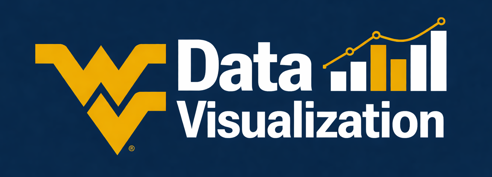

<!--  -->

<!---- 
# Data Viz Study Notes

https://searchingforbirds.visualcinnamon.com/

https://nightingaledvs.com/ive-stopped-using-box-plots-should-you/
https://media.licdn.com/dms/image/v2/D4E22AQGg8y8u42G-1w/feedshare-shrink_2048_1536/B4EZsCvGeqKkA0-/0/1765277461588?e=1767225600&v=beta&t=1Hr7OC5YQwyZhOo-BsuxjSin7Ag6nIj8Lr8XyukQCmk
https://nrennie.rbind.io/
https://nrennie.rbind.io/blog/year-in-data-viz-2025/

- 	- https://www.visualcapitalist.com/cp/life-expectancy-vs-healthcare-spending-1970-2023/
	- https://github.com/zhu-xlab/GlobalBuildingAtlas?tab=readme-ov-file

---->
# Business Data Analytics

**Nathan Garrett, PhD CPA**

*Department of Accounting and Information Systems*

*West Virginia University*

This course introduces students to data analysis through visualization. Students will learn how to clean, understanding, and visualize data using Tableau and PowerBI. They will also learn foundational SQL concepts, as well as be exposed to Python.

## Module 1: Data Visualization

### Week 1 - August 17, 2026

- [dv00. File management](dv00-files/index)
- [dv01. EDA process](dv01-eda/index)

Optional Reading:

- [High Income skills](https://ofdollarsanddata.com/high-income-skills/)

### Week 2 - August 24, 2026

- [dv20. Understand data values and structure](dv20-data/index)
- [dv30. Visual perception](dv30-visualperception/index)
- [dv31. Visual channels](dv31-visualchannels/index)
- [dv36. Colors](dv36-colors/index)

## Module 2: Tableau

### Week 3 - August 31, 2026

- [dv11. Presentations](dv11-presentations/index)
- [dv10. Writing an effective report](dv10-report/index)

- *DataCamp: Introduction to Tableau*
- [tb01. Tableau interface and data](tb01-interface/index)
- [tb41. Tableau basic charts](tb41-basic-charts/index)
- [tb42. Tableau basic features](tb42-basic-features/index)

### Week 4 - September 7, 2026

- [tb43. Chart refinements](tb43-chart-refinements/index)
- [tb44. Data refinements](tb44-data-refinements/index)

### Week 5 - September 14, 2026 

*Exam 1*

- *DataCamp: Analyzing Data with Tableau Parts 3 & 4*
- [tb45. Tableau maps](tb45-maps/index)

### Week 6 - September 21, 2026 

- *DataCamp: Creating Dashboards with Tableau*
- [tb46. Dashboards](tb46-dashboards/index)
- [tb48. Tableau Table Calculations](tb48-tablecalculations/index)

### Week 7 - September 28, 2026 

## Module 3: PowerBI

- *MLearn: Get Started 1/2 and 2/2*
- *MLearn: Get data in PowerBI*
- *MLearn: Clean, Transform, and load*

### Week 8 - October 5, 2026 

- [bi01. PowerBI Introduction](bi01-intro/index)

### Week 9 - October 12, 2026 

[Exam 2](exams/exam2.html)

- [bi02. PowerBI Modeling](bi02-model/index)

### Week 10 - October 19, 2026 

- [bi03. PowerBI Vis](bi03-vis/index)

## Module 4: SQL

### Week 11 - October 26, 2026 

- [sql01. SQL Introduction](sql01-introduction/index)
- [sql02. SQL Select, From, Order By, Where](sql02-selectfromorderby/index)

### Week 12 - November 2, 2026 

- [sql03. SQL Functions](sql03-functions/index)
- [sql04. SQL Aggregation](sql04-aggregation/index)
- [sql05. SQL Joins](sql05-joins/index)

[Exam 3](exams/exam3.html)

## Module 5: Python

### Week 13 - November 9, 2026 

- [Python](py00-overview/index)

### Week 14 - November 16, 2026 

Continue Python

### Week 15 - November 23, 2026 

*Spring Break - No activities*

### Week 16 - November 30, 2026 

*Project*

[Exam 4](exams/exam4.html)

### Week 17 - December 7, 2026 

*Final Exam Week, December 7-11*

## Further Resources

**Good examples**:

- [Names that switch gender](https://www.reddit.com/r/dataisbeautiful/comments/13mf2q5/oc_baby_names_in_the_us_that_have_switched_gender/#lightbox)
- [Book, the geometry of inequality in India](https://www.chartography.net/p/the-geometry-of-inequality)

**Workforce**:

- [What is life like as a Tableau Freelancer?](https://www.reddit.com/r/tableau/comments/1724zdf/six_years_as_a_tableau_freelancer_ama/)

**Free DataViz Courses**:

- [Andrew Heiss - Data Visualization with R](https://datavizf25.classes.andrewheiss.com/content/01-content.html)
- [Kieran Healy - Socviz - Data Visualization](https://socviz.co/)

