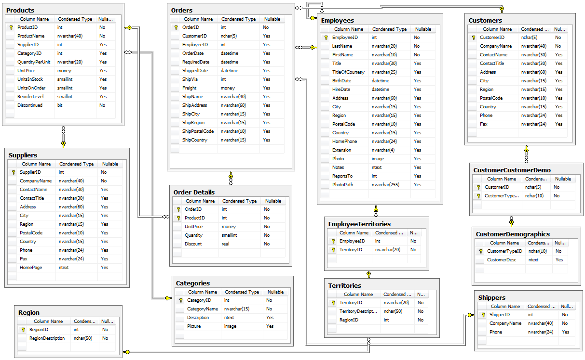

# SQL 1 - Introduction

**Outcomes**:
- Define a database
- Describe the role of a DBMS
- Describe advantages / disadvantages
- Describe issues using Excel to storage large datasets
- Describe SQL

**Links**:
- [Why use a database?](whydb2)
- Quizlet [course_sql01](https://quizlet.com/1049048584/course_sql01-introduction-to-databases-and-sql-concepts-flash-cards/?i=2up6jq&x=1jqt)

## Introduction to Databases

Please install the [SQLite DB Browser](https://sqlitebrowser.org/dl/)

### Definition of a Database

- A database is a structured collection of data organized in a way that allows for efficient storage, retrieval, and management. It is typically organized into tables, which consist of rows and columns, similar to a spreadsheet.
- Databases help prevent anomalies and errors during data operations such as updates, inserts, or deletes by enforcing data integrity and relationships between data elements.
- Example: A relational database might store customer information in one table and order information in another, linking them through a common key.

### Database Management System (DBMS)

- A DBMS is software that provides an interface for users to interact with databases, managing the storage, retrieval, and modification of data.
- It ensures data integrity, security, and concurrency control, allowing multiple users to access the database simultaneously without conflicts.
- Example: Popular DBMS include MySQL, PostgreSQL, and SQLite, each offering unique features and capabilities.

### Advantages and Disadvantages of Using a DBMS

- **Advantages:**
- Centralizes data storage, making it easier to manage and access.
- Ensures data integrity by enforcing data types and constraints.
- Provides security features to protect sensitive data.
- Allows for efficient data retrieval and manipulation, especially with large datasets.
- Overcomes limitations of tools like Excel, which can handle only a limited number of rows.
- **Disadvantages:**
- High initial setup costs for hardware and software.
- Requires skilled administrators to manage and maintain the system.
- Less flexible than unstructured data storage methods, such as Excel files.

## SQL: Structured Query Language

### Overview of SQL

- SQL is a programming language specifically designed for managing and manipulating relational databases.
- It provides a standardized way to perform operations such as creating, modifying, and querying databases, making it essential for database management.
- Common SQL operations include:
- **SELECT**: Retrieve data from one or more tables.
- **INSERT**: Add new records to a table.
- **UPDATE**: Modify existing records in a table.
- **DELETE**: Remove records from a table.

### Database Structure and Components

- A database consists of multiple tables, each containing rows (records) and columns (fields).
- **Record**: A horizontal row in a table representing a single entry.
- **Field**: A single value in a record, similar to a cell in Excel, typically named in singular form.
- **Primary Key**: A unique identifier for each record in a table, often an auto-incrementing integer, ensuring no null values.
- **Foreign Key**: A field that creates a link between two tables, maintaining referential integrity by pointing to a primary key in another table.

## Data Types and Database Design

### Data Types in Databases

- **Integer**: Whole numbers (e.g., 1, 2, 3), often referred to as 'int'.
- **Float**: Non-whole numbers (e.g., 1.2, 2.8), sometimes called 'double' or 'money'.
- **String**: Text values (e.g., 'Bob', 'Sarah'), often referred to as 'VARCHAR' for variable-length characters.

### Database Schema and Data Dictionary

- **Schema**: The data model that defines the structure of the database, including tables, fields, and relationships.
- **Data Dictionary**: A comprehensive definition of the fields and tables in a database, serving as a reference for database design and usage.

## Database Diagram and Conventions

### Database Diagrams

- A database diagram visually represents multiple tables and their relationships, providing a graphical view of the database structure.
- Example: The Northwind SQL Diagram illustrates how various tables (e.g., Products, Suppliers) are interconnected, aiding in understanding data flow and relationships.

### Naming Conventions

- Recommended naming conventions include using lowercase letters, avoiding spaces, and utilizing underscores (e.g., `product_id`).
- When dealing with columns that have spaces or special characters, wrap them in double quotes to ensure proper handling in SQL queries.

### Example Northwind Database Diagram

