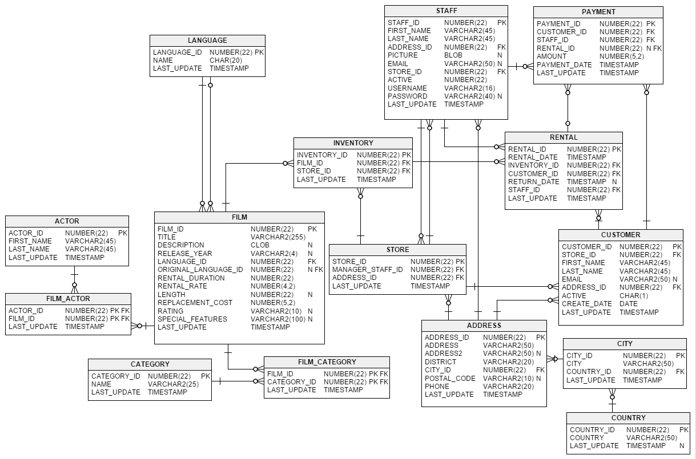

# Problem: Sakila Movie rentals

We will use concepts from [SQL 5](./../) to investigate movie rentals by joining tables.

Because we are using multiple tables, we will sometimes be able to get a high-level view of the database through an ERD (entity relationship diagram). The below image shows a high-level summary of our Sakila database.

## Outcome

- Practice `INNER JOIN` and `OUTER JOIN`

## Process

- Download the [db file](sakila.db)  
- Download the [sql file](problem.sql) 
- Move both files into a new folder.
- Open *DB Browser* and choose *File* / *Open DB*
- Go to the execute SQL tab. Then, use the 2nd button from the left to open the SQL file
- Start answering questions! 
