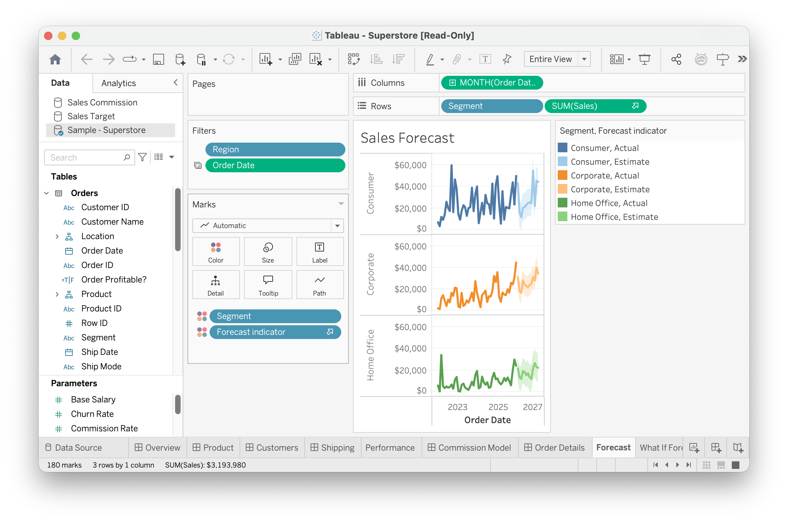
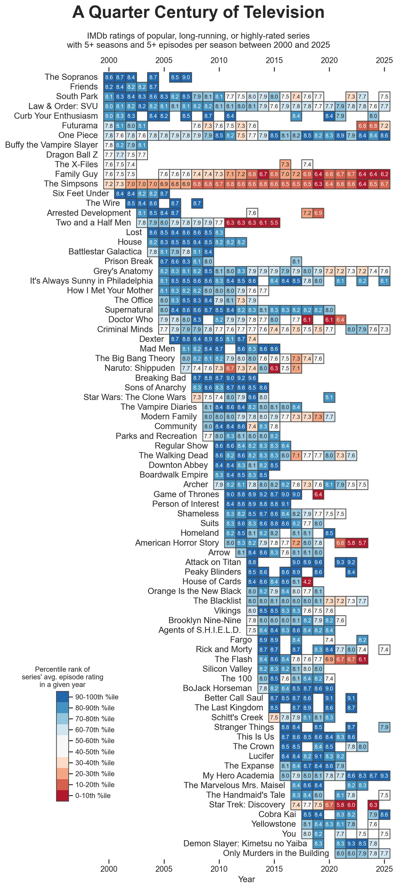

# Tableau Interface

This module covers the Tableau interface: how to install Tableau, connect to a data file, read the interface, and build a basic table. 

Tableau is very different from Excel:

- Excel asks you to select a chart, and then lets you pick columns for specific aspect of the chart
- Tableau asks you to *describe* your data by dragging fields onto shelves. You don't really pick a chart - you describe how different aspects of the dataset map to visual properties.

Most beginner frustration in Tableau is a field classification problem.

**Outcomes**:

- Install Tableau Desktop and activate a student license
- Connect to an Excel or CSV file, and explain the differences between the two formats
- Identify key interface elements: Data pane, shelves, Marks card, canvas, filters
- Save a Tableau workbook correctly, locally or on Tableau Public
- Identify common data types, including text, integers, decimals, dates, and booleans
- Differentiate between **dimensions** and **measures** (a field's *role*)
- Differentiate between **discrete** and **continuous** fields (how Tableau *draws* it)
- Select among aggregation functions, including sum, average, median, count, max, and min
- Create a basic text table

**Links**:

- See DataCamp *Introduction to Tableau*
- [Tableau's official interface reference](https://help.tableau.com/current/pro/desktop/en-us/environment_workspace.htm)

## Before Class: Installation

Install Tableau **before** the first Tableau class meeting.

- Download the [latest version of Tableau Desktop](https://www.tableau.com/tft/activation).
- Click the link above and select "Download Tableau Desktop." On the form, enter your school email address for Business E-mail and the name of your school for Organization.
- Activate with your product key: *See eCampus for key*.
- Already have Tableau Desktop installed? Update your license in the application: `Help` → `Manage Product Keys`. Make sure you are on the latest version — workbooks saved in a newer version will not open in an older one.

You also need a **Tableau Public account**, which is free and separate from your Desktop license. Create it at [public.tableau.com](https://public.tableau.com) before class.

## The Interface

Tableau's window has five regions you will use constantly. Open any workbook and find each one before continuing.

| Region | Location | What it does |
| --- | --- | --- |
| **Data pane** | Left sidebar | Lists every field in your data source. Fields are split into dimensions (top) and measures (bottom). |
| **Shelves** | Top: Columns, Rows | Where you drag fields to define the structure of the view. Columns is the x-axis; Rows is the y-axis. |
| **Marks card** | Left of the canvas | Controls *how* data is displayed — color, size, label, detail, tooltip, and mark type (bar, line, square, etc.). |
| **Canvas** | Center | The visualization itself. |
| **Filters shelf** | Above the Marks card | Limits which rows are included in the view. |

A field placed on a shelf is called a **pill**. Pills are the basic unit of work in Tableau.

Sheets, dashboards, and stories are managed by the tabs along the bottom of the window. A **sheet** holds one visualization; a **dashboard** combines several.

Buttons worth knowing on the toolbar:

- `Undo / Redo`  Tableau's undo history is deep. Use it freely; experimenting is cheap.
- `Show Me` — suggests chart types for the fields you have selected. Useful for learning, but it hides what is actually happening. Build charts manually in this course unless told otherwise.
- `Clear Sheet` — removes all pills and starts over.

Handy shortcut: hold **Ctrl** (Windows) or **Option** (Mac) while dragging a pill to *copy* it rather than move it.

### Saving

There are two Tableau file formats.  Submit all work in this class as a packaged workbook (`.twbx`).
Go to  `File` → `Save As` → choose *Tableau Packaged Workbook*.

| Extension | Name | Contains data? | Should you use it? |
| --- | --- | --- | -- |
| `.twb` | Workbook | Only a pointer to the file on your computer. | **No** |
| `.twbx` | Packaged workbook | Data is bundled inside. | **Yes**  |

You may also publish to **Tableau Public**, which hosts your workbook on the web. Anything you publish there is visible to anyone with the link and is indexed publicly. Never publish sensitive, confidential, or personally identifying data to Tableau Public.

## Connecting to Data

Tableau connects to many sources — databases, spreadsheets, flat files, and cloud services. This course uses Excel and CSV files. Databases are covered in the SQL modules.

| | Excel (`.xlsx`) | CSV (`.csv`) |
| --- | --- | --- |
| Sheets | Multiple | One |
| Formatting | Yes | None |
| Stored data types | Yes — Excel remembers a cell is a date | **No** — everything is text on disk |
| File size | Larger | Smaller |
| Opens in anything | No | Yes |

Because a CSV stores no type information, Tableau has to *guess* the type of every column when it connects. Always check the types on the Data Source tab after connecting to a CSV.

Once connected, Tableau shows a preview on the **Data Source** tab. Do basic cleaning here before building anything:

- Remove unnecessary fields (right-click → `Hide`)
- Rename fields to something readable (right-click → `Rename`)
- Fix any data type Tableau guessed wrong (click the type icon above the column name)

### Data Types

Every field has exactly one data type. Tableau shows it as a small icon next to the field name in the Data pane.

- **String** (`Abc`) — text such as names and categories
- **Number (whole)** (`#`) — integers, no decimal point
- **Number (decimal)** (`#`) — values with a decimal point, stored as floating point
- **Boolean** (`T|F`) — True or False
- **Date** (calendar icon) — a calendar date
- **Date & Time** (calendar + clock) — a date with a time of day

Two clarifications that trip students up:

**Money is not a Tableau data type.** Some databases have a dedicated money type (SQL Server's `MONEY` is a fixed-point number with four decimal places), which avoids the tiny rounding errors that come with floating-point decimals. Tableau has no such type. Currency in Tableau is a decimal number plus a *display format*: right-click the field → `Default Properties` → `Number Format` → `Currency`.

**Geographic is not a data type either.** Country, state, county, city, and ZIP are **geographic roles** layered on top of a string or number. Assign one with right-click → `Geographic Role`. Once assigned, Tableau generates Latitude and Longitude fields so the field can be mapped. Maps are covered in tb45.

Tableau parses many written formats and does **not** require a full day/month/year — a column of years, or of year-months, works fine. However, when you turn the column into a date or date/time, Tableau will infer the missing values. So, a column holding `February` and `March` will turn into `February 1, 1900` and `March 1, 1900`.

## The Two Questions Tableau Asks About Every Field

Tableau needs two independent answers for every field:

1. **Role: is it a dimension or a measure?** Dimensions *slice* the data; measures get *aggregated*.
2. **Type: is it discrete or continuous?** Discrete pills are **blue** and produce headers. Continuous pills are **green** and produce axes.

A field can be any of the four combinations.

| | **Discrete (blue) — headers** | **Continuous (green) — axes** |
| --- | --- | --- |
| **Dimension** slices the data | `Neighbourhood`, `Room Type` | `Order Date` as a continuous timeline |
| **Measure** gets aggregated | `SUM(Price)` used as a text label in a table | `SUM(Price)` on an axis |

By default, most dimensions are discrete and most measures are continuous. The other two cells exist, and you will use them, but they are the exception.

You can change either answer:

- Change the **role**: right-click the field in the Data pane → `Convert to Dimension` / `Convert to Measure`
- Change the **type**: right-click a pill on a shelf → `Discrete` / `Continuous`

A common real case for changing the role: a `Zip Code` or `Store ID` column arrives as a number, so Tableau files it under Measures and tries to sum it. Summing ZIP codes is meaningless. Convert it to a dimension.

### Why Blue and Green Matter Visually

- *Blue (discrete)* → Tableau draws a **header** — one labeled slot per distinct value, in whatever sort order you set.
- *Green (continuous)* → Tableau draws an **axis** — a number line, which may include values not present in your data.

## Aggregation

**Tableau aggregates measures automatically.** Drag `Price` onto a shelf and the pill reads `SUM(Price)` — one number, the total of every row. Tableau is not showing you rows; it is showing you a summary.

The dimensions in your view control the level of that summary. `SUM(Price)` with no dimensions is one grand total. Add `Neighbourhood` to Rows and it becomes one sum per neighborhood.

To change the function, click the pill → `Measure` → and choose:

| Function | Returns |
| --- | --- |
| `SUM` | Total of all values (Tableau's default for numbers) |
| `AVG` | Mean — sum divided by count |
| `MEDIAN` | Middle value when sorted |
| `COUNT` | Number of non-null rows |
| `COUNTD` | Number of *distinct* values |
| `MIN` / `MAX` | Smallest / largest value |

"Average" is ambiguous in everyday speech, and the three meanings give different answers on skewed data. Mean is most affected by outliers, and median is more resistant. Mode is rarely useful in a numeric column, but it is the only average that makes sense for categorical data.

Airbnb prices are a good illustration: a handful of $2,000/night listings pull the mean well above the median. Report the median unless you have a reason not to.

### Is a Table a Chart?

Not quite. A table encodes values as **text**, which readers process one cell at a time. A chart encodes values as **visual properties** — position, length, color, size — which readers compare at a glance without reading anything.

That distinction is what module dv30 covers under *pre-attentive attributes*. The two forms are not rivals: tables are better when readers need exact values, charts are better when they need to see a pattern. You can also blend them by adding color to a table, which is what the example below does.

Source: <https://www.reddit.com/r/dataisbeautiful/comments/1qaq7kz/a_quarter_century_of_television_oc/> by gammafission00

## Key terms

- **Excel Datasource**: A spreadsheet file that stores data in XML format. Provides some data type information to Tableau. Has multiple sheets.
- **CSV Datasource**: A file that stores data in plain text format. Tableau has to guess the type of every column.
- **Pill**: A field placed on a shelf in Tableau.
- **Dimension**: A field that slices data into groups or categories.
- **Measure**: A field that is aggregated, such as with sum, average, or count.
- **Discrete**: A blue pill that creates headers rather than an axis.
- **Continuous**: A green pill that creates an axis and supports a numeric scale.
- **Shelf**: A drop zone such as Columns, Rows, Filters, or Pages.
- **Marks card**: Controls how marks are displayed, including color, size, label, detail, tooltip, and mark type.
- **Aggregation**: A function that collapses many rows into one summary value.
- **Average**: A general term that can refer to different summaries, especially the mean, median, or mode.
- **Mean**: The arithmetic average; the sum of values divided by the count. It is sensitive to outliers.
- **Median**: The middle value when data are sorted. It is more resistant to outliers than the mean.
- **Mode**: The most common value in a dataset.
- **Geographic role**: A mapping role assigned to a field so Tableau can place it on a map.
- **.twb**: A Tableau workbook file that does not contain the underlying data.
- **.twbx**: A packaged Tableau workbook that includes the data.
- **String**: text such as names and categories
- **Number (whole)**: integers, no decimal point
- **Number (decimal)**: values with a decimal point, stored as floating point
- **Boolean**: True or False
- **Date**: a calendar date with day, month, and year
- **Date & Time**: a date with a time of day
