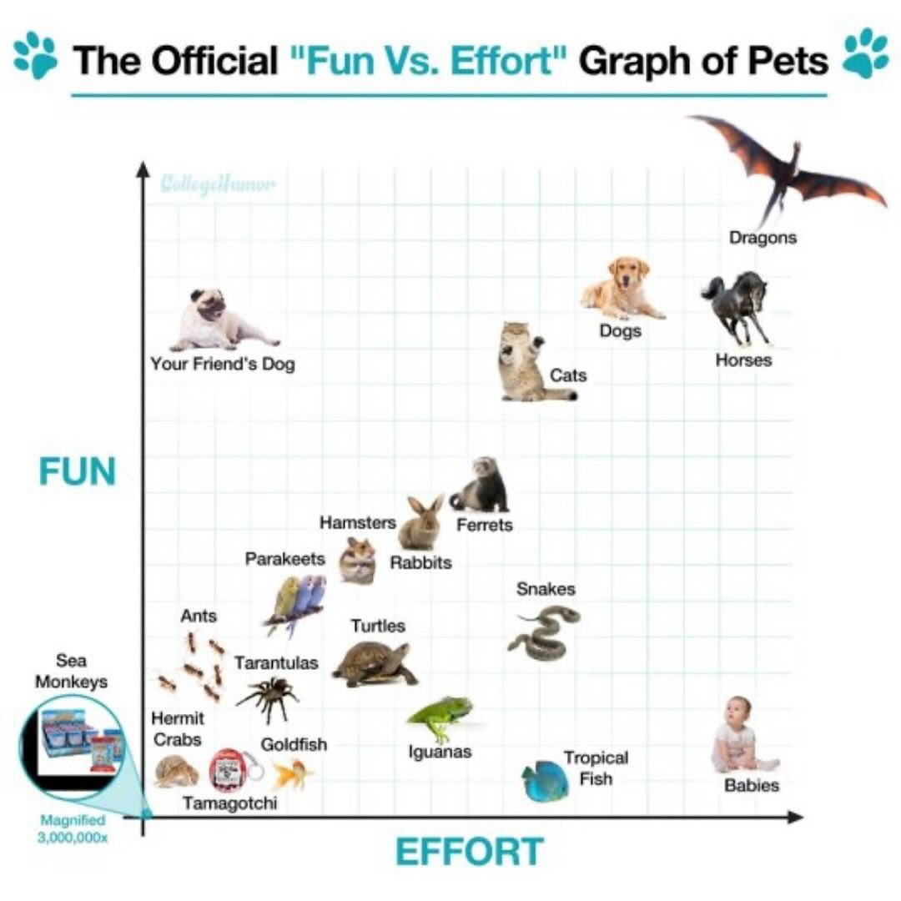
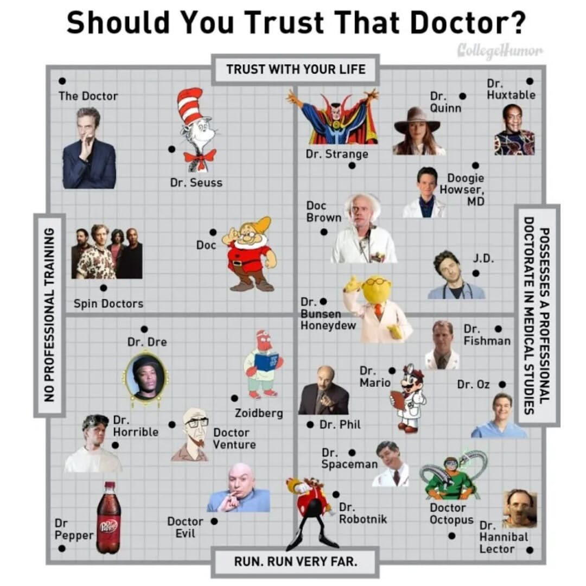
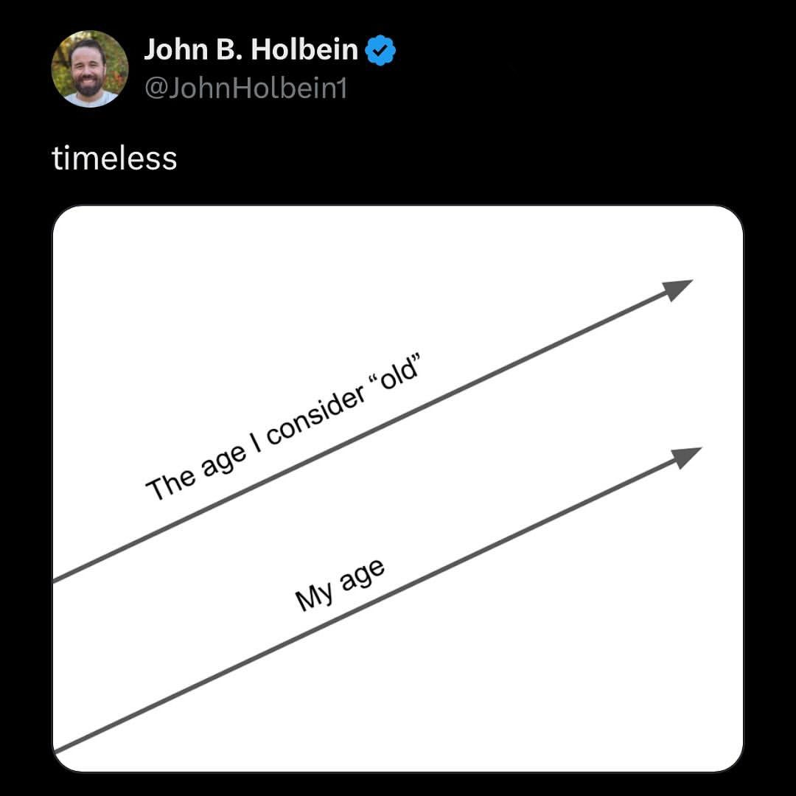
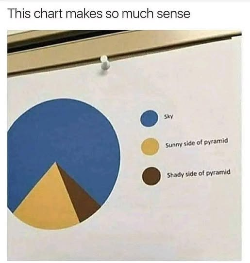

# Tableau Basic Charts

This module introduces basic chart types in Tableau. We will cover how to create and customize common visualizations such as bar charts, line charts, scatter plots, histograms, box plots, heat maps, pie charts, and combo charts.

**Outcomes**:

- Create heat maps, bar charts, histograms, scatterplots, boxplots, line charts, pie charts, and combo charts
- Describe what each chart is best used for
- Match a chart to the data structure and analysis goal
- Match a chart type to the appropriate pre-attentive attributes

**Links**:

- [Improving a line chart](https://nrennie.rbind.io/blog/accessible-line-chart/) — accessibility tips, referenced again in the Line section

## Terminology

Most charts have an x-axis and a y-axis. In Tableau, these are called *Columns* and *Rows*, respectively. The x-axis (Columns) is horizontal (from left to right). The y-axis (Rows) is vertical (up and down).

When both axes are numeric, best practices suggest the x-axis (Columns) should contain the independent variable (cause) and the y-axis (Rows) the dependent variable (effect). This rule applies to scatterplots and time series. It does *not* apply when one axis holds a category — the category on the x-axis of a bar chart is not a "cause" of anything.

### Dimensions and measures

Two distinctions drive almost everything in this chapter:

- **Dimension vs. measure.** A *dimension* categorizes or labels (Region, Product, Order Date). A *measure* is a number you aggregate (Sales, Profit, Age). Tableau guesses when you connect to data; you can change it.
- **Discrete vs. continuous.** *Discrete* fields (blue) create headers — separate panes or category labels. *Continuous* fields (green) create axes. Dimensions are usually discrete and measures are usually continuous, but either can be converted, which is why "a numeric dimension" and "a measure" are not the same thing.

Getting a scatterplot instead of a grid of boxes, or an axis instead of a row of labels, almost always comes down to whether the field is green or blue.

### Reading "n" in this chapter

Each chart below lists limits in terms of `n`. Because `n` means different things in different contexts, this chapter always says which:

- **n(categories)** — the number of distinct values in the dimension you are plotting
- **n(rows)** — the number of records in the data

Treat every threshold as a rough heuristic, not a rule. A scatterplot with 25 points can be perfectly readable; the guidance simply reflects where each chart usually works best.

## Aggregated vs. disaggregated data

This is the single hardest idea in the chapter, and it affects scatterplots and boxplots most. Two *separate* controls are involved, and they are often confused:

**1. `Analysis` → `Aggregate Measures` (a checkbox).**
When checked (the default), Tableau combines all rows that share the same level of detail into one mark — typically a SUM or AVG. When unchecked, Tableau draws **one mark per row** in the underlying data.

**2. `Marks` → `Detail` (adding a field).**
Dragging a field to Detail changes the view's *level of detail*: Tableau now draws one mark per value of that field, without giving it an axis or a color. This does not turn aggregation off — it changes what is being aggregated *to*.

So "one mark per customer" and "one mark per row of data" are different requests. The first uses Detail; the second unchecks Aggregate Measures.

> **Check your work:** click on a mark and select `View Data` to see exactly which rows it represents. If a single dot represents 4,000 rows, you are aggregated. If it represents one, you are not.

## Choosing a chart

| Dimensions | Measures | Analysis goal | Chart |
|---|---|---|---|
| 0 | 1 | See the shape of a distribution | Histogram |
| 1 categorical | 1 | Compare a value across categories | Bar |
| 1 categorical | 1 (disaggregated) | Compare distributions across categories | Boxplot |
| 0 | 2 | Show a relationship between two numbers | Scatterplot |
| 1 date | 1 | Show a trend over time | Line |
| 1 categorical (small) | 1 | Show parts of a whole | Pie |
| 2 categorical | 1 | Spot patterns across a grid | Heat map |
| 1 date | 2 | Two trends with different units | Combo (dual axis) |

### Why pre-attentive attributes matter here

Each section below lists the pre-attentive attributes the chart relies on. This is not trivia — it is the argument that organizes the whole chapter. People decode **position on a common scale** and **length** far more accurately than they decode **angle**, **area**, or **color**.

That ranking explains most of the advice that follows. Bar charts and scatterplots use the accurate channels, which is why they are the default answer to most questions. Pie charts (angle, area) and heat maps (color) use weaker channels, which is why they are limited to small numbers of categories and to spotting rough patterns rather than reading precise values.

## Heat Map

> **Note on naming.** In Tableau's `Show Me`, a **highlight table** colors each cell and can show a label, while a **heat map** sizes each mark by one measure and colors it by another. The process below builds a highlight table, which is the more common and more readable of the two. Both appear under `Show Me`, so expect to see both names.

- Best for
  - 2 dimensions
  - 1 measure
- Pre-attentive attributes
  - Color (use sequential or diverging scales, not categorical)
- Limits
  - Color is decoded with limited accuracy — good for patterns, poor for exact values
  - Hard to read with many cells; add labels if exact values matter
- Basic features
  - Sort rows or columns by dimension name or by measure value

Process:

- Drag a dimension onto Columns and another onto Rows
- Drag a measure onto Marks → Color
- Drag the same measure onto Marks → Label to show the underlying numbers
- Change the mark type to Square
- Click the color legend → `Edit Colors` and choose a sequential or diverging palette
- (Optional) Use the sort icons in the toolbar, or click a header, to sort by measure value

<!-- TODO: add example image, e.g. heatmap_ex.jpg -->

## Bar

- Best for
  - 1 dimension (0 if you want a single total bar)
  - 1 measure
- Pre-attentive attributes
  - Length (bars must start at zero)
  - Color (categorical from a dimension; sequential or diverging from a measure)
- Limits
  - Best for n(categories) < 10
  - Not for precise distributions of a single variable — use a histogram
- Basic features
  - Sort by dimension name or by measure value

Process:

- Drag a dimension onto Columns (for vertical bars) or Rows (for horizontal bars)
- Drag a measure onto the other shelf (Rows for vertical, Columns for horizontal)
- (If needed) Change the mark type to Bar
- (Optional) Add color:
  - Drag a **dimension** to Marks → Color for a categorical palette
  - Drag a **measure** to Marks → Color for a sequential or diverging palette
- (Optional) Sort using the toolbar sort buttons or the sort icon on the axis

> Horizontal bars are usually easier to read when category names are long.

<!-- TODO: add example image, e.g. bar_ex.jpg -->

## Histogram

- Best for
  - 1 measure, which you convert into bins (Tableau creates a new dimension for the bins)
- Pre-attentive attributes
  - Length (bars start at zero)
  - Color (rarely needed here; a measure gives sequential or diverging)
- Limits
  - Best for n(rows) > 100 — small samples produce noisy, misleading shapes
  - Bin width changes the story; try several before settling on one
- Basic features
  - Set a custom bin size
- Advanced features
  - Filter out outliers to see the bulk of the distribution

Process:

- Right-click a measure and select `Create` → `Bins...`
- Choose a bin size (Tableau suggests one; try a few)
- Drag the new bins dimension onto Columns
- Drag the original measure onto Rows
  - Right-click that pill and set the aggregation to `Count`, not SUM
- (If needed) Change the mark type to Bar
- (Optional) Drag a **measure** to Marks → Color for a sequential or diverging palette

<!-- TODO: add example image, e.g. histogram_ex.jpg -->

## Scatterplot

A scatterplot shows the relationship between two numeric variables. Depending on how you set it up, each point represents either a row in the dataset or a group of rows.

A common analytical technique is to split the graph into four quadrants using a reference line on each axis. When both scales have a meaningful zero, use zero; when they do not — a 1–5 survey scale, for example — use the scale midpoint or the mean, and say which you used.

- Best for
  - 2 measures (continuous), one on each axis
  - Optionally 1 dimension for color, size, or level of detail
- Pre-attentive attributes
  - Position on a common scale (x, y) — the most accurate channel available
  - Color (best for n(categories) ≤ 5)
  - Size
- Limits
  - Works best when n(rows) is large enough to reveal a pattern; heavy overplotting at very large n
  - Convention is cause on x and effect on y — but a visible relationship is **not** evidence of causation
- Basic features
  - Show aggregated or disaggregated data (see the section above)
- Advanced features
  - Trend lines and reference lines (`Analytics` pane)

Process:

- Drag a **measure** onto Columns
- Drag a **measure** onto Rows
  - Both pills should be green (continuous). If you see headers instead of axes, the field is discrete.
- Choose one:
  - **One mark per group** → drag a dimension to Marks → Detail
  - **One mark per row** → `Analysis` → uncheck `Aggregate Measures`
- (Optional) Drag a **dimension** to Marks → Color for a categorical palette, or a **measure** for sequential/diverging
- (Optional) Drag a **measure** to Marks → Size to encode a third value
  - Size shows magnitude only; there is no categorical/sequential/diverging choice for size
- (Optional) From the `Analytics` pane, drag on a Trend Line or Reference Line

## Boxplot

- Best for
  - 1 dimension
  - 1 measure, shown disaggregated
- Pre-attentive attributes
  - Position on a common scale
- Limits
  - Best for n(rows) > 100, with enough rows in *each* category to make quartiles meaningful
  - Useful exactly when there are too many points to read individually and quartiles summarize the spread better
- Basic features
  - Adjust whisker extent (1.5 × IQR vs. data range) and show or hide the underlying marks

Process:

- Drag a measure onto Rows (for vertical) or Columns (for horizontal)
- Drag a dimension onto the other shelf
- Use `Show Me` and select the box-and-whisker plot
- Decide what each point inside the box should represent (see *Aggregated vs. disaggregated* above):
  - **One point per group** → drag a dimension to Marks → Detail
  - **One point per row** → `Analysis` → uncheck `Aggregate Measures`
- (Optional) Drag another dimension to Rows or Columns to produce a separate boxplot per category
- Right-click the box → `Edit` to set whisker extent and mark visibility

<!-- TODO: add example image, e.g. boxplot_ex.jpg -->

## Line

A line chart shows trends over an ordered scale. In practice this is almost always a *date* dimension, though any ordered continuous variable (dose, distance, week number) works.

- Best for
  - 1 date (or other ordered continuous field)
  - 1 measure
- Pre-attentive attributes
  - Position on a common scale
- Limits
  - Requires an **ordered** dimension — connecting unordered categories with a line implies a trend that does not exist
  - Beyond about 5 lines, the chart becomes hard to follow; consider small multiples
- Advanced features
  - Custom date levels (Year / Quarter / Month; discrete vs. continuous dates)

Process:

- Drag a date dimension onto Columns
- Drag a measure onto Rows
- (If needed) Change the mark type to Line
- Right-click the date pill to choose the date level, and to switch between discrete (blue, separate headers) and continuous (green, unbroken axis)
- (Optional) Drag a dimension to Marks → Color to draw one line per category

> For labeling, color, and accessibility choices on line charts, see [Improving a line chart](https://nrennie.rbind.io/blog/accessible-line-chart/).

## Pie Charts

Pie charts get a lot of criticism because angle and area are decoded less accurately than length or position. They are still reasonable for part-to-whole relationships with a small number of categories.

- Best for
  - 1 dimension (a category)
  - 1 measure (Tableau converts the values into angles for you)
- Pre-attentive attributes
  - Angle
  - Area
  - Color (categorical)
- Limits
  - Best for n(categories) < 5
  - Hard to compare slices of similar size; a bar chart is almost always more precise
  - Only valid when the parts genuinely sum to a meaningful whole
- Basic features
  - Show labels as either percent of total or actual value

Process:

- Change the mark type to Pie
- Drag a dimension onto Marks → Color
- Drag a measure onto Marks → Angle
- (Optional) Drag the measure onto Marks → Label
  - Right-click the label pill → `Quick Table Calculation` → `Percent of Total` to label by share instead of raw value
- Use the Size slider on the Marks card to enlarge the pie

## Combo Charts

A combo chart puts two measures on the same view using two axes, letting each measure use its own mark type — for example, revenue as bars and profit margin as a line.

- Best for
  - 1 date (or one dimension)
  - 2 measures, usually with different units or very different magnitudes
- Pre-attentive attributes
  - Length (bars) and position on a common scale (line)
- Limits
  - Two axes make it easy to imply a relationship that is not there; readers often assume the axes are comparable when they are not
  - Only synchronize the axes when both measures share the same unit
  - Label both axes clearly, and use color to tie each axis to its mark
- Basic features
  - Dual axis, synchronized axis, per-measure mark types

Process:

- Drag a date dimension onto Columns
- Drag the first measure onto Rows
- Drag the second measure onto Rows, to the right of the first (you now have two stacked charts)
- Right-click the **second** measure's axis and select `Dual Axis`
- If — and only if — both measures use the same unit, right-click that axis again and select `Synchronize Axis`
- On the Marks card, a separate panel now exists for each measure. Select each one and set its mark type (for example, Bar for the first, Line for the second)
- Give each axis a clear title (right-click → `Edit Axis`)

<!-- TODO: add example image, e.g. combo_ex.jpg -->

## Notes on Tableau versions

Menu paths in this chapter reflect recent versions of Tableau Desktop and Tableau Public. Minor wording differences appear between versions, and `Show Me` options depend on which fields you have selected. When a menu item is missing, check whether the field is a dimension or a measure and whether it is discrete (blue) or continuous (green) — that is the cause most of the time.
