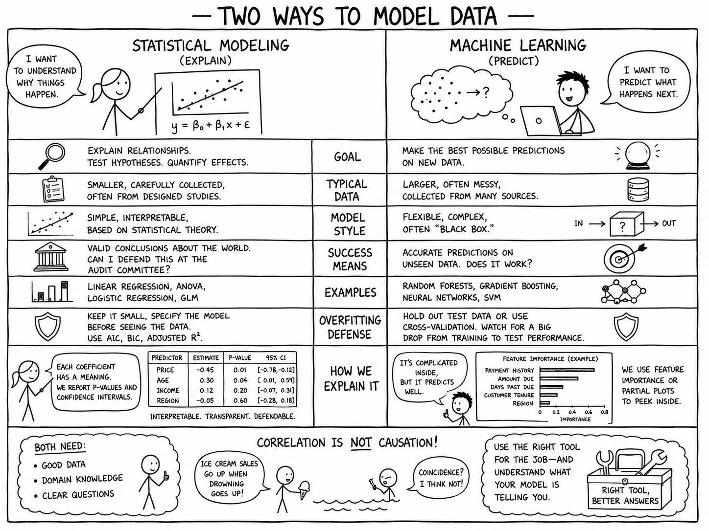

# Modeling to predict the future

Our prior course focused on visualizations as a means to understand and make predictions. In this course, we focus on creating models. A model is a simplified version of the real-world, expressed in mathematical terms (i.e., y = x + 1).

**Outcomes**
- Define key terms (model, feature, target, error, overfitting)
- Distinguish explanation from prediction, and statistical modeling from machine learning
- Explain how p-values and confidence intervals express uncertainty (traditional statistical approach)
- Simulate values and measure the results (modern machine-learning approach)

**Links**
- [Template](template.ipynb)
- [Suno y = f(x) + error](https://suno.com/s/nrophQQjMMi5eYfP)

## What is a model?

A model is a deliberately simplified description of the real world, written in math:

> y = f(x) + ε

This course is all about building better *f*.

- **y** is what we want to know (the target)
- **x** is what we already know (the features)
- **f** is the pattern connecting them
- **ε** is error — everything affecting y that we did not, or could not, measure

Measuring error is a critical part of our process. Because the model is simpler than reality, it is never exactly right. We can't build a model that is always true, but we can build one that is predicably wrong.

> "All models are wrong, but some are useful." — George Box

### Model key terms

- **Features** (independent variables, predictors, X): what we use to predict
- **Target** (dependent variable, outcome, y): what we are predicting
- **Model**: the mathematical relationship between features and target
- **Parameters** (coefficients): the numbers the model learns from the data — the `0.02` above
- **Error** (residual): actual minus predicted, for a single observation
- **Training data**: the rows used to build the model
- **Test data**: rows held back, used only to check the finished model
- **Overfitting**: when a model memorizes the training data instead of learning the pattern

Expect multiple terms for everything. Statistics says "independent variable," machine learning says "feature," and your database says "column."

## Two goals: explain or predict

Before building anything, decide which question you are answering.

- **Explain** focuses on *why* do invoices go unpaid? Which factors matter, by how much, and can I defend that in a memo to the audit committee?
- **Predict** focuses on *which* of these 12,000 invoices will go unpaid? I want the best possible guess, and I do not much care whether I can explain it.

Two traditions grew up around these two goals:

| | Statistical modeling | Machine learning |
|---|---|---|
| Goal | Explain, test hypotheses | Predict |
| Typical data | Smaller, carefully collected | Larger, often opportunistic |
| Model | Simpler, interpretable | Complex, often opaque |
| Success means | Valid conclusions about the world | Accurate predictions on new data |
| Overfitting guard | Keep the model small, specify it in advance | Hold out test data |

These cultures sometimes share tools. Regression sits in both columns: we will use it to explain in one chapter and to predict in the next. Each culture uses different approaches.

**Prediction is not causation.** A model might predict unpaid invoices well using customer zip code, even though zip code doesn't directly influence customer behavior.  Asking "so what should we change?" is a causal question. Correlation isn't caustion, but it does suggest where to look.

## How we judge a model

We judge a model with two separate criteria:

- **Predictive performance**: how close are the predictions to the actual values? 
- **Generalizability**: does the model perform on new data, or only on data it has already seen?

The right metric depends on the target.

- Predicting a number requires measuring error. Some metrics include RMSE and R² 
- Predicting a category requires true positive, false positive, etc...

Note that "accuracy" is one specific measure, not the general word for "how good is it."

Generalizability is very hard. If we add enough information, the model will fit its training data perfectly. It has memorized rather than learned. That is **overfitting**.

The two traditions guard against overfitting differently:

- **Machine learning defence against overfitting**: split the data into training and test sets. Build on training, judge on test. A large drop from one to the other means you overfit.
- **Statistical modeling defence against overfitting**: keep the model small, specify it before looking at the data, and penalize complexity with adjusted R², AIC, or BIC.

One warning, because this is a common misconception: **p-values do not protect against overfitting.** Choosing variables because they had small p-values (stepwise regression) actively causes it, and it invalidates the p-values themselves, since a p-value assumes you picked the model before you saw the data.

## How sure are we?

A model produces a number. Neither tradition trusts a number without a range around it.

- **Confidence interval**: a plausible range for something we estimated, such as 90% of people are between 5'1 and 6'0.
- **p-value**: how likely we would be to see a relationship this strong if there were truly no relationship at all. 

A small p-value says "probably not just noise." It does *not* say the effect is large, important, or causal.

Modern practice often answers the same question by brute force instead of algebra: **simulation**. Rather than deriving a formula for uncertainty, refit the model on 1,000 resamples of your data and watch how much the answer moves. The spread of those 1,000 answers *is* your uncertainty. 

We will use both approaches this semester.

## EDA process

Exploratory data analysis works the same way for statistical modeling and machine learning, and it is covered in our prior class — see the [EDA chapter](https://profgarrett.github.io/course_dv/dv01-eda/). If you did not take that course with me, review it before continuing.

The short version:

- Load the dataset
- One field at a time:
  - Understand the data structure (wide, long, roll-up, aggregated, longitudinal, cross-sectional)
  - Clean the field: check the data type, find missing values and duplicates
  - Visualize the distribution (find outliers)
- Visualize relationships between variables

Once the data is clean:

- Select features and a target
- *If using ML*, split the data into training and testing sets — **before** you look at the test set
- Fit the model
- Evaluate it, on data it has not seen
- Repeat as needed, remembering that every repetition is another chance to overfit

### Communicating results

A model that nobody acts on has accomplished nothing. Your deliverable is an argument, not a number:

- **Presentation** for decision-makers who want the recommendation and its uncertainty, not your feature engineering
- **Written memo** for the record — what you did, what you assumed, what would change your conclusion
- **Poster** for a mixed audience skimming in ninety seconds

In every format, report what the model does *not* know alongside what it predicts.

## Key Terms

- **Machine Learning**: A tradition emphasizing prediction
- **Statistics**: A tradition emphasizing explanation