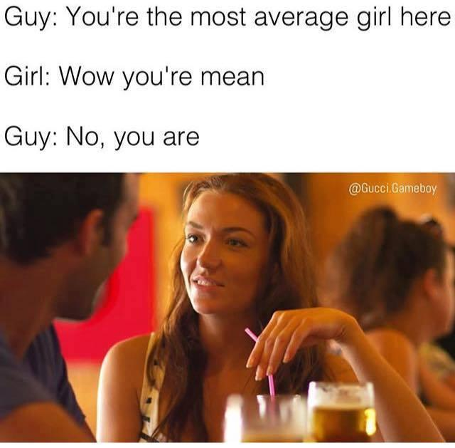

# Understand your data and its distribution

Understand the type of data you are using! You can't use data in a model if you don't understand its characteristics.

**Outcomes**:
- Distinguish between continuous, discrete, and categorical data types
- Calculate measures of central tendency and measures of spread
- Distinguish between normal, uniform, and binomial distributions
- Transform data using log transformation and standardization
- Pick the right type of visualization for different data types


**Good examples**:
- Distribution: [How good is good?](https://today.yougov.com/society/articles/21717-how-good-good-1)


## Data Types

There are several types of data. The main types are continuous, discrete, and categorical. These do not fully align with Python data types (such as int, float, str), but are more about the meaning of the data.

The distinction is about *meaning*, not storage. The same Python `int` can be a count, a rating, or a zip code. 

```python
import pandas as pd

df = pd.DataFrame({
    'weight':   [154.2, 180.7, 143.9],   # continuous
    'children': [0, 2, 1],               # discrete
    'zip_code': [26505, 26501, 26508],   # categorical, despite being stored as a number
})

print(df.dtypes)
# weight      float64
# children      int64
# zip_code      int64
```

Python reports two of these as `int64`, but averaging the number of children is meaningful while averaging a zip code is nonsense.

### Continuous data

**Continuous data**: Numerical data whose precision is set by the measuring tool, not the underlying value. A good example is height or weight.
- Can take on any value within a range, such as 5.1 inches, 5.12 inches, 5.123 inches, etc. There are infinite possible values within a range.
- In practice, continuous data is often stored with limited precision (for example, height rounded to whole inches instead of feet and inches, or weight in pounds instead of pounds and ounces).
- *The most important definitional requirement is that continuous data can take on any value within a range, and that there are many unique values.*

Visualize with a histogram, line chart, or scatterplot. Continuous data does not show well on a bar chart, as it shows a lot of very small bars that are hard to read.

A quick practical test is to count the unique values relative to the number of rows:

```python
print(df['weight'].nunique())     # 3 unique values out of 3 rows -> continuous
print(df['children'].nunique())   # 3 unique values, but only a few are possible -> discrete
```

The count alone will not decide it for you. You still have to ask how many values are *possible*, not just how many appeared.

### Discrete data

**Discrete Data** is numerical data with a limited number of options.
- Has no intermediate values, such as number of children or a 1-5 ranking on a survey question.
  - In practice, discrete data is often stored as a float (for example, a ranking stored as 1.0, 2.0, 3.0 instead of 1, 2, 3).
  - *The most important definitional requirement is that discrete data has a limited number of possible values.*

You can have 2 children or 3 children, but never 2.4, no matter how precise your measuring tool is. That is the difference from continuous data: the limit comes from the thing itself, not the instrument.

Visualize with counting and a bar chart.
- Discrete data does not show well on a line chart, as it implies values between the discrete points.
- Discrete data can be hard to visualize on a scatterplot, as the dots will overlap. You can add "jitter" to the points to spread them out, or set a lower alpha transparency.

```python
ratings = pd.Series([5, 4, 5, 3, 4, 5, 2, 4])
print(ratings.value_counts().sort_index())
# 2    1
# 3    1
# 4    3
# 5    3
```

Counting is the natural summary for discrete data. The `value_counts()` function is very helpful.

### Categorical data

**Categorical data** is a value describing a group or category with a limited number of options that do not have a meaningful numeric value.
- This is generally text (such as major or a person's name), but can be stored as a number (such as a district code or zip code).
  - In practice, categorical data is often stored as a number (for example, district code stored as 101, 102, 103, etc.).
  - *The most important definitional requirement is that categorical data represents groups or categories.*

The test that settles most cases: if the average of the values is meaningless, the data is categorical. The average of three zip codes is not a place.

Visualize with a bar chart or pie chart.
- Categorical data does not show well on a line chart, as it implies values between the categories.
- Categorical data can be hard to visualize on a scatterplot, as the dots will overlap. You can add "jitter" to the points to spread them out, or set a lower alpha transparency.

```python
majors = pd.Series(['ACCT', 'FIN', 'ACCT', 'MIS', 'ACCT', 'FIN'])
print(majors.value_counts().to_dict())   # {'ACCT': 3, 'FIN': 2, 'MIS': 1}
print(majors.mode().tolist())            # ['ACCT']
print(majors.mean())                     # TypeError: no numeric data
```

Mode is the only measure of central tendency that works here. There is no mean or median major.


## Descriptive Measures

After you understand your data type, you should calculate *descriptive statistics*. These summarize your data, and can be very useful for both understanding your data and communicating results.

- Measures of central tendency
  - **Mean, median, mode**: average, middle value, most common value
  - **Skewness**: asymmetry of the data
    - Positive skew (long right tail): typically mean > median > mode
    - Negative skew (long left tail): typically mean < median < mode
    - This ordering is a rule of thumb, not a law. It holds for the smooth, single-peaked distributions you will usually meet, and there are constructed counterexamples where it fails.
- Measures of spread
  - **Variance**: the mean of the squared distances between each data point and the mean.
  - **Standard deviation**: square root of variance
  - **Mean absolute deviation**: similar to standard deviation, but does not square the difference.
  - **Quantiles**: cut points that split sorted data into equal-sized groups
    - **Quartiles**: 4 groups, cut at the 25th, 50th, and 75th percentiles
    - **Deciles**: 10 groups
    - **Percentiles**: 100 groups
- **Outliers**: extreme data values.



### Central tendency in code

```python
scores = pd.Series([70, 75, 80, 80, 85, 90, 95])

print(scores.mean())            # 82.14285714285714
print(scores.median())          # 80.0
print(scores.mode().tolist())   # [80]
```

Mean, median, and mode answer the same question three different ways, and they disagree whenever the data is not symmetric. Here mean > median = mode, the signature of a mild positive skew:

```python
print(scores.skew())            # 0.169
```

The difference between mean and median matters most with outliers. The mean is pulled toward extreme values; the median is not:

```python
salaries = pd.Series([45, 48, 52, 55, 60])
print(salaries.mean(), salaries.median())     # 52.0 52.0

with_ceo = pd.Series([45, 48, 52, 55, 60, 900])
print(with_ceo.mean(), with_ceo.median())     # 193.33333333333334 53.5
```

One value moved the mean from 52 to 193 while the median barely budged. This is why "average salary" and "median salary" are different.

### Spread in code

```python
scores = pd.Series([70, 75, 80, 80, 85, 90, 95])

print(scores.var())                            # 73.80952380952381
print(scores.std())                            # 8.591247037802884
print((scores - scores.mean()).abs().mean())   # 6.734693877551022  mean absolute deviation
```

Standard deviation is more useful than variance in a report because it is in the original units. If scores are points, the standard deviation is about 8.6 points, while the variance is 73.8 "squared points," which means nothing to a reader.

**A warning that will bite you.** Pandas and NumPy disagree on the default:

```python
import numpy as np

print(scores.std())          # 8.5912  pandas defaults to the SAMPLE sd (divides by n-1)
print(np.std(scores))        # 7.9539  numpy defaults to the POPULATION sd (divides by n)
print(np.std(scores, ddof=1))# 8.5912  matches pandas
```

Neither is wrong; they answer different questions. Because you almost always have a sample rather than an entire population, the pandas default is usually the one you want. Just never mix the two in the same analysis.

### Quantiles and the five-number summary

`describe()` gives you most of this in one call, which is a reasonable first thing to run on any new numeric column:

```python
print(scores.describe())
# count     7.000000
# mean     82.142857
# std       8.591247
# min      70.000000
# 25%      77.500000
# 50%      80.000000
# 75%      87.500000
# max      95.000000
```

The 25%, 50%, and 75% rows are the quartiles. You can request any quantile directly:

```python
print(scores.quantile(0.25))   # 77.5   Q1
print(scores.quantile(0.90))   # 92.0   90th percentile
```

### Finding outliers

"Extreme" needs a definition before you can act on it. The most common rule flags anything more than 1.5 IQRs beyond the quartiles. IQR is a term meaning "interquartile range," which is Q3 minus Q1. 

```python
income = pd.Series([32, 35, 38, 41, 44, 47, 52, 58, 65, 250])

q1, q3 = income.quantile(0.25), income.quantile(0.75)
iqr = q3 - q1
print(q1, q3, iqr)                 # 38.75 56.5 17.75

lower = q1 - 1.5 * iqr
upper = q3 + 1.5 * iqr
print(lower, upper)                # 12.125 83.125

print(income[(income < lower) | (income > upper)].tolist())   # [250]
```

This is a boxplot: the box spans Q1 to Q3, and the whiskers stop at the last point inside these fences. Anything beyond gets plotted as an individual dot.

Being flagged as an outlier is not a reason to delete a value. Ask first whether it is a data-entry error, a genuinely rare case.


## Data Distributions

After understanding your data and calculating descriptive statistics, look at each value's distribution. This helps you choose the right model.

This normally requires some form of visualization, such as a histogram or density plot.

- **Normal distribution** is a bell-shaped curve that is symmetric around the mean.
  - A normal distribution (or bell curve) has most values near the mean, with fewer values as you move away.
  - Many natural phenomena follow a normal distribution, such as height or weight
  - Most classical statistical tests assume a normal distribution.
- **Uniform distribution** all outcomes have an equal probability.
  - Examples include rolling a fair die or selecting a random card from a deck.
- **Binomial distribution**: the number of successes in a fixed number of independent trials, each with the same probability of success.
  - A single true/false trial (one coin flip, one pass/fail test) is a **Bernoulli trial**. The binomial distribution counts the successes across many such trials.
  - Flipping one coin is Bernoulli; counting how many heads you get in 10 flips is binomial.

[*3-minute data science* Normal distribution](https://www.youtube.com/watch?v=3VYupIsbLlY)

### Seeing the three distributions

You can generate each one and look at its shape. The `default_rng(42)` seed makes these numbers reproducible, so you should see the same results:

```python
import numpy as np
import pandas as pd

rng = np.random.default_rng(42)
```

**Normal.** Symmetric, so skew is near zero and mean is near median:

```python
heights = pd.Series(rng.normal(69, 3, 1000))   # mean 69 inches, sd 3
print(round(heights.mean(), 2))     # 68.91
print(round(heights.skew(), 2))     # -0.04  essentially symmetric
```

The bell curve's useful property is the **68-95-99.7 rule**: about 68% of values fall within one standard deviation of the mean, and about 95% within two.

```python
m, s = heights.mean(), heights.std()
print(round((heights.between(m - s, m + s)).mean(), 3))       # 0.687  about 68%
print(round((heights.between(m - 2*s, m + 2*s)).mean(), 3))   # 0.955  about 95%
```

**Uniform.** Every outcome roughly equally likely, so the histogram is flat:

```python
die = pd.Series(rng.integers(1, 7, size=1000))
print(die.value_counts().sort_index().tolist())
# [161, 177, 175, 157, 159, 171]   all near 1000/6 = 167
```

The counts are not identical, and that is the point. Random variation means a fair die does not produce exactly equal counts.

**Binomial.** Count the successes in a fixed number of trials:

```python
heads = pd.Series(rng.binomial(n=10, p=0.5, size=1000))   # 1000 rounds of 10 coin flips
print(round(heads.mean(), 2))       # 5.02   expected value is n * p = 5
print(heads.value_counts().sort_index().tolist())
# [1, 3, 49, 112, 214, 252, 188, 126, 41, 13, 1]
```

Note that the binomial result *looks* bell-shaped. With enough trials and a probability near 0.5, the binomial approximates the normal distribution — which is one reason the normal curve shows up so often.

### Transformations

At times, you may need to transform your data to better fit a model. Common transformations include:
- **Log transformation**: finds the natural logarithm of the data, useful for right-skewed data (such as income)
- **Standardization**: puts data on the same numeric scale
  - We will use this in k-means clustering and other ML techniques
  - **Z-score scaling**: rescales data to have a mean of 0 and standard deviation of 1
  - **Min-max scaling**: rescales data to a 0-1 range (from minimum to maximum)
- **Removing outliers**: removes extreme values that can skew results

**Log transformation.** Income is the standard example. A log pulls in the long right tail and can turn a badly skewed variable into something close to normal:

```python
income = pd.Series(rng.lognormal(mean=10.8, sigma=0.9, size=1000))
print(round(income.mean()), round(income.median()))   # 75874 50012
print(round(income.skew(), 2))                        # 3.61   heavily right-skewed

log_income = np.log(income)
print(round(log_income.skew(), 2))                    # 0.04   nearly symmetric
```

Notice the mean sitting well above the median before the transform — the positive-skew signature from the section above, showing up in real data.

Two cautions. The log of zero is undefined and the log of a negative number is not a real number, so a variable containing zeros needs `np.log1p()`, which computes log(1 + x):

```python
print(np.log(0))          # -inf, with a RuntimeWarning
print(np.log1p(0))        # 0.0
```

And after you log-transform a variable, your model's coefficients describe the *log* of it. You have to convert back before reporting results to anyone.

**Z-score scaling.** Subtract the mean, divide by the standard deviation. The result is how many standard deviations each point sits from the mean:

```python
scores = pd.Series([70, 75, 80, 80, 85, 90, 95])

z = (scores - scores.mean()) / scores.std()
print(z.round(3).tolist())   # [-1.413, -0.831, -0.249, -0.249, 0.333, 0.915, 1.497]
print(round(z.mean(), 10))   # 0.0
print(round(z.std(), 6))     # 1.0
```

A z-score of 1.497 means that score sits about 1.5 standard deviations above the mean. Z-scores are unbounded and keep outliers visible.

**Min-max scaling.** Rescale so the smallest value becomes 0 and the largest becomes 1:

```python
mm = (scores - scores.min()) / (scores.max() - scores.min())
print(mm.round(3).tolist())  # [0.0, 0.2, 0.4, 0.4, 0.6, 0.8, 1.0]
```

Min-max gives you a guaranteed range, which some algorithms want, but it is fragile: a single extreme outlier compresses every other value toward zero.

**Why standardize at all?** Any technique that measures distance between points — k-means clustering, k-nearest neighbors — will let a large-scale variable dominate a small-scale one. Salary in dollars and years of experience are not comparable until you put them on the same scale:

```python
employees = pd.DataFrame({
    'salary': [45000, 62000, 88000],
    'years':  [2, 7, 15],
})

standardized = (employees - employees.mean()) / employees.std()
print(standardized.round(3))
#    salary  years
# 0  -0.924 -0.915
# 1  -0.139 -0.152
# 2   1.062  1.067
```

Before scaling, a $1,000 salary difference swamps a 10-year experience difference in any distance calculation. After scaling, the two variables contribute comparably.


## Key Terms

- **Continuous data**: Numerical data whose precision is set by the measuring tool, with many unique values
- **Discrete data**: Numerical data with a limited number of possible values and no values in between
- **Categorical data**: Values naming a group, with no meaningful numeric value
- **Descriptive statistics**: Numbers that summarize a variable, such as mean or standard deviation
- **Central tendency**: Where the middle of the data sits
- **Mean**: The arithmetic average, sensitive to outliers
- **Median**: The middle value when sorted, resistant to outliers
- **Mode**: The most common value, the only measure that works for categorical data
- **Spread**: How far the values sit from the center
- **Variance**: The mean of the squared distances from the mean
- **Standard deviation**: The square root of variance, in the same units as the data
- **Mean absolute deviation**: The mean of the unsquared distances from the mean
- **Quantile**: A cut point dividing sorted data into equal-sized groups
- **Quartile**: Quantiles that split data into 4 groups, at 25%, 50%, and 75%
- **Decile**: Quantiles that split data into 10 groups
- **Percentile**: Quantiles that split data into 100 groups
- **IQR (interquartile range)**: Q3 minus Q1, the range of the middle half of the data
- **Skewness**: The asymmetry of a distribution, and the direction of its longer tail
- **Outlier**: An extreme value far from the rest of the data
- **Distribution**: The pattern of how often each value occurs
- **Normal distribution**: The symmetric bell curve, with most values near the mean
- **Uniform distribution**: Every outcome equally likely
- **Bernoulli trial**: A single yes/no trial, such as one coin flip
- **Binomial distribution**: The number of successes in a fixed number of independent trials
- **Log transformation**: Taking the logarithm of a variable to pull in a long right tail
- **Standardization**: Rescaling variables onto a common scale
- **Z-score**: A standardized value, giving how many standard deviations a point sits from the mean
- **Min-max scaling**: Rescaling a variable to run from 0 to 1


## Practice Questions

1. Which type of data can take on any value within a range, with its precision set by the measuring tool?
   - Continuous
   - Discrete
   - Categorical
   - Binomial
1. A survey asks respondents to rate a course from 1 to 5. What type of data is the rating?
   - Discrete
   - Continuous
   - Categorical
   - Uniform
1. A dataset stores zip codes as the numbers 26501, 26505, and 26508. What type of data is this?
   - Categorical, because the numbers name places rather than measure anything
   - Continuous, because the values are numeric
   - Discrete, because there is a limited number of zip codes
   - It depends on whether they are stored as int or float
1. Which quick test best identifies categorical data?
   - Ask whether the average of the values is meaningful
   - Check whether Python stores it as a string
   - Check whether the values are whole numbers
   - Count whether there are fewer than 10 unique values
1. Why is a bar chart a poor choice for continuous data?
   - It produces many very small bars that are hard to read
   - Bar charts cannot display numeric values
   - It implies values exist between the categories
   - Bar charts require exactly two variables
1. Why is a line chart a poor choice for categorical data?
   - It implies meaningful values exist between the categories
   - Categories cannot be sorted
   - Lines can only show continuous time
   - It hides the count of each category
1. What is "jitter" used for?
   - Spreading out overlapping points on a scatterplot so they can be seen
   - Removing outliers before plotting
   - Smoothing a line chart
   - Randomly sampling a large dataset
1. Which measure of central tendency works for categorical data?
   - Mode
   - Mean
   - Median
   - Variance
1. Which measure of central tendency is most affected by an outlier?
   - Mean
   - Median
   - Mode
   - Interquartile range
1. A dataset has mean 193 and median 53.5. What does this suggest?
   - A strong positive skew, with a long right tail
   - A strong negative skew, with a long left tail
   - A symmetric distribution
   - A uniform distribution
1. In a positively skewed distribution, what is the typical ordering?
   - Mean > median > mode
   - Mean < median < mode
   - Mean = median = mode
   - Median > mean > mode
1. How is variance defined?
   - The mean of the squared distances between each value and the mean
   - The difference between the largest and smallest value
   - The square root of the standard deviation
   - The distance between the mean and the median
1. Why is standard deviation usually reported instead of variance?
   - It is in the same units as the original data
   - It is always a smaller number
   - It is not affected by outliers
   - It does not require calculating the mean
1. Quartiles split sorted data into how many groups?
   - 4
   - 10
   - 25
   - 100
1. Quantiles that split data into 10 groups are called what?
   - Deciles
   - Quartiles
   - Percentiles
   - Outliers
1. What is the IQR?
   - Q3 minus Q1, covering the middle half of the data
   - The largest value minus the smallest value
   - The mean plus or minus one standard deviation
   - The number of outliers in the dataset
1. Under the common outlier rule, a value is flagged when it falls how far beyond the quartiles?
   - More than 1.5 IQRs
   - More than 1 standard deviation
   - More than 2 IQRs
   - Outside the 10th and 90th percentiles
1. `scores.std()` in pandas returns 8.59 but `np.std(scores)` returns 7.95. Why?
   - Pandas defaults to the sample standard deviation and NumPy to the population version
   - NumPy rounds its result
   - Pandas excludes outliers automatically
   - One of the two is calculating variance instead
1. Which pandas method returns count, mean, standard deviation, min, quartiles, and max in one call?
   - `describe()`
   - `summary()`
   - `value_counts()`
   - `info()`
1. Which distribution is symmetric and bell-shaped, with most values near the mean?
   - Normal
   - Uniform
   - Binomial
   - Skewed
1. Under the 68-95-99.7 rule, about what share of values falls within two standard deviations of the mean?
   - 95%
   - 68%
   - 99.7%
   - 50%
1. Rolling a fair die produces which distribution?
   - Uniform
   - Normal
   - Binomial
   - Lognormal
1. You count how many heads appear in 10 coin flips, repeated many times. Which distribution describes the counts?
   - Binomial
   - Bernoulli
   - Uniform
   - Normal
1. What is the difference between a Bernoulli trial and a binomial distribution?
   - A Bernoulli trial is a single yes/no outcome; the binomial counts successes across many trials
   - A Bernoulli trial applies to dice and the binomial to coins
   - They are two names for the same thing
   - A Bernoulli trial requires a normal distribution
1. Which transformation is most useful for a right-skewed variable such as income?
   - Log transformation
   - Min-max scaling
   - Z-score scaling
   - No transformation, since skew does not affect models
1. After a z-score transformation, what are the mean and standard deviation of the data?
   - Mean 0 and standard deviation 1
   - Mean 1 and standard deviation 0
   - Mean 0 and standard deviation 0
   - Unchanged from the original data
1. What range does min-max scaling produce?
   - 0 to 1
   - -1 to 1
   - -3 to 3
   - The original range, recentered on zero
1. Why standardize variables before k-means clustering?
   - Otherwise a large-scale variable dominates the distance calculations
   - Clustering algorithms cannot read floats
   - It removes outliers from the dataset
   - It converts categorical data into numbers
1. What happens when you run `np.log(0)`?
   - It returns `-inf` with a warning, so use `np.log1p()` when the data contains zeros
   - It returns 0
   - It returns 1
   - It silently drops the value from the dataset
1. Being flagged as an outlier by the 1.5 IQR rule means what?
   - The value deserves investigation, which may or may not lead to removing it
   - The value is definitely a data-entry error and should be deleted
   - The dataset is not normally distributed
   - The mean should be replaced with the median