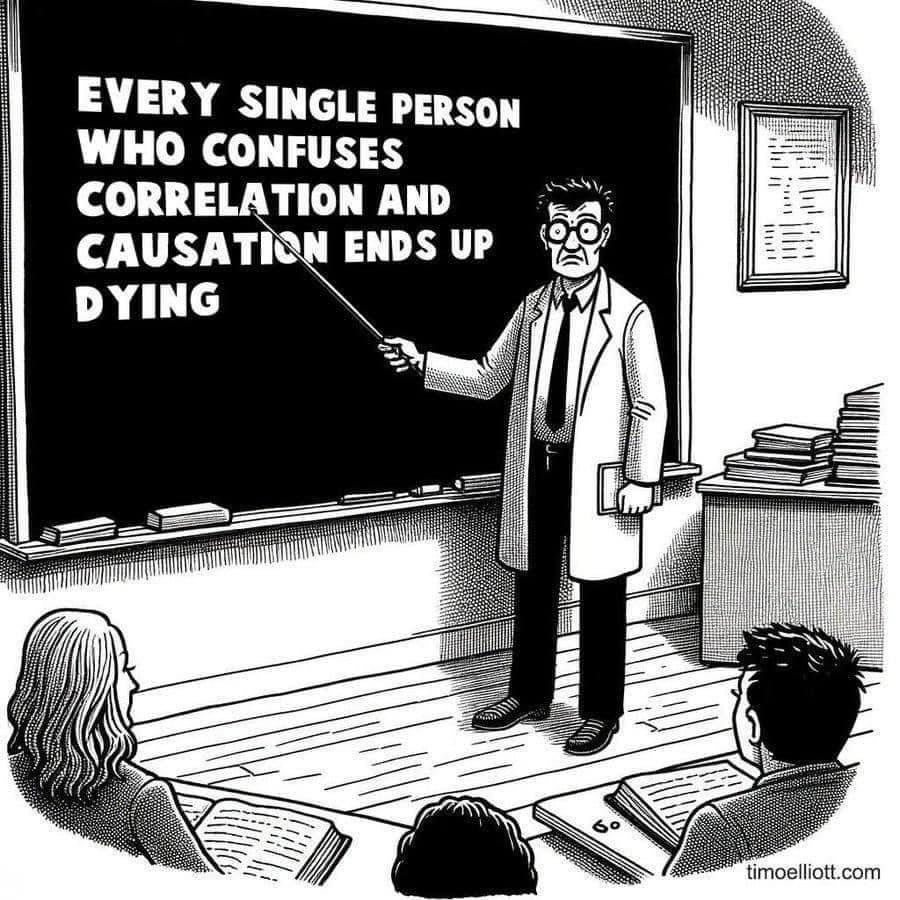

# Predicting Numerical Value

Some models predict a continuous variable. For example, can we predict a student's test score based on hours studied?

**Outcomes**:
- Interpret correlation strength and significance (p value)
- Distinguish between correlation and causation
- Calculate RMSE 
- Calculate residuals
- Describe R-squared

**Links:**
- [Correlation Simulation](correlation.html)
- [Correlation samples](correlation_samples.docx)
  - [Poll](https://docs.google.com/forms/d/e/1FAIpQLSdAzdeIGzL0F2j4xPqqmLLnq1bkcuslApHJhLw8ryXjkhHdTw/viewform?usp=publish-editor)
  - [Answers Spreadsheet](docs.google.com/spreadsheets/d/15DGDcSCIAMRfq71E-VJqOTNjM1knpSdsQP-Fu2rX-ZE)
- [Quizlet terms](https://quizlet.com/1127642197/ml04-predicting-numbers-flash-cards/?i=2up6jq&x=1jqt)

**Other Resources:**
- [Helpful video on correlation](https://www.youtube.com/watch?v=rijqfllOq6g)
- [Good discussion and examples of correlation](https://www.reddit.com/r/dataisbeautiful/comments/18p85yp/correlating_four_other_variables_with_a_states/?share_id=IsERBPtlNN-F0Bw9s0kSn)

## Correlation

A simple model for predicting numerical value is *correlation*. Correlation measures the strength *and* direction of a linear relationship between two continuous variables. 

Interpretation:
- Ranges from -1 to +1
  - +1 is perfect positive correlation (as one goes up, so does the other)
  - -1 is perfect negative correlation (as one goes up, the other goes down)
  - 0 is no correlation
  - Strong > 0.5, moderate > 0.25, weak around 0.2.

Correlation is not causation! Two variables may be correlated, but that does not mean one causes the other. There may be a third variable causing both, or it may be a coincidence. 

## Measuring Error

In a classical approach to statistics, we measure error with p-values. 

**p-value**: the probability of observing the data if the null hypothesis is true
- A low p-value (<= 0.05) indicates that the observed effect is unlikely to be due to chance
- A high p-value (> 0.05) indicates that the observed effect could be due to chance

In newer ML approaches, we will measure error by splitting out data into test and training sets. After training our model, we will evaluate it using the test set. This will be covered in more detail in later modules.

A correlation has both:
- **Strength**: how closely the points fit a line
- **Statistical significance**: how likely the correlation is due to chance
  - p-value <= 0.05 is generally considered statistically significant

## Problems 

There are a variety of problems that can affect correlation:
- **Non-linear relationships**: A correlation only measures linear relationships. Two variables may have a strong non-linear relationship, but a low correlation.
  - Example: age and height. As children age, they grow quickly, but after a certain age height levels off. This is a non-linear relationship.
  - Solution: for skewed data (such as income), take the log of the data to make it more linear.
- **Outliers**
  - Example: measuring income of a small town that includes Bill Gates will dramatically skew the results.
  - Solution: Exclude outliers (a common approach is to remove to the top and bottom 1%.

## Example: Predicting Grade

Imagine we are trying to predict a customer's total sales based on advertisements viewed. We find a positive correlation of 0.5, meaning that for every 2 advertisements a person sees, they will increase their total sales by 1. 

We will test this model.  We need to calculate error, or the difference between the actual result and our model.

We have 3 customers:

- A actual sales $10, predicted $10
- B actual sales $12, predicted $10
- C actual sales $8, predicted $10

### RMSE

RMSE is the squared difference of each error. Here is a [good reference](https://www.statology.org/how-to-interpret-rmse/).

Calculate the squared difference of each point,
(10 - 10)^2 + (12 - 10)^2 + (8 - 10)^2 = 8

Divide by the number of observations, and take the square root.
(20 / 3) ^ .5 = 2.58

### Residuals

We may also want to see the difference between our prediction and actual values. 
(10 - 10), (12 - 10), (8 - 10) --> (0, 2, -2)

So, the RMSE is the square root of the variance. This is essentially the average distance between predicted and actual values.

### R-squared (R^2)

The coefficient of determination tells us the *proportion* of variance in our dependent variable that can be explained by our independent variables.

It ranges from 0 to 1. Generally, the higher the number the better the prediction. This will be more fully explained in the regression sections. 
