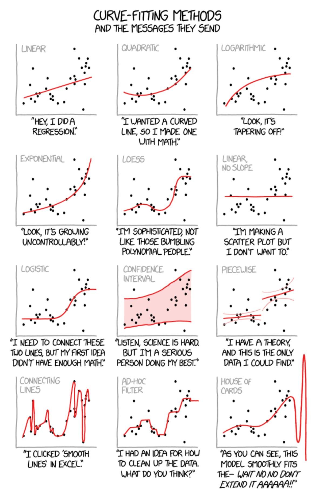
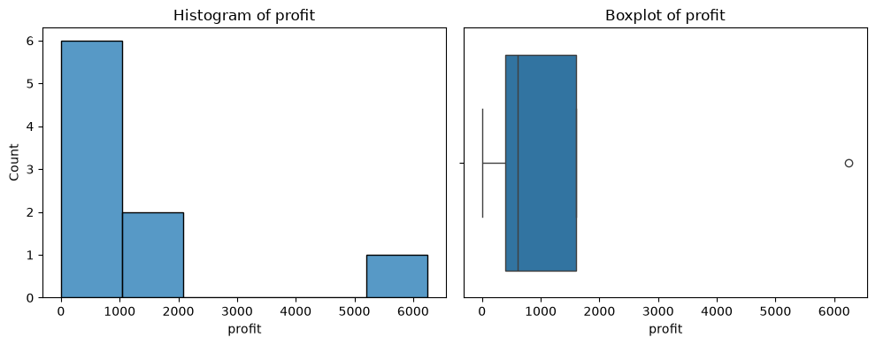
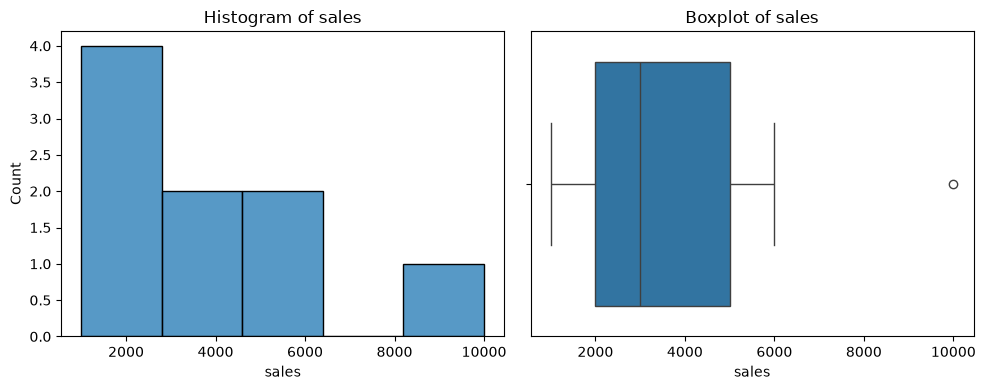
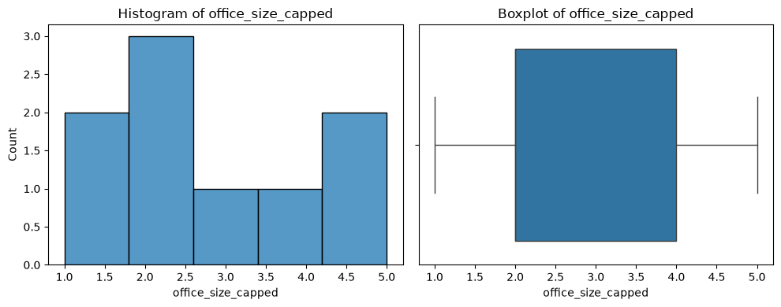
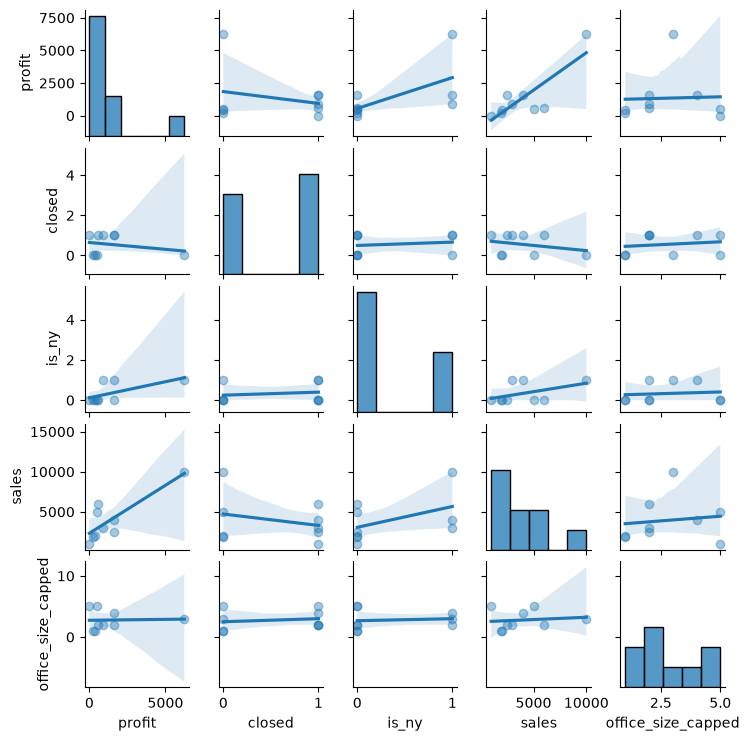
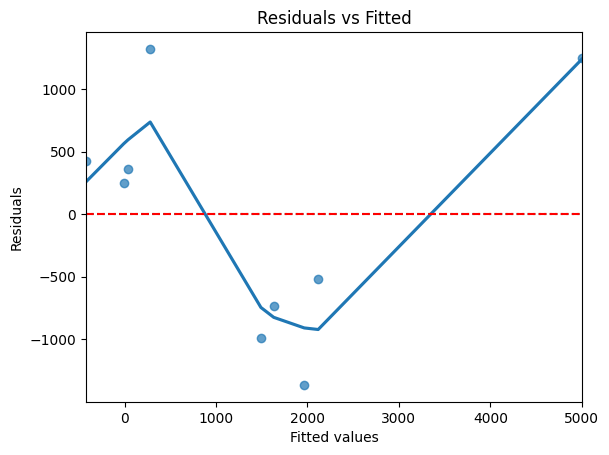

<script src="/course_model/toc.js"></script>

# Linear Regression

Linear Regression is our most important prediction tool. It uses multiple numerical independent variables to predict a single output/dependent variable. We generally use the OLS (ordinary least squares) algorithm.

**Outcomes**:
- Explain when to use linear regression and its main assumptions
- Explain the difference between test/train splits versus p-values for model evaluation for reducing overfitting
- Explain the accuracy and statistical significance of a linear regression model and individual coeffiecients
- Explain R^2, RMSE, residuals, coefficients, and p-values
- Draw a graph of a linear regression model from an equation
- Explain multicollinearity and how to detect it
- Explain normality of residuals (or homoscedasticity)

**Links**:
- [Quizlet](https://quizlet.com/1127682970/ml05-ols-regression-flash-cards/?i=2up6jq&x=1jqt)
- [Regression Error Template](regression-simple-error-problem.docx)
- [template](template.ipynb) and [data files](statelife.csv)

**Good Resources**:
- [Linear Regression in 3 minutes](https://www.youtube.com/watch?v=3dhcmeOTZ_Q)
- [Multiple regression in R](https://www.youtube.com/watch?v=hokALdIst8k)
- [Multiple regression in theory](https://www.youtube.com/watch?v=zITIFTsivN8)
- [Multiple linear regression tutorial](https://bradleyboehmke.github.io/HOML/linear-regression.html)
- [Should we use a p<0.05 in science?](https://www.tandfonline.com/doi/full/10.1080/00031305.2019.1583913)
- [Linear Regression Visual](https://mlu-explain.github.io/linear-regression/)


## Key concepts in regression

When to use Linear Regression:

- Linear regression assumes a *linear* relationship between the independent variables and the output variable. 
    - If the relationship is non-linear, we may need to transform the inputs (e.g., log, square root, polynomial) to achieve linearity.
- The output variable is a *continuous* numerical variable. 
    - Logistic regression is used when the output variable is categorical (e.g., yes/no, true/false, 0/1).
- Train/test split
    - We do not typically use test/train split in *classical* regression. Instead, we look at individual coefficients and their p-values to determine significance, as well as overall model metrics like R^2 and RMSE.




Interpretation:

- Overall Model 
    - R^2 value indicates the proportion of variance in the dependent variable that can be explained by the independent variables.
        - We want a higher R^2 value (closer to 1) as it indicates a better fit.
        - If we have multiple independent variables, we instead use *adjusted* R^2.
            - This adjusts the R^2 value based on the number of predictors in the model, providing a penalty for adding predictors.
    - RMSE (root mean squared error) indicates the average distance between the predicted values and the actual values.
        - We want a lower RMSE value as it indicates better predictive accuracy.
    - Residuals are the differences between predicted and actual values
        - Residuals should be normally distributed around zero.
        - We can check this with a histogram of residuals.
- Individual Predictors
    - Each independent variable has a *coefficient* that indicates the strength and direction of its relationship with the output variable.
        - A positive coefficient means that as the independent variable increases, the output variable also increases.
        - A negative coefficient means that as the independent variable increases, the output variable decreases.
    - Each independent variable also has a *p-value* that indicates the statistical significance of its relationship with the output variable.
        - A common threshold for significance is p < 0.05, meaning there is less than a 5% chance that the observed relationship is due to random chance.
        - However, this threshold is arbitrary and should be considered in context.


Weaknesses / Assumptions:

- *Overfitting* occurs when the model captures noise in the training data rather than the underlying pattern. This can lead to poor performance on new, unseen data.
    - Our primary tool to avoid overfitting is looking at individual coefficients and their p-values to determine significance.
- *Multicollinearity* is a problem when independent variables are highly correlated with each other. This can make it difficult to determine the individual effect of each variable on the output.
- *Normality of residuals*: The residuals should be approximately normally distributed. This is important for hypothesis testing and constructing confidence intervals.
    - We can check this with a histogram of residuals.
- All input variables should be continuous or discrete numerical variables. 
    - Categorical variables need to be converted to dummy/indicator variables. I.E., if we have a categorical variable with three levels (A, B, C), we would create two dummy variables (is_B, is_C) where is_B = 1 if the observation is B and 0 otherwise, and is_C = 1 if the observation is C and 0 otherwise. Level A would be the reference level.


## Step 1: Understand your data

### Check field types and values

First we want to make sure that we understand our data. Begin by visually scanning the table.
Then, use some functions to show what values are present in the data.


```python
# Check field types and values
import pandas as pd
import numpy as np

# Sales table
df_raw = pd.DataFrame({
    'sales_id': [1, 2, 3, 4, 5, 6, 7, 8, 9, 10],
    'sales_as_text': ['1,000', '2,000', '2,500', '10,000', '1,900', np.nan, '3,000', '4,000', '5,000', '6,000'],
    'profit': [0, 400, 1600, 6250, 240, np.nan, 900, 1600, 500, 600],
    'office_size': [16, 1, 2, 3, 1, 3, 2, 4, 5, 2],
    'closed': [True, False, True, False, False, False, True, True, False, True],
    'state': ['ca', 'ca', np.nan, 'NY', 'ca', np.nan, 'NY', 'NY', 'ca', 'ca'],
})

print("DataFrame dtypes:")
print(df_raw.dtypes)
df_raw.describe()
```

    DataFrame dtypes:
    sales_id           int64
    sales_as_text        str
    profit           float64
    office_size        int64
    closed              bool
    state                str
    dtype: object


|   | sales_id | profit | office_size |
|---|---|---|---|
| count | 10.00000 | 9.000000 | 10.000000 |
| mean | 5.50000 | 1343.333333 | 3.900000 |
| std | 3.02765 | 1922.862450 | 4.433459 |
| min | 1.00000 | 0.000000 | 1.000000 |
| 25% | 3.25000 | 400.000000 | 2.000000 |
| 50% | 5.50000 | 600.000000 | 2.500000 |
| 75% | 7.75000 | 1600.000000 | 3.750000 |
| max | 10.00000 | 6250.000000 | 16.000000 |


### Graph your data

You want to look for the distribution of values in each column, and the relationships between columns.


```python
import matplotlib.pyplot as plt
import seaborn as sns

df = df_raw.copy()

# Create is_ny column
df['is_ny'] = df['state'].apply(lambda x: True if x == 'NY' else False)

# Convert text to numbers
df['sales'] = df['sales_as_text'].str.replace(',', '').astype(float)

# Cap office size to 5
df['office_size_capped'] = df['office_size'].apply(lambda x: x if x <= 5 else 5)

# Remove old columns
df = df.drop(columns=['sales_as_text', 'office_size', 'state', 'sales_id'])

# Remove NaN values
df = df.dropna()

number_columns = df.select_dtypes(include=['number']).columns.tolist()
text_columns = df.select_dtypes(include=['string', 'category']).columns.tolist()

# Print a histogram and boxplot for each numeric column
for col in number_columns:
    plt.figure(figsize=(10, 4))
    plt.subplot(1, 2, 1)
    sns.histplot(df[col])
    plt.title(f'Histogram of {col}')
    
    plt.subplot(1, 2, 2)
    sns.boxplot(x=df[col].dropna())
    plt.title(f'Boxplot of {col}')
    
    plt.tight_layout()
    plt.show()

# Print a chart showing the distribution of values for each text column
for col in text_columns:
    plt.figure(figsize=(6, 4))
    sns.countplot(y=df[col], order=df[col].value_counts().index)
    plt.title(f'Value counts of {col}')
    plt.show()
```


    

    


    

    


    

    


```python
# Plot a pairs printout of each of the numeric variables
# Note that we use the alpha to set the visibility of the points to 0.01 to avoid overplotting. This also works well for large datasets.

sns.pairplot(df, kind='reg', height=1.5, plot_kws={'scatter_kws': {'alpha': 0.4}})
plt.show()
```


    

    


## Step 2: Regression with Python


Key items:

- Residuals = errors in each row between actual & predicted
- Standard Error = the squared difference between the predicted and actual values. 
- Coefficients:
  - Estimate: value of the change in input to output
  - Standard Error: averages squared diff between prediction / actual
  - p Value: probability of the estimate being a result of random chance
- Residual standard error: the overall avg difference between actual
    and predicted for the entire model.
  - Adj R^2,  the % of variation explained by the model


```python
import numpy as np
import statsmodels.api as sm
import statsmodels.formula.api as smf

X = df[['office_size_capped', 'sales', 'is_ny']]
y = df['profit']

# Fit the model
X = sm.add_constant(X)  # Adds a constant term to the predictor
model = sm.OLS(y, X).fit()
predictions = model.predict(X)
print(model.summary())
```

                                OLS Regression Results                            
    ==============================================================================
    Dep. Variable:                 profit   R-squared:                       0.760
    Model:                            OLS   Adj. R-squared:                  0.616
    Method:                 Least Squares   F-statistic:                     5.274
    Date:                Mon, 28 Sep 2026   Prob (F-statistic):             0.0524
    Time:                        11:12:34   Log-Likelihood:                -73.875
    No. Observations:                   9   AIC:                             155.7
    Df Residuals:                       5   BIC:                             156.5
    Df Model:                           3                                         
    Covariance Type:            nonrobust                                         
    ======================================================================================
                             coef    std err          t      P>|t|      [0.025      0.975]
    --------------------------------------------------------------------------------------
    const               -654.8170    986.176     -0.664      0.536   -3189.863    1880.229
    office_size_capped  -105.8695    272.240     -0.389      0.713    -805.685     593.946
    sales                  0.4871      0.173      2.822      0.037       0.043       0.931
    is_ny               1128.8053    955.146      1.182      0.290   -1326.476    3584.087
    ==============================================================================
    Omnibus:                        0.645   Durbin-Watson:                   0.608
    Prob(Omnibus):                  0.724   Jarque-Bera (JB):                0.522
    Skew:                          -0.002   Prob(JB):                        0.770
    Kurtosis:                       1.820   Cond. No.                     1.20e+04
    ==============================================================================
    
    Notes:
    [1] Standard Errors assume that the covariance matrix of the errors is correctly specified.
    [2] The condition number is large, 1.2e+04. This might indicate that there are
    strong multicollinearity or other numerical problems.


## Step 3: Interpret results

Important parts of the summary output:

- **Dep. Variable: profit** What is our output variable?
- **Adj. R-squared** What is the R-squared value, with an appropriate penalty for number of variables?
- **No. Observations** How many observations were used in the model?

What explains each variable in our model?

- **coef** The estimated coefficient for each independent variable. This represents the change in the dependent variable for a one-unit change in the independent variable, holding all other variables constant.
- **t** The t-statistic for the hypothesis test that the coefficient is equal to zero.
- **p>|t|** The probability of this result, given a random underlying variable. A low p-value (typically < 0.05) suggests that a good relationship exists.
- **[0.025 0.975]** The 95% confidence interval for the coefficient. This means that we are 95% confident that the true coefficient lies within this interval.

### RMSE

RMSE is the squared difference of each error. (https://www.statology.org/how-to-interpret-rmse/)[Link to a good reference]

Calculate the squared difference of each point,
(10 - 10)^2 + (12 - 10)^2 + (8 - 10)^4 = 20

Divide by the number of observations, and take the square root.
(20 / 3) ^ .5 = 2.58

### Residuals

We may also want to see the difference between our prediction and actual values. 
(10 - 10), (12 - 10), (8 - 10) --> (0, 2, -2)

So, the RSME is the square root of the variance. This is the average distance between observed data values and predicted.

### R-squared

The coefficient of determination tells us the *proportion* of variance in our dependent variable that can be explained by our independent variables.

It ranges from 0 to 1. Generally, the higher the number the better the prediction.

We will *always* use the adjusted R^2 when using multiple coeffients. This applies a small penalty for using additional columns.


```python
# Calculate error metrics

# Find the residuals, which are the differences between the observed and predicted values
resid = model.resid

# The fitted values are the predicted values from the model
fitted = model.fittedvalues

# Calculate RMSE 
rmse_value = np.sqrt(np.mean(resid*resid))
print(f"RMSE: {rmse_value}")

# Calculate R²
r2_value = model.rsquared
print(f"R²: {r2_value}")

# Plot residuals
sns.residplot(x=fitted, y=resid, lowess=True, scatter_kws={'alpha': 0.7})
plt.xlabel('Fitted values')
plt.ylabel('Residuals')
plt.title('Residuals vs Fitted')
plt.axhline(0, color='red', linestyle='--')
plt.show()
```

    RMSE: 888.3554873466958
    R²: 0.7598792649195762


    

    


## Key Terms

- **Linear regression**: A model that predicts a continuous output from one or more numeric inputs using a straight-line equation
- **OLS (ordinary least squares)**: The algorithm that picks the line minimizing the sum of squared residuals
- **Dependent variable**: The output variable being predicted, such as profit
- **Independent variable**: An input variable used to make the prediction, such as sales
- **Coefficient**: The change in the output for a one-unit change in an input, holding all other inputs constant
- **Intercept (const)**: The predicted output when every input is zero
- **Residual**: The difference between an actual value and the predicted value for one row
- **RMSE (root mean squared error)**: The square root of the average squared residual; roughly the typical size of a prediction error
- **R²**: The proportion of variance in the output explained by the inputs
- **Adjusted R²**: R² with a penalty for each added input; used when there are multiple inputs
- **p-value (coefficient)**: The probability of seeing a coefficient this far from zero if the input had no real relationship with the output
- **Confidence interval**: The range [0.025, 0.975] in which we are 95% confident the true coefficient lies
- **Overfitting**: When a model captures noise in the data rather than the underlying pattern
- **Multicollinearity**: When input variables are highly correlated with each other, making their individual effects hard to separate
- **Normality of residuals**: The assumption that residuals are roughly normally distributed around zero
- **Dummy variable**: A 0/1 column that represents one level of a categorical variable


## Practice Questions

1. What kind of output variable does linear regression predict?
   - A continuous number, such as profit
   - A category, such as yes/no
   - A cluster label
   - A ranking
1. What does OLS (ordinary least squares) minimize?
   - The sum of squared residuals
   - The number of input variables
   - The p-value of each coefficient
   - The R² value
1. What is a residual?
   - The difference between an actual value and the predicted value
   - The coefficient for an input variable
   - The proportion of variance explained
   - The number of observations in the model
1. A model predicts 10 for three rows whose actual values are 10, 12, and 8. What are the residuals?
   - 0, 2, -2
   - 0, 4, 4
   - 10, 12, 8
   - 0, -2, 2 squared
1. For three residuals (0, 2, -2), what is the RMSE?
   - About 1.63, the square root of (0 + 4 + 4) / 3
   - 0, because the residuals cancel out
   - 8, the sum of squared residuals
   - 2.67, the average squared residual
1. Is a lower or higher RMSE better?
   - Lower, because predictions are closer to the actual values
   - Higher, because the model explains more variance
   - Neither; RMSE only measures sample size
   - It depends only on the p-values
1. What does an R² of 0.76 mean?
   - The inputs explain about 76% of the variance in the output
   - 76% of predictions are exactly correct
   - The average error is 0.76
   - There is a 76% chance the model is significant
1. Why do we use adjusted R² when a model has several inputs?
   - Regular R² never goes down when inputs are added, so adjusted R² penalizes extra inputs
   - Adjusted R² is always higher than R²
   - Regular R² cannot be calculated with more than one input
   - Adjusted R² removes the need to check p-values
1. In our model, the coefficient for `sales` is 0.4871. How do you interpret it?
   - Each extra dollar of sales adds about $0.49 of profit, holding other inputs constant
   - Sales explains 48.71% of the variance in profit
   - There is a 48.71% chance sales is unrelated to profit
   - Profit is 0.4871 when sales is zero
1. What does a negative coefficient mean?
   - As that input increases, the predicted output decreases
   - The input is not statistically significant
   - The input has no effect on the output
   - The model is overfit
1. What does the intercept (const) represent?
   - The predicted output when all inputs are zero
   - The average residual
   - The slope of the line
   - The p-value for the whole model
1. In our model, `sales` has p = 0.037 and `is_ny` has p = 0.290. Using a 0.05 cutoff, which is statistically significant?
   - Only sales
   - Only is_ny
   - Both
   - Neither
1. The 95% confidence interval for a coefficient runs from -805 to 594. What does this suggest?
   - The true coefficient could plausibly be zero, so the input may have no real effect
   - The input is highly significant
   - The coefficient is exactly -105
   - The model has an R² of 0.95
1. In classical regression, what is our main tool for avoiding overfitting?
   - Checking the p-values of individual coefficients and dropping weak inputs
   - Splitting the data into training and test sets
   - Adding as many inputs as possible
   - Maximizing regular R²
1. What is multicollinearity?
   - When input variables are highly correlated with each other
   - When the output is correlated with an input
   - When residuals are not normally distributed
   - When the model has too few observations
1. Why is multicollinearity a problem?
   - It makes it hard to separate the individual effect of each input
   - It makes R² impossible to calculate
   - It forces all coefficients to be negative
   - It causes residuals to always equal zero
1. How can you check whether residuals meet the normality assumption?
   - Plot a histogram of residuals and look for a bell shape centered on zero
   - Check that every p-value is below 0.05
   - Confirm that R² is above 0.5
   - Count the number of observations
1. A `region` column has three levels: North, South, and West. How should it enter a regression?
   - As two dummy variables (such as is_south and is_west), with North as the reference level
   - As a single column coded 1, 2, 3
   - As three dummy variables, one for every level
   - It cannot be used in a regression
