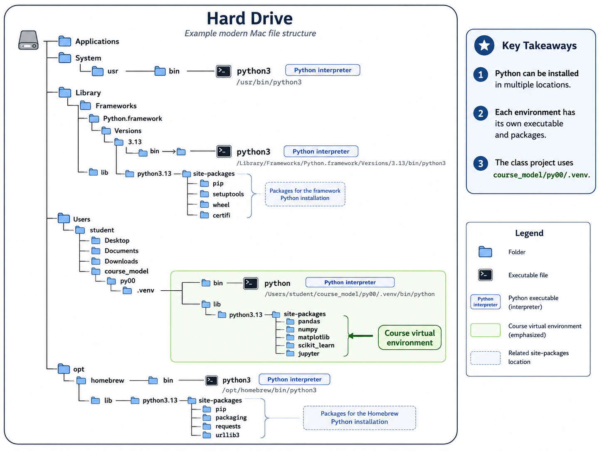
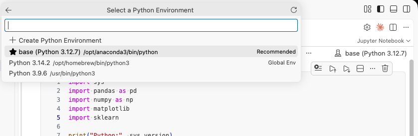
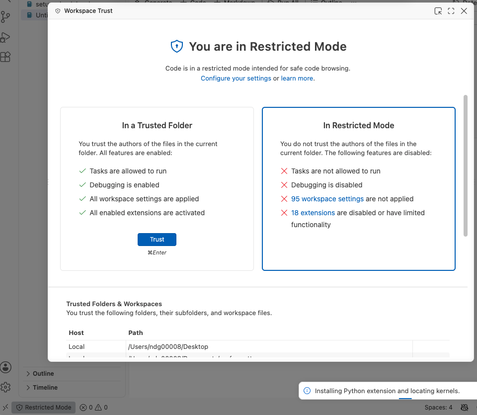

# Setup your computer

We will be using Python for data analysis and modeling in this course. Follow the steps below to install Python and Visual Studio Code (VS Code), and to set up a folder and Python environment for our work.

I do not recommend using Anaconda. If it is already working for you, feel free to continue using it. However, some people have issues with using it for package management.

**Outcomes**:

- Be comfortable moving files around your computer, and creating folders
- Install Python
- Install Visual Studio Code (VS Code)
- Turn off Copilot
- Create a course folder and a Python environment for it
- Install the packages we will use, and confirm they work
- Understand file extensions, file paths, and hidden files

**Files**:

- [template file](template.ipynb)

## File Management

Managing your folders and files is a key skill. When you save a file, it goes onto the storage drive in your computer. That drive (usually labeled `C:` on Windows) organizes files into locations called folders.

All modern systems store your files in several folders:

- `Downloads`: this is supposed to be a temporary spot for files downloaded by Safari or Chrome.
- `Desktop`: files/folders visible on your desktop
- `Documents`: where you should store your long-term files

One wrinkle is that Windows often uses OneDrive. OneDrive is an online service that syncs your local files with servers on the Internet. Files are typically still stored on your computer, but are regularly uploaded. So if you have OneDrive turned on, the OneDrive Downloads/Desktop/Documents folders are usually the same as the ones on your hard drive (usually `C:`).

As noted below, you'll have significantly more success if you keep your course folder outside of OneDrive.

Organize your files: [link to video on YouTube](https://www.youtube.com/watch?v=gfPujXtQqwc)

Here is a quick guide for organizing your files, slightly more focused on the Mac. [link to video on YouTube](https://www.youtube.com/watch?v=gfx7G4NQQMg)

### Making folders

You should have a folder for our class. Then, create a folder for each week or major project. Store your files inside of this folder.

- On a PC: Right-click in a folder, and choose `New folder` (or press `Ctrl+Shift+N`). [link to video on YouTube](https://www.youtube.com/watch?v=Amd6V-ERLO8)
- On a Mac: Right-click in a folder, and choose `New Folder`. [link to video on YouTube](https://www.youtube.com/watch?v=xPVOaFmQ7_s)

### Moving files

Avoid modifying any files in your Downloads folder. Instead, download them, and then move them to the appropriate folder.

**On a PC**, here's a quite guide to using File Explorer. [link to video on YouTube](https://www.youtube.com/watch?v=hXLpEG3IX-A)

**On a Mac**, there are a few more steps.

First, I suggest disabling the Force touch feature:

- Open `System Settings` from the Apple menu (this was called `System Preferences` on older versions of macOS)
- Click `Trackpad`, then the `Point & Click` tab
- Turn off `Force Click and haptic feedback`

Second, to **copy** a file, right-click it and choose Copy, go to the new location, and choose Paste.

Third, to **move** a file, copy it with `Command+C`, then paste with `Command+Option+V`. The extra Option key turns a copy into a move. If you forget it, you end up with two versions of the file. You can also move a file by opening a second `Finder` window and dragging it across.

[link to video on YouTube](https://www.youtube.com/watch?v=gFKJpkpDcwo)


## Show file extensions

Turning on file extensions will show you information living in filenames. When you save a Word document as `my stuff`, it is actually saved as `my stuff.docx`. The `.docx` tells the computer to open the file in Word.

As we work with more complex files, you will find that you cannot just double-click a file to open it in the right program. Instead, get in the habit of opening the program first. Then, inside the program, open the file.

**On Windows:**

- Open File Explorer
- Open the `View` menu
- Open the `Show` submenu
- Check `File name extensions`

**On Mac:**

- Open `Finder`
- Choose `Finder > Settings` from the menu bar (`Command+,`)
- Click `Advanced`
- Check `Show all filename extensions`

### Hidden files

Both systems hide certain files by default, usually ones whose names begin with a period. Our `.venv` folder is one of these. You do not need to open them, but you should be able to see them.

- **Windows** File Explorer, `View` menu, `Show` submenu, check `Hidden items`
- **Mac** in Finder, press `Command+Shift+.` (period) to toggle them on and off


## Python

Python is a computer programming language. Some version of it is installed on many computers already, but it is often the wrong version or is not configured properly.

Open a terminal window:

- On macOS, press `Command+Space`, type `terminal`, and hit Enter.
- On Windows, press `Windows+R`, type `cmd`, and hit Enter.

Then check what you have.

**On Windows**, type:

```bash
py --version
```

**On macOS or Linux**, type:

```bash
python3 --version
```

You should see something like `Python 3.13.2`.

A few things to watch for:

- **Windows students: do not type `python3`.** On Windows that command usually fails or opens the Microsoft Store, even when Python is installed correctly. Use `py`.
- **If Windows opens the Microsoft Store**, close it. Do not install Python from the Store. It causes permission problems later. Install from python.org instead.
- **If macOS asks to install "command line developer tools"**, you can accept, but you should still install Python from python.org. The version Apple ships is meant for the operating system, not for us.

### Installing Python

If the command above failed, or your version is older than 3.11, install a new copy.

- Go to the official Python website: [https://www.python.org/downloads/](https://www.python.org/downloads/)
- **Download version 3.13.** Do not download the newest release (3.14 at the moment). New releases are fine for Python itself, but the data science packages we use often take months to catch up, and you will get confusing installation errors.
- Run the installer.
- **On Windows, check the box that says "Add python.exe to PATH"** on the very first installer screen, before clicking Install. This is easy to miss and is the single most common setup mistake.
- Close your terminal window completely, open a new one, and run the version check again.


## Visual Studio Code (VS Code)

VS Code is our editor. It has a lot of excellent features. However, you will need to do some configuration.

- Go to the official VS Code website: [https://code.visualstudio.com/](https://code.visualstudio.com/)
- Download the installer
- Run the installer.
- After installation, open VS Code.
- Install extensions
   - Click on the Extensions icon in the left sidebar (or press `Ctrl+Shift+X`).
   - Install Microsoft's "Python" plugin
   - Install Microsoft's "Jupyter" plugin
   - Install Microsoft's "Data Wrangler"


### Turn off Copilot

We will use the AI features in VS Code later in the semester. For the first few weeks, using them will significantly hamper your learning.

By the end of the class, we won't be writing code by hand. However, its' really important to your long-temr skill development that you can read and understand code.

Logging out of your Copilot account is not enough on its own, because VS Code will offer to sign you back in and you may accept without noticing. Do this instead:

- Open the Extensions panel (`Ctrl+Shift+X`) (replace `Ctrl` with `Command` on a Mac)
- Find "GitHub Copilot" and "GitHub Copilot Chat"
- Click the gear icon on each and choose **Disable**

## Your course folder and Python environment



### Make the course folder

Create one folder for this class.  If you have OneDrive enabled, I generally recommend not placing it in your Downloads in a location that is **not** synced to OneDrive or iCloud. Cloud sync causes problems, as files get moved online to save space.

- On Windows, use `C:\Users\yourname\wvu_model\`
- On macOS, use `/Users/yourname/wvu_model/`

Inside that folder, make a folder for each week or major project.

### Create a virtual environment

A virtual environment is a private copy of Python and associated libraries. 

If you use any other development environments on your computer, I recommend setting up a virtual environment for this class. If you don't, then it's probably ok to install packages globally.

Open a terminal, and navigate to your course folder:

```bash
cd C:\Users\yourname\datasci
```

On macOS:

```bash
cd ~/datasci
```

Then create the environment.

**Windows:**

```bash
py -m venv .venv
.venv\Scripts\activate
```

**macOS or Linux:**

```bash
python3 -m venv .venv
source .venv/bin/activate
```

You will know it worked because your terminal prompt now begins with `(.venv)`.

If Windows PowerShell refuses to run the activate script and mentions an "execution policy," you are in PowerShell rather than Command Prompt. Close it, open `cmd` instead, and try again.

You need to activate the environment every time you open a new terminal for this class. VS Code will usually do it for you once you complete the next step.

### Install the packages

With `(.venv)` showing in your prompt, run:

```bash
pip install pandas numpy matplotlib seaborn scikit-learn jupyter openpyxl
```

This will take a few minutes and will print a lot of text. That is normal.

It's not stricly necessary to use this approach. When I give you a ipython script, I'll generally include some lines of code at the top that will install the needed packages.

### Tell VS Code which Python to use

This is a major source of confusion! You need to tell VS Code which version of Python to run. Running the wrong version can be very frustrating. The symptom is an error like `ModuleNotFoundError: No module named 'pandas'` even though you know that you've installed pandas.

To fix it:

- In VS Code, choose **File > Open Folder** and open your course folder. Open the *folder*, not an individual file.
- Press `Ctrl+Shift+P` (`Command+Shift+P` on Mac)
- Type `Python: Select Interpreter`
- Choose the one that shows `.venv` in its path, usually labeled "Recommended"

Or, you can do this visually by clicking on the button on the top-right corner of your screen.



## Check your setup

1. Open VS Code and use `File > Open Folder` to open your course folder.
2. Create a new folder called py00
3. Download the template.ipynb file (linked at the top of the course)
4. Put that file into your py00 folder
5. Run the file

You may get this restricted error. Trust the file.



## When something goes wrong

Error messages look intimidating, but they are the most useful text on your screen. Read the **last line first**. It names the actual problem.

| What you see | What it usually means |
|---|---|
| `'python3' is not recognized` | You are on Windows. Use `py` instead. |
| `ModuleNotFoundError: No module named 'pandas'` | VS Code is using the wrong interpreter. Re-select `.venv`. |
| `FileNotFoundError: 'data.csv'` | You opened a file in VS Code instead of the folder, or the file is somewhere else. |
| `SyntaxError: unterminated string literal` on a Windows path | Backslashes. Use `r"C:\Users\me\data.csv"` or forward slashes. |
| `PermissionError` when saving | The file is open in Excel. Close it. |

Debugging errors messages is a great use of AI! Copy the entire message, and upload it and your file into ChatGPT or Claude.

## Key terms

- **File path**: The location of a file on your computer, such as `C:\Users\me\datasci\week1\data.csv`
- **Folder** (or **directory**): A container that holds files and other folders
- **File extension**: The part of a file's name after the last period, such as `.csv` or `.docx`, which tells your computer which program to use
- **Absolute path**: A path that starts at the top of the drive, such as `C:\Users\me\datasci\data.csv`
- **Relative path**: A path that starts from wherever your code is currently running, such as `data.csv` or `week1/data.csv`
- **Terminal**: The text window where you type commands directly to your computer
- **PATH**: A list your operating system uses to find programs by name. This is what the "Add python.exe to PATH" checkbox affects.
- **Package**: A bundle of reusable Python code written by someone else, such as pandas
- **pip**: The tool that installs packages
- **Virtual environment**: A private, self-contained copy of Python and its packages, belonging to one project
- **Interpreter**: The specific Python program that runs your code. You can have several installed at once.
